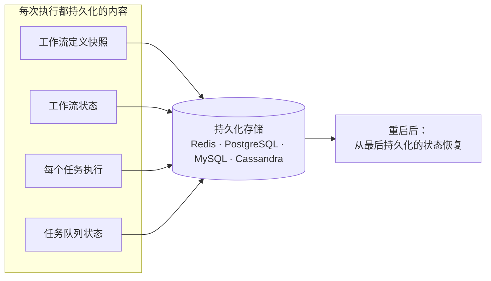
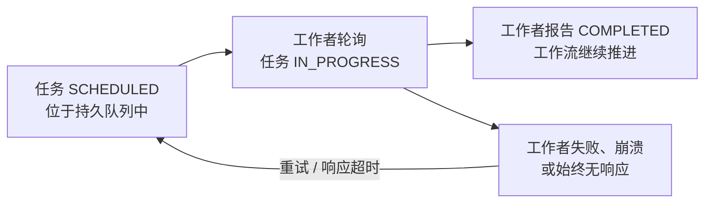

# 持久化执行语义

Conductor 是面向分布式工作流和持久化智能体的持久化执行引擎。每次工作流执行都会在每一步被持久化，能够经受基础设施故障，并保证任务至少一次投递。这种持久化执行模型意味着你的工作流和智能体永远不会丢失进度。本页将精确说明这到底意味着什么。

## 哪些内容被持久化 { #what-persists }

工作流执行时，Conductor 会持久化以下内容：

- 本次执行所用的**工作流定义快照**（启动后不可变）。
- **工作流状态**：状态、输入、输出、关联 ID 和变量。
- 每个**任务执行**：状态、输入、输出、时间戳、重试次数和工作者 ID。
- **任务队列状态**：哪些任务已调度、进行中或已完成。

所有状态都会在下一步继续执行之前写入所配置的持久化存储（Redis、PostgreSQL、MySQL 或 Cassandra）。如果服务器重启，执行将从最后持久化的状态恢复。



## 任务投递保证

Conductor 为所有任务提供**至少一次投递（at-least-once delivery）**：

- 任务被调度时，会被放入持久化任务队列。
- 工作者轮询到任务并接收它，任务进入 `IN_PROGRESS` 状态。
- 如果工作者完成任务，则报告 `COMPLETED`，Conductor 推进工作流。
- 如果工作者失败或崩溃，任务会根据重试和超时配置**重新投递**。

任务永远不会被静默丢失。如果工作者轮询到任务后始终没有响应，响应超时（response timeout）会触发重新投递。



## 故障矩阵

以下是每种故障场景下实际发生的情况：

| 场景 | Conductor 的行为 | 结果 |
|---|---|---|
| **工作者在轮询之后、执行任何工作之前崩溃** | 响应超时触发。任务回到 `SCHEDULED` 状态，新的工作者接手。 | 任务自动重试，不会丢失数据。 |
| **工作者在产生副作用之后、更新完成状态之前崩溃** | 响应超时触发。任务被重新投递给另一个工作者。 | 任务会再次执行。对于副作用，工作者必须是幂等的，或使用任务的 `updateTime` 检测重新投递。 |
| **工作者报告 FAILED** | Conductor 根据重试配置（`retryCount`、`retryDelaySeconds`、`retryLogic`）创建新的任务执行。 | 最多重试到配置的上限。耗尽后，任务进入 `FAILED` 状态，工作流的故障处理逻辑生效。 |
| **工作者报告 FAILED_WITH_TERMINAL_ERROR** | 不重试，任务为终止状态。 | 工作流失败，或执行配置的 `failureWorkflow`。 |
| **工作流执行期间服务器重启** | 重启后，sweeper 服务从持久化存储中接管进行中的工作流并重新评估。 | 执行从最后持久化的状态恢复，无需人工干预。 |
| **跨多次部署的长时间等待** | WAIT 和 HUMAN 任务在持久化存储中保持 `IN_PROGRESS` 状态，计时器或信号的解析是持久化的。 | 当等待时长到期或信号到达时（即使数天后、经历多次部署），任务完成，工作流继续推进。 |
| **信号/webhook 到达已暂停的工作流** | Task Update API 或事件处理器将 WAIT/HUMAN 任务置为 `COMPLETED`，并携带提供的输出。 | 工作流立即恢复，信号载荷可作为任务输出使用。 |
| **执行进行中时工作流定义被更新** | 运行中的执行继续使用启动时保存的定义**快照**。新的执行使用更新后的定义。 | 定义变更不会影响任何运行中的执行，零停机升级。 |
| **执行进行中时工作流版本被删除** | 运行中的执行与元数据存储解耦，继续使用其内嵌的定义快照。 | 已有执行正常完成，仅新的启动受影响。 |
| **工作者与服务器之间发生网络分区** | 工作者的更新无法到达服务器。响应超时触发，任务重新入队。 | 分区恢复后，新的工作者（或原工作者）接手该任务。 |

## 任务状态转换

每个任务都遵循以下状态机：

```
SCHEDULED ──→ IN_PROGRESS ──→ COMPLETED
     │              │
     │              ├──→ FAILED ──→ SCHEDULED (retry)
     │              │
     │              ├──→ FAILED_WITH_TERMINAL_ERROR
     │              │
     │              └──→ TIMED_OUT ──→ SCHEDULED (retry)
     │
     └──→ CANCELED (workflow terminated)
```

**终止状态**：`COMPLETED`、`FAILED`（重试耗尽后）、`FAILED_WITH_TERMINAL_ERROR`、`CANCELED`、`COMPLETED_WITH_ERRORS`（可选任务）。

每个状态转换都会在采取任何后续动作之前被持久化。

## 超时与重试配置

任务的持久化行为可通过[任务定义](../documentation/configuration/taskdef.md)按任务粒度配置：

| 参数 | 作用 |
|---|---|
| `timeoutSeconds` | 任务到达终止状态的最大墙钟时间。 |
| `responseTimeoutSeconds` | 在重新入队之前，等待工作者状态更新的最长时间。 |
| `pollTimeoutSeconds` | 已调度任务在被轮询之前等待的最长时间，超过即超时。 |
| `retryCount` | 失败或超时时的重试尝试次数。 |
| `retryLogic` | `FIXED`、`EXPONENTIAL_BACKOFF` 或 `LINEAR_BACKOFF`。 |
| `retryDelaySeconds` | 重试之间的基础延迟。 |
| `timeoutPolicy` | `RETRY`、`TIME_OUT_WF` 或 `ALERT_ONLY`。 |

## 工作流级持久性

除单个任务外，Conductor 还提供工作流级的持久性：

- **补偿流程**：配置 `failureWorkflow`，当主工作流失败时自动运行，并携带完整上下文（原因、失败的任务 ID、工作流执行数据）。
- **暂停与恢复**：任何运行中的工作流都可以通过 API 暂停并在之后恢复，状态完整保留。
- **重启、重跑与重试**：关于重新执行工作流的完整细节，见下文[回放与恢复](#replay-and-recovery)。
- **版本控制**：多个工作流版本可以并发运行。运行中的执行对定义变更保持不可变。重启时可以选择使用最新定义。

## 回放与恢复 { #replay-and-recovery }

每次工作流执行都是完全可回放的。Conductor 保留完整的执行图——每个任务的输入、输出和状态——因此你可以在任何时候重新执行工作流。

| 操作 | 作用 | 使用场景 |
|-----------|-------------|-------------|
| **重启** | 从头开始重新执行整个工作流 | 定义已变更，需要一次干净的运行 |
| **重跑** | 从特定任务开始重新执行，复用之前任务的输出 | 修复中间某个任务，而无需重跑所有任务 |
| **重试** | 重试最后失败的任务，并从该点继续 | 瞬时故障、外部依赖曾不可用 |

三种操作都适用于处于任何终止状态（COMPLETED、FAILED、TIMED_OUT、TERMINATED）的工作流，并且可以无限期使用——Conductor 保留完整的执行图。重启时可以选择使用最新的工作流定义，这样你修复定义中的 bug 后即可立即回放。

## 分布式一致性

在多节点部署中，Conductor 通过以下机制保证一致性：

- **分布式锁**：整个集群中，每个工作流同一时间只有一个 `decide` 评估在运行（可插拔：Zookeeper、Redis）。
- **围栏令牌（fencing token）**：防止锁已失效的节点产生过期更新。
- **持久化队列**：任务队列可经受节点故障。可配置的分片策略（轮询或仅本地）在分发与一致性之间做权衡。

有关分布式锁的配置，见[部署指南](../devguide/running/deploy.md#locking)。

## 这对你的代码意味着什么

1. **工作者应当是幂等的。** 由于至少一次投递，任务可能执行不止一次。请设计工作者以安全地处理重新投递。
2. **你无需自行构建重试逻辑。** Conductor 负责重试、超时和重新入队。你的工作者只需报告成功或失败。
3. **长时运行进程是安全的。** 对于跨越数分钟到数天的暂停，使用 WAIT 和 HUMAN 任务。状态在多次部署之间持久保留。
4. **定义变更是安全的。** 更新工作流定义不会影响运行中的执行。新版本可以零停机地逐步推出。
