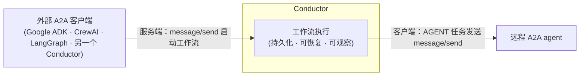
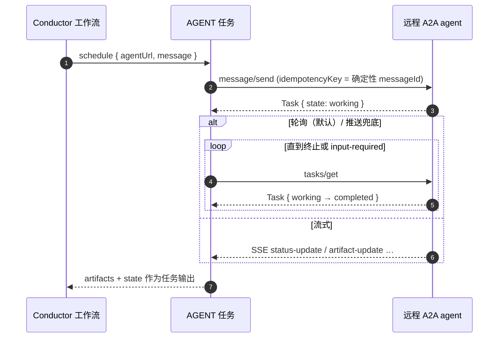
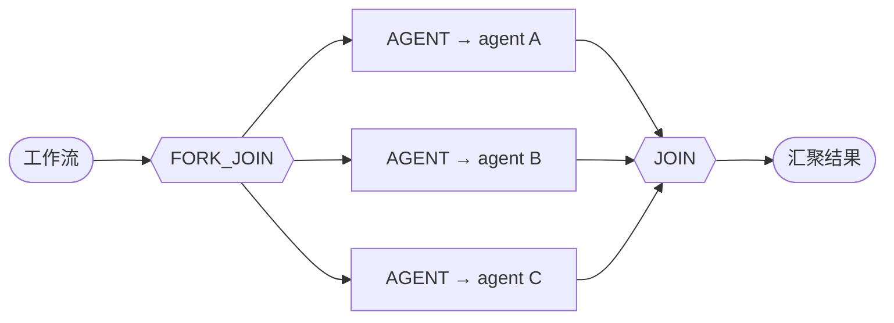
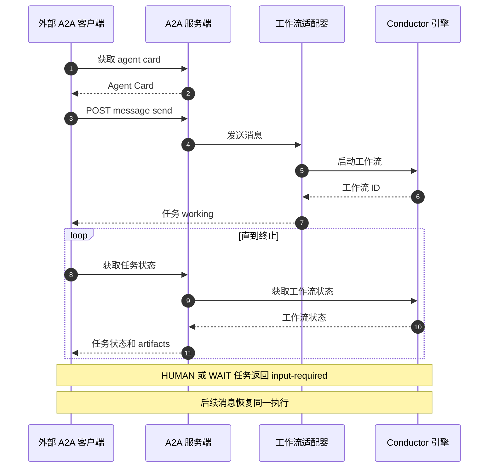

# A2A 集成

<section class="integration-hero integration-hero--a2a" aria-label="A2A 集成">
  <p><strong><a href="https://a2a-protocol.org/">A2A（Agent2Agent）</a></strong> 是 agent 之间通过 HTTP 互相通信的开放协议。在 Conductor 中它双向可用：工作流可以把远程 A2A agent 作为一个持久化步骤来调用，Conductor 工作流也可以被暴露出来，供任意 A2A 客户端发现并调用。无论哪种方式，Conductor 都会记录这次交接及其结果。</p>
  <div class="integration-action-grid">
    <a class="integration-action-card" href="#call-a-remote-agent-from-a-workflow-client">
      <span class="integration-action-card__title">调用远程 agent</span>
      <span>使用持久化 <code>AGENT</code>、<code>GET_AGENT_CARD</code> 和 <code>CANCEL_AGENT</code> 任务。</span>
    </a>
    <a class="integration-action-card" href="#expose-a-workflow-as-an-a2a-agent-server">
      <span class="integration-action-card__title">把工作流暴露为 agent</span>
      <span>为外部 A2A 客户端提供一个可发现、持久化的工作流端点。</span>
    </a>
  </div>
</section>


## 什么是 A2A

A2A 标准化了三件事：**Agent Card**（描述 agent 技能的 `/.well-known/agent-card.json` 文档）、**JSON-RPC** 接口（`message/send`、`tasks/get`、`tasks/cancel` …）以及**任务生命周期**（`submitted → working → input-required → completed/failed/canceled`）。agent 运行长任务；客户端通过轮询（或被动推送）跟踪，直到任务到达终止状态。

Conductor 把这个生命周期映射到它自己的持久化任务模型上，因此远程 agent 任务表现得与其他任何 Conductor 任务一样——由引擎重试、超时、观察和恢复。

Conductor 以**双向**方式讲 A2A：工作流可以*调用*远程 agent（客户端），工作流也可以*成为*被外部 A2A 客户端调用的 agent（服务端）。




## 从工作流调用远程 agent（客户端）

*方向 A——Conductor 是 A2A 客户端。* 这些任务要求启用 AI 集成：

```properties
conductor.integrations.ai.enabled=true
```

每个任务都接受一个 **`agentType`** 输入，用于选择两种受支持的 `AGENT` 模式之一。它不用于选择编写框架（如 OpenAI Agents、Google ADK 或 LangGraph）。无法识别的值会让任务以清晰的错误失败。

**选择运行时。** `agentType` 决定 agent 在哪里运行：

- `agentType: "a2a"`（默认）——调用**远程** Agent2Agent 端点（`agentUrl`）。即本页内容。
- `agentType: "conductor"`——按 `name` 运行已部署的 **Conductor Agent**。参见 [Conductor Agents](conductor-agents.md)。

### AGENT — 向 agent 发送消息

发送 A2A `message/send`，并把产生的 agent 任务推进到终止状态。非阻塞：快速回复会立即完成；长时间运行的工作会进入 `IN_PROGRESS` 并按固定节奏轮询（不占用工作者线程）。



```json
{
  "name": "call_currency_agent",
  "taskReferenceName": "agent",
  "type": "AGENT",
  "inputParameters": {
    "agentType": "a2a",
    "agentUrl": "https://currency-agent.example.com",
    "text": "convert 100 USD to EUR",
    "pollIntervalSeconds": 5,
    "headers": {
      "Authorization": "Bearer ${workflow.input.agentToken}"
    }
  }
}
```

**关键输入**（参见 `A2ACallRequest`）：

| 字段 | 说明 |
|---|---|
| `agentType` | `"a2a"`（默认）调用远程 A2A 端点。`"conductor"` 运行已部署的 Conductor Agent。它不选择框架；其他值会被拒绝。 |
| `agentUrl` | 远程 agent 的基础 URL（必填）。 |
| `text` / `prompt` | 单个文本部分的便捷写法。 |
| `parts` / `message` | 完整的 A2A 消息（多部分/数据部分），替代 `text`。 |
| `contextId`, `taskId` | 继续现有会话 / 恢复 agent 任务（多轮）。 |
| `headers` | 按调用的 HTTP 头（如认证）。凭证通过工作流输入/密钥引用，不要硬编码。 |
| `pollIntervalSeconds` | 轮询模式下的轮询节奏（默认 5）。 |
| `streaming` | `true` → 消费 `message/stream`（SSE）并聚合到完成。 |
| `pushNotification` | `true` → 任务完成时 agent 回调我们的 webhook（见下文）。 |
| `maxDurationSeconds` | 绝对截止时间（默认 86400）。 |
| `maxPollFailures` | 失败前容忍的连续瞬时轮询失败次数（默认 30）。 |

**输出**（`agent.output`）：`state`（A2A 任务状态）、`taskId` 和 `contextId`（用于恢复）、`artifacts`、`text`（提取的文本）、`agentMessage`，以及完整的 `task` 对象。完成的调用看起来像：

```json
{
  "state": "completed",
  "taskId": "task-7f3a",
  "contextId": "ctx-7f3a",
  "text": "100 USD = 92.40 EUR",
  "artifacts": [
    { "artifactId": "result", "parts": [ { "kind": "text", "text": "100 USD = 92.40 EUR" } ] }
  ]
}
```

下游任务通过 `${agent.output.text}`、`${agent.output.taskId}` 等读取这些值。

#### 三种执行模式

- **轮询**（默认）——任务为 `IN_PROGRESS`，按 `pollIntervalSeconds` 通过 `tasks/get` 轮询。轮询之间不持有线程；调用可以存活重启。
- **流式**（`streaming: true`）——消费 agent 的 SSE 流并聚合事件。要求 agent card 上 `capabilities.streaming=true`。在整个流期间持有一个线程——最适合交互式/短流；长时间运行的工作请优先使用轮询或推送。受 `maxDurationSeconds`（默认 86400）作为绝对调用截止时间约束，因此 agent 靠数据或 keepalive 保活却永不结束的连接无法无限期占用线程。
- **推送**（`pushNotification: true`）——任务结束时 agent 回调 Conductor 的 webhook，期间无需轮询。要求配置 `conductor.a2a.callback.url`。仍会运行一个较慢的**兜底轮询**（`pushBackstopPollSeconds`，默认 300），这样 webhook 丢失也不会挂死任务。

#### 推送通知——端到端

**1. 配置外部可达的回调基础 URL**（agent 能访问到 Conductor 的地址）：

```properties
conductor.integrations.ai.enabled=true
conductor.a2a.callback.url=https://conductor.example.com
```

**2. 在任务上请求推送：**

```json
{
  "name": "call_research_agent",
  "taskReferenceName": "agent",
  "type": "AGENT",
  "inputParameters": {
    "agentUrl": "https://research-agent.example.com",
    "text": "research durable agent protocols",
    "pushNotification": true,
    "pushBackstopPollSeconds": 300
  }
}
```

**3. Conductor 发送的内容**——`message/send` 携带一个指向按任务 webhook 的 `pushNotificationConfig`，附一次性 bearer token（一个 `{uuid}:{expiryEpochMillis}` 形式的值，TTL 24 小时）：

```json
{
  "method": "message/send",
  "params": {
    "message": { "role": "user", "messageId": "a2a-...", "parts": [ { "kind": "text", "text": "research durable agent protocols" } ] },
    "configuration": {
      "pushNotificationConfig": {
        "url": "https://conductor.example.com/api/a2a/callback/<conductorTaskId>",
        "token": "3f9c…:1750300000000",
        "authentication": { "schemes": ["Bearer"], "credentials": "3f9c…:1750300000000" }
      }
    }
  }
}
```

随后 `AGENT` 任务**等待**（不持有工作者线程）直到 webhook 到达；兜底轮询只作为安全网运行。

**4. agent 回调**——当任务到达终止/中断状态时，Conductor 校验 token（恒定时间比较 + 过期检查），通过 `tasks/get` 获取最终任务，并完成该工作流任务：

```bash
curl -X POST https://conductor.example.com/api/a2a/callback/<conductorTaskId> \
  -H 'Authorization: Bearer 3f9c…:1750300000000' \
  -H 'Content-Type: application/json' \
  -d '{ "taskId": "<remoteAgentTaskId>", "status": { "state": "completed" } }'
# → 200 OK; the AGENT task is now COMPLETED with the agent's output.
```

不支持 `authentication` 字段的 agent 会退化为在回调 URL 上使用 `?token=` 查询参数，该端点仍然接受（并给出弃用警告，因为 URL 中的 token 会落入访问日志）。

### GET_AGENT_CARD — 发现 agent

```json
{
  "name": "discover_agent",
  "taskReferenceName": "discover",
  "type": "GET_AGENT_CARD",
  "inputParameters": { "agentUrl": "https://currency-agent.example.com" }
}
```

从 `/.well-known/agent-card.json` 解析 agent card（回退到旧版 `/.well-known/agent.json`），并返回解析出的技能/能力——把它喂给 LLM，让它在运行时选择技能。

### CANCEL_AGENT — 取消运行中的 agent 任务

```json
{
  "name": "cancel_agent_task",
  "taskReferenceName": "cancel",
  "type": "CANCEL_AGENT",
  "inputParameters": {
    "agentUrl": "https://currency-agent.example.com",
    "taskId": "${agent.output.taskId}"
  }
}
```

`agentType: "conductor"` 则是终止一次 Conductor agent 执行——与[Conductor agents](conductor-agents.md)思路相同，但作为一次性任务，而非 `AGENT` 任务自身的取消生命周期：

```json
{
  "name": "cancel_agent_task",
  "taskReferenceName": "cancel",
  "type": "CANCEL_AGENT",
  "inputParameters": {
    "agentType": "conductor",
    "executionId": "${agent.output.executionId}",
    "reason": "No longer needed"
  }
}
```

### 多轮（input-required）

当远程任务到达 `input-required`（或 `auth-required`）时，`AGENT` **完成**，并在其输出中呈现 agent 的问题以及 `taskId`/`contextId`。工作流按该状态分支，并发起另一个携带答案的 `AGENT` 任务，使用**相同的 `taskId` 和 `contextId`**——恢复同一个远程任务，而不是开始新会话：

```json
{
  "name": "branch_on_state",
  "taskReferenceName": "branch",
  "type": "SWITCH",
  "evaluatorType": "value-param",
  "expression": "state",
  "inputParameters": { "state": "${ask.output.state}" },
  "decisionCases": {
    "input-required": [
      {
        "name": "answer_agent", "taskReferenceName": "answer", "type": "AGENT",
        "inputParameters": {
          "agentUrl": "${workflow.input.agentUrl}",
          "text": "${workflow.input.answer}",
          "contextId": "${ask.output.contextId}",
          "taskId": "${ask.output.taskId}"
        }
      }
    ]
  },
  "defaultCase": []
}
```

完整示例：`ai/examples/29-a2a-client-multi-turn.json`。

### 编排多个 agent

由于每个 `AGENT` 都是普通的持久化任务，你可以用常见的 Conductor 算子来组合 agent——例如用 **`FORK_JOIN`** 并行调用多个 agent，用 **`JOIN`** 汇聚结果。每个分支都独立崩溃安全：如果 Conductor 中途重启，每个进行中的 agent 调用都会从持久化状态恢复（`ai/examples/27-a2a-multi-agent.json`）。要让 LLM 选择使用哪个技能，把 `GET_AGENT_CARD → LLM_CHAT_COMPLETE → AGENT` 串起来（`ai/examples/28-a2a-llm-pick-skill.json`）。



### 错误处理与重试

`AGENT` 把远程结果映射到 Conductor 任务状态，因此引擎常规的重试/超时机制适用。可重试的失败变为 `FAILED`（引擎按任务定义的 `retryCount` 重试）；永久性失败变为 `FAILED_WITH_TERMINAL_ERROR`（不重试）：

| 条件 | 任务状态 | 会重试？ |
|---|---|---|
| HTTP 408/429/5xx，连接/读取超时，流中断/空流 | `FAILED` | 是 |
| JSON-RPC 瞬时错误（如 `-32603` internal） | `FAILED` | 是 |
| 远程 agent 任务以 `failed` / `rejected` 结束 | `FAILED` | 是 |
| HTTP 4xx（408/429 除外） | `FAILED_WITH_TERMINAL_ERROR` | 否 |
| JSON-RPC 终止码（`-32700/-32600/-32601/-32602/-3200{1..5,7}`） | `FAILED_WITH_TERMINAL_ERROR` | 否 |
| 缺少 `agentUrl` / 空消息 / **被 SSRF 拦截**的 URL | `FAILED_WITH_TERMINAL_ERROR` | 否 |
| 超过 `maxDurationSeconds`，或连续 `maxPollFailures` 次轮询失败 | `FAILED_WITH_TERMINAL_ERROR` | 否 |

重试复用确定性的 `messageId`，因此按它去重的 agent 能得到等效一次（effectively-once）投递。失败原因在 `task.reasonForIncompletion` 上。

**故障排查**

| 现象 | 原因 / 解决办法 |
|---|---|
| `… SSRF blocked` | `agentUrl` 解析到私有/回环/元数据地址。使用公共 URL，或在可信/开发环境设置 `conductor.a2a.client.allow-private-network=true`（云元数据仍被拦截）。 |
| `streaming: true` 表现如同轮询 | agent card 上 `capabilities.streaming=false`；只有 agent 声明支持时客户端才会流式。 |
| 轮询失败 N 次后失败 | agent 不可达——调高 `maxPollFailures` 或检查连通性。 |
| 挂起后在截止时间失败 | agent 在 `maxDurationSeconds` 内从未到达终止状态。 |


## 把工作流暴露为 A2A agent（服务端）

*方向 B——Conductor 是 A2A 服务端。* 任何 Conductor 工作流都可以发布为 A2A agent，供其他 A2A 客户端（Google ADK、CrewAI、LangGraph、另一个 Conductor）发现并调用。工作流执行**本身就是**那个持久化、可恢复的 A2A 任务——这正是它的天然契合点。



启用服务端并让工作流加入：

```properties
conductor.a2a.server.enabled=true
# Expose by name…
conductor.a2a.server.exposed-workflows=order_pizza,book_appointment
```

……或按工作流通过 `WorkflowDef.metadata` 配置：

```json
{
  "name": "order_pizza",
  "version": 1,
  "metadata": { "a2a.enabled": true, "a2a.tags": ["ordering"] },
  "tasks": [ ... ]
}
```

**路由：每个工作流一个 agent。** 每个暴露的工作流都是 `/api/a2a/workflow` 下自己专属的 agent；原生 Conductor agent 位于 `/api/a2a/agent`：

| 方法与路径 | 用途 |
|---|---|
| `GET /api/a2a/workflow/{name}/.well-known/agent-card.json` | 工作流支撑型 agent 的 Agent Card（也支持 `/agent.json`）。 |
| `POST /api/a2a/workflow/{name}` | JSON-RPC：`message/send`、`message/stream`（SSE）、`tasks/get`、`tasks/cancel`。 |
| `GET /api/a2a/workflow` | 暴露的工作流 agent 的便捷列表（非规范）。 |
| `GET /api/a2a/agent/{name}/.well-known/agent-card.json` | 原生 Conductor agent 的 Agent Card（也支持 `/agent.json`）。 |
| `POST /api/a2a/agent/{name}` | JSON-RPC：方法相同，由 Conductor Agents 运行时支撑。 |
| `GET /api/a2a/agent` | 暴露的原生 agent 的便捷列表（非规范）。 |

暴露的 agent 会声明 `capabilities.streaming=true`。

### 发现与调用

```bash
# 1. Discover
curl http://localhost:8080/api/a2a/workflow/order_pizza/.well-known/agent-card.json

# 2. Start a task (message/send → starts the workflow)
curl -X POST http://localhost:8080/api/a2a/workflow/order_pizza \
  -H 'Content-Type: application/json' \
  -d '{
    "jsonrpc": "2.0", "id": 1, "method": "message/send",
    "params": { "message": {
      "role": "user", "messageId": "m-1",
      "parts": [ { "kind": "text", "text": "one large pepperoni" } ]
    } }
  }'
# → result is an A2A Task: { "id": "<workflowId>", "contextId": ..., "status": { "state": "working" } }

# 3. Poll
curl -X POST http://localhost:8080/api/a2a/workflow/order_pizza \
  -H 'Content-Type: application/json' \
  -d '{ "jsonrpc": "2.0", "id": 2, "method": "tasks/get", "params": { "id": "<workflowId>" } }'
```

入站 A2A 消息会被注入工作流输入，作为 `_a2a_text`、`_a2a_message_id`、`_a2a_context_id`（以及任何数据部分），而 `contextId` 成为工作流的 `correlationId`。

### 流式（message/stream）

使用 `message/stream` 替代 `message/send`，即可获得 Server-Sent Events 流：先是初始 `Task`，随后随着工作流 A2A 状态变化发出 `status-update` 事件、随输出生成发出 `artifact-update` 事件，最后以终止 / input-required 状态下的 `final` status-update 结束。

```bash
curl -N -X POST http://localhost:8080/api/a2a/workflow/order_pizza \
  -H 'Content-Type: application/json' \
  -d '{ "jsonrpc":"2.0", "id":1, "method":"message/stream",
        "params": { "message": { "role":"user", "messageId":"m-1",
          "parts":[ {"kind":"text","text":"one large pepperoni"} ] } } }'
```

```text
data: {"jsonrpc":"2.0","id":1,"result":{"kind":"task","id":"wf-7f3a","status":{"state":"working"}}}

data: {"jsonrpc":"2.0","id":1,"result":{"kind":"artifact-update","taskId":"wf-7f3a","artifact":{"artifactId":"workflow-output","parts":[{"kind":"data","data":{"orderId":"ORD-42"}}]}}}

data: {"jsonrpc":"2.0","id":1,"result":{"kind":"status-update","taskId":"wf-7f3a","status":{"state":"completed"},"final":true}}
```

该流是持久化执行的实时视图——连接断开后，用 `tasks/get` 恢复跟踪。调优项：`conductor.a2a.server.stream-poll-interval-millis`（默认 500）和
`conductor.a2a.server.stream-max-duration-seconds`（默认 300）。

### 持久化、幂等的启动

`message/send` 以 `idempotencyKey = {workflow}:{messageId}` 和 `RETURN_EXISTING` 启动工作流，因此客户端**重试**的 `message/send` 会返回**已有的**执行，而不是启动一个重复的执行——服务端等效一次（effectively-once）。执行的持久性（崩溃安全、可恢复）继承自引擎。

### 状态映射

| Conductor 工作流 | A2A 任务状态 |
|---|---|
| RUNNING，阻塞在 `HUMAN`/`WAIT` 任务上 | `input-required` |
| RUNNING（未阻塞）/ PAUSED | `working` |
| COMPLETED | `completed`（output → 一个 artifact） |
| FAILED / TIMED_OUT | `failed` |
| TERMINATED | `canceled` |

### 多轮恢复——完整示例

如果工作流阻塞在 `HUMAN`/`WAIT` 任务上，agent 会报告 `input-required`。后续携带该任务 `id`（即工作流 id）的 `message/send` 会**恢复**暂停的执行——消息内容完成待处理任务，工作流继续。不会启动重复的工作流；如果工作流已终止或未等待输入，则原样返回其当前状态。

以这个暴露的工作流（`ai/examples/25-a2a-server-multi-turn.json`）为例——它先提问，再确认：

```json
{
  "name": "book_appointment",
  "version": 1,
  "metadata": { "a2a.enabled": true },
  "tasks": [
    { "name": "ask_preferred_time", "taskReferenceName": "ask", "type": "HUMAN" },
    {
      "name": "confirm_appointment", "taskReferenceName": "confirm", "type": "INLINE",
      "inputParameters": {
        "evaluatorType": "graaljs",
        "expression": "({ status: 'confirmed', when: $.when })",
        "when": "${ask.output._a2a_text}"
      }
    }
  ]
}
```

**第 1 轮——启动。** 工作流到达 `HUMAN` 任务，停在 `input-required`：

```bash
curl -X POST http://localhost:8080/api/a2a/workflow/book_appointment \
  -H 'Content-Type: application/json' \
  -d '{ "jsonrpc":"2.0", "id":1, "method":"message/send",
        "params": { "message": { "role":"user", "messageId":"m-1",
          "parts":[ {"kind":"text","text":"Book me a dentist appointment"} ] } } }'
```

```json
{
  "jsonrpc": "2.0", "id": 1,
  "result": {
    "kind": "task",
    "id": "wf-7f3a91",
    "contextId": "wf-7f3a91",
    "status": {
      "state": "input-required",
      "message": { "role": "agent", "parts": [ { "kind": "text",
        "text": "Workflow is awaiting input. Send another message/send carrying this task's id to provide the input and resume the execution." } ] }
    }
  }
}
```

**第 2 轮——恢复。** 用**相同的 `taskId`**（`= result.id`）发送答案；`HUMAN` 任务以该消息为输入完成，工作流结束：

```bash
curl -X POST http://localhost:8080/api/a2a/workflow/book_appointment \
  -H 'Content-Type: application/json' \
  -d '{ "jsonrpc":"2.0", "id":2, "method":"message/send",
        "params": { "message": { "role":"user", "messageId":"m-2", "taskId":"wf-7f3a91",
          "parts":[ {"kind":"text","text":"Tuesday at 3pm"} ] } } }'
```

```json
{
  "jsonrpc": "2.0", "id": 2,
  "result": {
    "kind": "task",
    "id": "wf-7f3a91",
    "contextId": "wf-7f3a91",
    "status": { "state": "completed" },
    "artifacts": [
      { "artifactId": "workflow-output", "name": "output",
        "parts": [ { "kind": "data", "data": { "status": "confirmed", "when": "Tuesday at 3pm" } } ] }
    ]
  }
}
```

答案（`Tuesday at 3pm`）以 `${ask.output._a2a_text}` 的形式到达工作流，与通过 Conductor API 完成 `HUMAN` 任务完全一样。


## 持久化

“durable A2A”这一说法基于几个具体机制：

- **确定性消息 id。** `AGENT` 从 `workflowInstanceId + referenceTaskName + iteration` 推导 A2A `messageId`——跨任务重试和服务端重启保持稳定，且每个 `DO_WHILE` 迭代各不相同。按 `messageId` 去重的 agent 即使在至少一次重试下也能得到等效一次投递。
- **状态在执行里，而不是在线程里。** 轮询模式不持有线程；远程 `taskId`、截止时间和轮询失败计数都保存在持久化的任务输出中，因此重启会恢复轮询循环。
- **活性保护。** 绝对截止时间（`maxDurationSeconds`）和连续轮询失败上限（`maxPollFailures`）确保死亡或卡住的 agent 无法永远挂死任务。
- **推送兜底。** 推送模式仍会兜底轮询，因此 webhook 丢失时退化为轮询，而不是挂死。


## 安全

- **SSRF 防护。** 解析到回环、私有（RFC-1918）、链路本地、IPv6 ULA（`fc00::/7`）或云元数据地址的出站 `agentUrl` 会被拒绝。云元数据地址**始终**被拦截。要允许私有网络 agent（如开发环境的 localhost）：

    ```properties
    conductor.a2a.client.allow-private-network=true
    ```

    即使开启此项，云元数据仍被拦截。生产环境建议优先使用网络层出口防火墙。
- **服务端认证。** 与 OSS Conductor REST 一样，A2A 服务端**默认开放**。用网关/防火墙（或 mTLS）前置来控制访问。入站认证（API key、OAuth/OIDC、mTLS、按技能的 scope、签名 Agent Card）由**企业版**提供。
- **推送 token。** 推送回调携带一次性 bearer token，内嵌 24 小时过期时间，由回调端点（`POST /api/a2a/callback/{taskId}`）恒定时间校验。


## 可观察性

A2A 代码路径通过共享的 Conductor 指标注册表发出指标，并设置 MDC 键用于日志关联。

**指标：** `a2a_client_calls{result}`、`a2a_client_poll_failures`、`a2a_rpc_errors{method,terminal}`、`a2a_ssrf_blocked`、`a2a_server_requests{method}`、`a2a_server_resumes`。

**MDC 键**（可在日志中 grep）：`a2aWorkflowId`、`a2aTaskId`、`a2aRef`、`a2aRemoteTaskId`、`a2aContextId`、`a2aMessageId`、`a2aAgent`、`a2aMethod`。


## 配置参考

| 属性 | 默认值 | 用途 |
|---|---|---|
| `conductor.integrations.ai.enabled` | `false` | 启用客户端任务（`AGENT` …）。 |
| `conductor.a2a.callback.url` | — | 推送回调的外部可达基础 URL。 |
| `conductor.a2a.client.allow-private-network` | `false` | 允许私有/回环网络上的 agent URL（元数据仍被拦截）。 |
| `conductor.a2a.server.enabled` | `false` | 启用 A2A 服务端端点。 |
| `conductor.a2a.server.basePath` | `/api/a2a/workflow` | 工作流支撑型 agent 的基础路径。 |
| `conductor.a2a.server.agentBasePath` | `/api/a2a/agent` | 原生 Conductor agent 的基础路径。 |
| `conductor.a2a.server.exposed-workflows` | — | 要暴露的工作流名称（逗号分隔）。 |
| `conductor.a2a.server.expose-all` | `false` | 自动暴露所有已注册工作流（开发/单租户）。 |
| `conductor.a2a.server.public-url` | 由请求推导 | agent card 上声明的基础 URL。 |
| `conductor.a2a.server.provider-organization` | `Conductor` | card 上的 `provider.organization`。 |

## 示例

### 完整工作流：先发现再调用

该工作流先发现远程 agent 的 card，再调用它——把 agent URL 和 prompt 作为工作流输入传入，使同一份工作流定义可用于任何 A2A agent：

```json
{
  "name": "a2a_interop_echo",
  "version": 1,
  "schemaVersion": 2,
  "description": "Discover a remote A2A agent, then call it.",
  "ownerEmail": "a2a@example.com",
  "tasks": [
    {
      "name": "discover_agent",
      "taskReferenceName": "discover",
      "type": "GET_AGENT_CARD",
      "inputParameters": { "agentUrl": "${workflow.input.agentUrl}" }
    },
    {
      "name": "call_agent",
      "taskReferenceName": "call",
      "type": "AGENT",
      "inputParameters": {
        "agentUrl": "${workflow.input.agentUrl}",
        "text": "${workflow.input.prompt}",
        "pollIntervalSeconds": 2
      }
    }
  ]
}
```

注册并运行它（必须启用 AI 集成——`conductor.integrations.ai.enabled=true`；开发环境的 localhost agent 还需设置 `conductor.a2a.client.allow-private-network=true`）：

```bash
# register
curl -X POST localhost:8080/api/metadata/workflow \
  -H 'Content-Type: application/json' -d @a2a_interop_echo.json

# run against a reachable A2A agent
curl -X POST localhost:8080/api/workflow/a2a_interop_echo \
  -H 'Content-Type: application/json' \
  -d '{"agentUrl":"http://localhost:9999","prompt":"convert 100 USD to EUR"}'
```

### 端到端运行（showcase 演示）

`ai/src/test/resources/a2a/` 下有两个自包含的演示，启动真实 agent + Conductor 并对其运行工作流——无需 API key：

```bash
# Interop: Conductor calls the official a2a-sdk reference agent (a real, non-Conductor A2A server)
ai/src/test/resources/a2a/interop-demo/run-interop-demo.sh

# Durability: kill the Conductor server mid-call; the workflow resumes and completes after restart
ai/src/test/resources/a2a/durable-demo/run-durable-demo.sh
```

### 示例库

可运行的工作流定义位于 [`ai/examples/`](https://github.com/conductor-oss/conductor/tree/main/ai/examples)：

| 文件 | 演示内容 |
|---|---|
| `10-a2a-call-agent.json` | 调用远程 agent（轮询模式） |
| `11-a2a-get-agent-card.json` | 发现 agent 的技能 |
| `12-a2a-server-workflow.json` | 把工作流暴露为 A2A agent |
| `23-a2a-streaming.json` | 流式（SSE）调用 |
| `24-a2a-push.json` | 推送通知模式 |
| `25-a2a-server-multi-turn.json` | 多轮服务端 agent（HUMAN 任务 → 恢复） |
| `26-a2a-cancel.json` | 启动然后取消远程 agent 任务 |
| `27-a2a-multi-agent.json` | 并行调用多个 agent（FORK_JOIN → JOIN） |
| `28-a2a-llm-pick-skill.json` | 发现 → LLM 选择 prompt → 调用 |
| `29-a2a-client-multi-turn.json` | 客户端多轮（按 input-required 分支，再次调用） |
