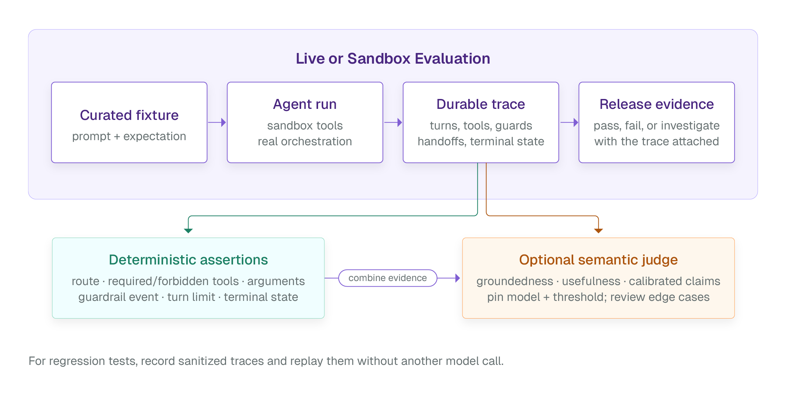

# Agent 评估

<section class="integration-hero integration-hero--evals" aria-label="Agent 评估">
  <p><strong>eval（评估）</strong>是针对 agent 的可重复测试。它对 agent 重放一个代表性请求，并对 agent 实际做了什么做出断言——而不只是它产出的文本：调用了哪些工具、参数是什么、如何在 agent 之间路由、哪些护栏被触发、运行如何结束。在提升新的 agent 版本之前运行 eval，就像在发布代码前运行测试一样。</p>
  
  <div class="integration-action-grid integration-action-grid--three">
    <a class="integration-action-card" href="#start-with-deterministic-behavior">
      <span class="integration-action-card__title">断言确定性行为</span>
      <span>验证路由、工具使用、参数、交接和终止状态。</span>
    </a>
    <a class="integration-action-card" href="#add-a-semantic-judge-deliberately">
      <span class="integration-action-card__title">评判定性输出</span>
      <span>用固定的模型和阈值给 groundedness 和有用性打分。</span>
    </a>
    <a class="integration-action-card" href="#record-a-regression-trace">
      <span class="integration-action-card__title">回放回归</span>
      <span>录制脱敏 trace，无需新的模型调用即可快速、可重复地断言。</span>
    </a>
  </div>
</section>

eval 回答一个发布问题：对代表性场景，agent 是否走了预期路径？护栏在实时运行中强制执行策略；评估在版本提升前度量行为。

Conductor 持久化评估所需的事件：工具调用和参数、交接、护栏结果、轮次、输出、重试和终止状态。这让行为检查比纯文本断言更有用。

## eval 检查什么

eval 对**持久化 trace** 断言，而不只是最终文本。Conductor 持久化每次工具调用及其参数、每次交接、护栏结果、轮次、重试和终止状态——因此用例可以断言 agent 实际走的路径。

| 可断言项 | 示例 |
|---|---|
| 工具行为 | 哪些工具运行了、顺序如何、参数是什么；哪些被禁止 |
| 路由 | 哪个子 agent 处理了它、哪个交接被触发 |
| 护栏 | 某规则通过，或它正确拦截 |
| 形态 | 终止状态、轮次数、输出类型、文本或正则匹配 |
| 质量 | 可选的 LLM 评判器给 groundedness 或有用性打分 |

## 构件

| 构件 | 作用 |
|---|---|
| `EvalCase` | 一个场景：一个 prompt 加上它必须满足的断言 |
| `CorrectnessEval` | 运行一组用例并返回 `EvalSuiteResult` |
| `expect(result)` | 对单次运行的链式断言 |
| `assert_*` 辅助函数 | 针对工具、输出、状态、事件、交接、护栏的命名断言 |
| `mock_run()` | 用脚本化事件驱动 agent，不调用模型 |
| `record()` / `replay()` | 保存 trace，之后对它重新断言 |
| `assert_output_satisfies()` | 以固定模型和阈值做 LLM-as-judge 评分 |

## 从确定性行为开始

在评判文本质量之前，先让路由和副作用策略变得确定。本例运行真实的 agent prompt 并检查持久化 trace：

```python
from conductor.ai.agents.testing import CorrectnessEval, EvalCase

suite = CorrectnessEval(runtime).run([
    EvalCase(
        name="refund_routes_to_billing",
        agent=support_agent,
        prompt="I need a refund for order 123.",
        expect_handoff_to="billing",
        expect_tools=["lookup_order"],
        expect_tools_not_used=["send_marketing_email"],
        expect_output_contains=["refund"],
        tags=["routing", "safety"],
    ),
])

assert suite.all_passed
```

每次变更都运行一个小型确定性套件。用 tags 把快速的路由检查与依赖 provider 或更慢的集成用例分开。

## 审慎地加入语义评判

有些需求无法化简为精确文本：“基于检索到的证据”、“清晰的升级摘要”或“不夸大置信度”。Python SDK 可以用一个独立的模型作为评判器：

```python
from conductor.ai.agents.testing.semantic import assert_output_satisfies

def is_grounded(result):
    assert_output_satisfies(
        result,
        criterion="The answer cites only supplied evidence and clearly states uncertainty.",
        model="anthropic/claude-sonnet-4-6",
        threshold=0.8,
    )

suite = CorrectnessEval(runtime).run([
    EvalCase(
        name="review_is_grounded",
        agent=review_agent,
        prompt="Review this change.",
        custom_assertions=[is_grounded],
        tags=["semantic"],
    ),
])
```

LLM 评判是概率性的，且有成本。固定评判模型和阈值，在合适时让它与快速 CI 分开运行，并包含确定性的检查，即使评判器不可用也能阻止不安全路径。

## 测试护栏与副作用

对每个可写入的工具，至少包含这些用例：

| 用例 | 预期证据 |
|---|---|
| 安全请求 | 必需的读取工具和预期的写入路径只在审批之后发生。 |
| 不被允许的参数 | 工具未被调用；护栏失败被记录。 |
| 审批被拒绝 | agent/工作流在没有写入任务的情况下完成或终止。 |
| 可重试的依赖失败 | 只有失败的任务被重试；已完成的上游工作仍被记录。 |
| 取消 | 取消后不再发生新的写入；按幂等键或标记核对模糊的进行中写入。 |

对可能发送邮件、扣费、修改仓库或运行命令的测试，使用 fixture 账户、沙箱或伪造工具。不要把生产凭证或生产记录放进 eval 语料库或 LLM 评判提示词。

## 断言辅助

除了链式 `expect(...)` API，`conductor.ai.agents.testing` 还导出可直接用于测试的命名断言：

| 领域 | 断言 |
|---|---|
| 工具 | `assert_tool_used`、`assert_tool_not_used`、`assert_tool_called_with`、`assert_tool_call_order`、`assert_tools_used_exactly` |
| 输出 | `assert_output_contains`、`assert_output_matches`、`assert_output_type` |
| 状态 | `assert_status`、`assert_no_errors`、`assert_max_turns` |
| 事件 | `assert_events_contain`、`assert_event_sequence` |
| 多智能体 | `assert_handoff_to`、`assert_agent_ran` |
| 护栏 | `assert_guardrail_passed`、`assert_guardrail_failed` |

```python
from conductor.ai.agents.testing import assert_tool_used, assert_no_errors

result = runtime.run(agent, "What's the weather in San Francisco?")
assert_tool_used(result, "get_weather")
assert_no_errors(result)
```

## 不调用模型地测试

`mock_run()` 用脚本化的事件序列驱动 agent，测试即可在不调用 provider、零成本的情况下断言路由和工具选择：

```python
from conductor.ai.agents.testing import mock_run

result = mock_run(agent, "What's the weather?", events=[...])
```

工具默认仍会执行；传 `auto_execute_tools=False` 也可以 stub 掉它们。对每个提交都必须成立的逻辑使用 `mock_run()`，对只有真实模型才能触发的行为使用实跑的 `CorrectnessEval` 套件。

## 录制回归 trace

当目的是保存已知良好的行为形态、而不是重新测试实时模型时，使用 record/replay：

```python
from conductor.ai.agents.testing import expect, record, replay

result = runtime.run(support_agent, "Where is my order?")
record(result, "tests/recordings/order-status.json")

saved = replay("tests/recordings/order-status.json")
expect(saved).completed().used_tool("lookup_order").no_errors()
```

录制的 trace 可能包含 prompt、工具参数和输出。只保存脱敏后的 fixture，并以与测试数据同样的谨慎保护录制目录。

## 在 pytest 中运行

SDK 自带一个 pytest 插件，注册名为 `conductor-agents-testing`，提供两个 fixture：

- **`mock_agent_run`**——mock 运行器，每个测试一个
- **`event`**——脚本化事件的构造器

```python
def test_weather_routes_to_the_right_tool(mock_agent_run, event):
    result = mock_agent_run(agent, "Weather in SF?", events=[event.tool_call("get_weather")])
    assert_tool_used(result, "get_weather")
```

## 实用的发布阶梯

1. **单元测试：** 针对固定输入，测自定义护栏、工具和数据整形逻辑。
2. **Trace 断言：** 用 mock 或回放的 agent 结果验证路由、工具、护栏和轮次数不变式。
3. **实跑正确性 eval：** 真实 agent 运行，配合沙箱工具和一小套精选 prompt。
4. **语义 eval：** 独立的评判器给 groundedness、有用性和策略遵循打分。
5. **生产监控：** 检查执行历史、审批决策、失败、重试和 token 用量；把生产失败场景加入 fixture 套件。

把第 1–3 层的失败作为安全或路由不变式的发布阻断项。把语义分数当作质量信号，配合有文档记录的阈值，边界用例人工复核。

## 下一步

- **[生产 Agent 架构](production-agent-architecture.md)**——把评估证据用作发布门禁和运维基线。
- **[Agent 护栏](agent-guardrails.md)**——对输入、输出和工具的运行时策略执行。
- **[Conductor Agents](conductor-agents.md)**——从工作流部署并调用 SDK 编写的 agent。
- **[人工介入（Human-in-the-Loop）](human-in-the-loop.md)**——评估审批、编辑和拒绝路径。
- **[失败语义](failure-semantics.md)**——测试重试、取消和模糊的外部写入。
