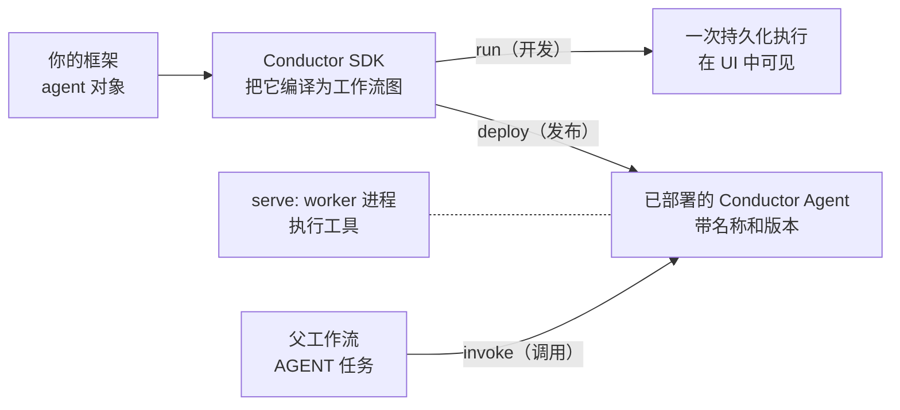

# 框架 Agent

<section class="framework-hero" aria-label="框架 agent">
  <p>你可以引入在其他框架中编写的 agent，如 OpenAI Agents、LangChain、LangGraph 或 Google ADK。你保留自己框架定义的 agent 对象，Conductor SDK 把它编译并运行为一个持久的 Conductor 执行。本页是参考文档：支持哪些框架和语言、框架 agent 如何变成可部署的 Conductor Agent，以及每种组合的维护示例在哪里。</p>
  <div class="framework-logo-grid">
    <a class="framework-logo-card" href="../../quickstart/framework-agents.html#openai-agents-sdk" aria-label="OpenAI Agents 快速上手">
      
      <span>OpenAI Agents</span>
    </a>
    <a class="framework-logo-card" href="../../quickstart/framework-agents.html#google-adk" aria-label="Google ADK 快速上手">
      
      <span>Google ADK</span>
    </a>
    <a class="framework-logo-card" href="../../quickstart/framework-agents.html#langchain" aria-label="LangChain 快速上手">
      
      <span>LangChain</span>
    </a>
    <a class="framework-logo-card" href="../../quickstart/framework-agents.html#langgraph" aria-label="LangGraph 快速上手">
      
      <span>LangGraph</span>
    </a>
    <a class="framework-logo-card" href="https://github.com/conductor-oss/javascript-sdk/tree/main/examples/agents/vercel-ai" aria-label="GitHub 上的 Vercel AI SDK 示例">
      
      <span>Vercel AI SDK</span>
    </a>
    <a class="framework-logo-card" href="../../quickstart/first-agent.html" aria-label="Conductor Agents 快速上手">
      
      <span>Conductor Agents</span>
    </a>
  </div>
</section>

## 选择你的框架

| 框架 | 从这里开始 |
|---|---|
| OpenAI Agents | [OpenAI Agents 快速上手](../../quickstart/framework-agents.md#openai-agents-sdk) |
| Google ADK | [Google ADK 快速上手](../../quickstart/framework-agents.md#google-adk) |
| LangChain / LangChain4j | [LangChain 快速上手](../../quickstart/framework-agents.md#langchain) |
| LangGraph / LangGraph4j | [LangGraph 快速上手](../../quickstart/framework-agents.md#langgraph) |
| Vercel AI SDK | [GitHub 上的 Vercel AI SDK 示例](https://github.com/conductor-oss/javascript-sdk/tree/main/examples/agents/vercel-ai) |
| Conductor Agents | [你的第一个 Agent](../../quickstart/first-agent.md) |

每条路线都把框架特有的代码、依赖和可运行示例保留在对应的 Conductor SDK 中。SDK 就是边界：你的框架仍是编写界面，Conductor 在它周围提供持久化执行。

## 从框架对象到工作流步骤

每个框架都走同一条从你的代码到可复用工作流步骤的路径：



1. **迭代时运行它。** 把你的框架 agent 对象传给 Conductor SDK 并运行。SDK 编译 agent 并在 Conductor 上执行它，因此从第一次运行开始，持久化执行就在 UI 中可见。
2. **稳定后部署它。** 部署会把编译好的 agent 以带名称、带版本的 Conductor Agent 注册到服务端。之后调用方无需导入你的框架及其依赖即可调用它。
3. **serve 它的工作者。** 当 SDK 把你的工具作为本地函数运行时，必须有一个工作者进程在运行来执行它们。只要已部署的 agent 在使用，就让它保持运行。
4. **从工作流调用它。** 父工作流用 `AGENT` 任务调用已部署的 agent，与调用任何其他持久化步骤的方式相同。

在 Python SDK 中，这些步骤是对同一 runtime 的四个调用。以下用 LangChain 展示：

```python
from conductor.ai.agents import AgentRuntime
from langchain.agents import create_agent
from langchain_core.tools import tool

@tool
def check_token() -> str:
    """Check a token."""
    return "available"

agent = create_agent("openai:gpt-4o-mini", tools=[check_token],
                     system_prompt="You are a helpful assistant.")

with AgentRuntime() as runtime:
    runtime.run(agent, "Is the token set?")  # develop: compile and execute once
    runtime.plan(agent)                      # CI: inspect the compiled graph
    runtime.deploy(agent)                    # release: register without executing
    runtime.serve(agent)                     # operate: run tool workers and block
```

`serve()` 会阻塞，因此生产中它应放在自己独立的长生命周期工作者进程中，而 `deploy()` 在 CI/CD 中运行。部署后，父工作流按名称调用 agent：

```json
{
  "name": "run_agent",
  "taskReferenceName": "run_agent_ref",
  "type": "AGENT",
  "inputParameters": {
    "agentType": "conductor",
    "name": "<deployed-agent-name>",
    "prompt": "${workflow.input.prompt}"
  }
}
```

[Conductor Agents](conductor-agents.md) 页面涵盖已部署 agent 的运行时行为：调用、等待、恢复、取消和输出。

## 维护中的 SDK 示例

| 框架 | Python | Java | TypeScript / JavaScript | C# |
|---|---|---|---|---|
| OpenAI Agents | [示例](https://github.com/conductor-oss/python-sdk/tree/main/examples/agents/openai) | [示例](https://github.com/conductor-oss/java-sdk/tree/main/agent-examples) | [示例](https://github.com/conductor-oss/javascript-sdk/tree/main/examples/agents/openai) | [示例](https://github.com/conductor-oss/csharp-sdk/tree/main/Conductor.AI.Examples) |
| Google ADK | [示例](https://github.com/conductor-oss/python-sdk/tree/main/examples/agents/adk) | [示例](https://github.com/conductor-oss/java-sdk/tree/main/agent-examples) | [示例](https://github.com/conductor-oss/javascript-sdk/tree/main/examples/agents/adk) | [示例](https://github.com/conductor-oss/csharp-sdk/tree/main/Conductor.AI.Examples) |
| LangChain | [示例](https://github.com/conductor-oss/python-sdk/tree/main/examples/agents) | [LangChain4j 示例](https://github.com/conductor-oss/java-sdk/tree/main/agent-examples) | [示例](https://github.com/conductor-oss/javascript-sdk/tree/main/examples/agents) | — |
| LangGraph | [示例](https://github.com/conductor-oss/python-sdk/tree/main/examples/agents/langgraph) | [LangGraph4j 示例](https://github.com/conductor-oss/java-sdk/tree/main/agent-examples) | [示例](https://github.com/conductor-oss/javascript-sdk/tree/main/examples/agents/langgraph) | — |
| Vercel AI SDK | — | — | [示例](https://github.com/conductor-oss/javascript-sdk/tree/main/examples/agents/vercel-ai) | — |

## 下一步

- [运行框架快速上手](../../quickstart/framework-agents.md)，通过 Conductor 执行一个现有 agent。
- [构建 agentic 工作流图](first-ai-agent.md)，把已部署 agent 与直接的 Conductor 任务组合起来。
- [应用护栏](agent-guardrails.md)，并在提升前[评估录制行为](agent-evals.md)。
- 当 agent 独立部署且保持远程时，[使用 A2A 集成](a2a-integration.md)。
