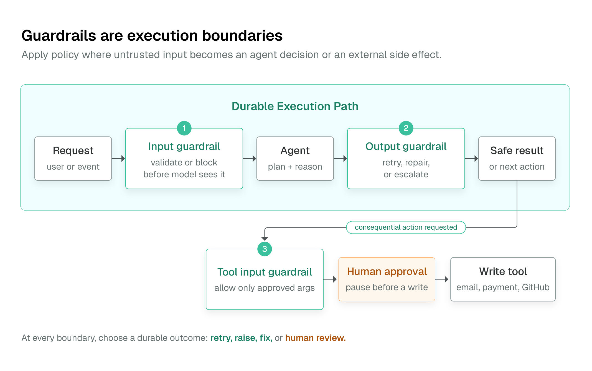

# Agent 护栏

<section class="integration-hero integration-hero--guardrails" aria-label="Agent 护栏">
  <p><strong>护栏（guardrail）</strong>是作为 agent 执行的一部分、在可能出现问题的节点上运行的检查。它可以校验入站请求、约束模型返回的内容、拦截不安全的工具参数，或者把一次重要写入挂起直到人批准。由于每条护栏都是运行中的一个持久化步骤，它的判定会与 agent 做的其他一切一起被记录。</p>
  
  <div class="integration-action-grid integration-action-grid--three">
    <a class="integration-action-card" href="#choose-the-closest-enforcement-point">
      <span class="integration-action-card__title">放置控制点</span>
      <span>把策略放在可执行的输入、输出或工具边界上。</span>
    </a>
    <a class="integration-action-card" href="#outcomes-on-failure">
      <span class="integration-action-card__title">选择失败结果</span>
      <span>重试、失败、修复，或暂停等待评审人——并留下持久化记录。</span>
    </a>
    <a class="integration-action-card" href="human-in-the-loop.html">
      <span class="integration-action-card__title">设计人工评审</span>
      <span>在邮件、支付、命令或写入之前使用持久化审批点。</span>
    </a>
  </div>
</section>

护栏与通过 SDK 编写的 **Conductor Agents** 配合使用。对于直接用 `LLM_CHAT_COMPLETE`、MCP、`HUMAN` 和控制流任务搭建的声明式工作流，用 schema、`SWITCH`、`JSON_JQ_TRANSFORM` 和 `HUMAN` 显式组合出同样的策略。该模式参见[持久化自适应图](dynamic-workflows.md)。

## 选择最近的执行点

| 需求 | 控制点位置 | 典型动作 |
|---|---|---|
| 在模型看到之前拒绝不安全的用户输入 | Agent 输入护栏 | 拦截或返回安全响应 |
| 让模型响应保持在策略之内 | Agent 输出护栏 | 重试、终止、修复或询问评审人 |
| 阻止危险的副作用 | 工具输入护栏 | 在工具运行前拒绝 |
| 校验工具返回的数据 | 工具输出护栏 | 停止、修复或升级 |
| 在重要动作前要求评审 | 工具审批或 `HUMAN` 任务 | 暂停直到运维人员决定 |

工具输入护栏是写入的关键边界。不要只靠 prompt 指令来保护数据库变更、shell 命令、支付、邮件或 GitHub 写入。

## 护栏类型

Conductor Agent 定义支持四种护栏实现：

| 类型 | 最适合 | 执行形态 |
|---|---|---|
| Regex | PII 模式、格式、白名单、已知危险字符串 | 确定性的服务端检查 |
| LLM | 语气、groundedness、策略解释、语义质量 | 第二个模型在零温度下评估策略 |
| Custom | 需要应用状态的领域策略 | 一个已注册的 Conductor worker |
| External | 集中管理的策略服务 | 按名称选择的现有 worker |

Regex 护栏默认以 `block` 模式运行：模式匹配即检查失败。当内容必须匹配至少一个允许的模式（如受约束的输出格式）时，使用 `allow` 模式。正则要窄且确定；对结构化工具参数的白名单，通常更适合表达为按字段解析参数的自定义护栏。

LLM 护栏接收候选内容和一条策略，然后必须产出 JSON 形式的通过/失败判定。把它当作语义检查，而不是确定性访问控制的替代品。不要向 LLM 评判器发送凭证或原始敏感记录；改为校验脱敏后的表示。（注意：在 Python SDK 中使用 `LLMGuardrail` 需要 `litellm` 包：`pip install litellm`）。

Custom 和 External 护栏会变成 `SIMPLE` 任务。部署 agent 之前注册它们的任务定义并运行幂等的工作者；否则护栏任务无法完成。

## 失败时的结果

每条护栏都声明一个 `onFail` 策略：

| 结果 | 行为 |
|---|---|
| `retry` | 把失败反馈加入对话，让模型再尝试一次，最多 `maxRetries` 次。 |
| `raise` | 以失败终止 agent 执行。用于不可妥协的策略违规。 |
| `fix` | 接受自定义护栏修正后的 `fixed_output`。 |
| `human` | 暂停在持久化评审步骤；评审人可以批准、编辑或拒绝输出。 |

只在另一次生成有可能满足规则时使用 `retry`。Regex 和 LLM 护栏是校验检查，不是重写器；需要确定性修复时使用自定义护栏。human 结果适用于输出评审，不适用于输入校验。

## 示例：保护一个可写入的工具

这个 Python Agent SDK 示例在邮件工具运行之前拦截卡号形态的文本。当响应必须在下游使用前检查时，同一个 `RegexGuardrail` 也可以挂到工具的输出上。

```python
from conductor.ai.agents import OnFail, Position, RegexGuardrail, tool

no_card_data = RegexGuardrail(
    patterns=[r"\b(?:\d[ -]?){15}\d\b"],
    name="no_card_data_in_email",
    position=Position.INPUT,
    on_fail=OnFail.RAISE,
    message="Refusing to send payment-card data by email.",
)

@tool(guardrails=[no_card_data], approval_required=True)
def send_email(to: str, subject: str, body: str) -> dict:
    # Invoke the approved mail integration here.
    return {"status": "sent", "to": to}
```

这里有两个独立的控制：护栏在工具调用前拒绝不安全参数，`approval_required=True` 为原本可接受的写入创建人工决策点。该工具仍应是幂等的，因为外部副作用周围可能发生重试和模糊的网络失败。

## 约束 agent 能做的事

护栏是更大策略边界中的一层：

- 定义工具输入和输出 schema，让畸形参数在执行前被拒绝。
- 为每个工具设置 `maxCalls`、每个 agent 设置 `maxTurns`，并设置任务或 agent 超时，以约束工作和成本。
- 使用 plan-and-compile 路径的已知工具白名单，拒绝引用未声明工具的 plan。
- 用 `allowedTransitions` 限制多智能体交接，并在流程依赖强制检查时用 `requiredTools` 要求已声明的工具。
- 对 CLI/代码执行，使用小型命令白名单，非必要禁用 shell 执行，并设置较短的超时。
- 在 agent 或工具上声明 credentials，让它们在执行时解析。不要把密钥放在 prompt、工作流输入或工作者进程的环境变量里。
- 用 `maskedFields` 从执行历史和 UI 中脱敏敏感输入或输出字段。

对直接的工作流定义，把同样的约束在图中显式化：校验模型 plan，只分支到白名单任务，限制 `DO_WHILE` 和 `FORK_JOIN_DYNAMIC`，并在外部写入之前放一个 `HUMAN` 任务。

## 验证护栏本身

通过和失败的用例都要测。一个好的发布门禁会验证：

1. 不安全输入永远到不了工具。
2. 被拦截的输出到不了调用方或写入任务。
3. 重试预算耗尽时会停止。
4. 人工评审人可以批准、编辑和拒绝持久化暂停。
5. 预期的护栏事件出现在执行历史中。

用 [Agent 评估](agent-evals.md) 把这些检查变成可重复的 CI 用例。

## 下一步

- **[生产 Agent 架构](production-agent-architecture.md)**——把这些控制接入评估、部署、恢复和运维。
- **[Agent 评估](agent-evals.md)**——发布前测试路由、工具使用、护栏行为和输出质量。
- **[人工介入（Human-in-the-Loop）](human-in-the-loop.md)**——重要动作的持久化审批模式。
- **[持久化自适应图](dynamic-workflows.md)**——为直接用原生任务构建的自适应工作流设护栏。
- **[失败语义](failure-semantics.md)**——副作用周围的重试、取消和幂等行为。
