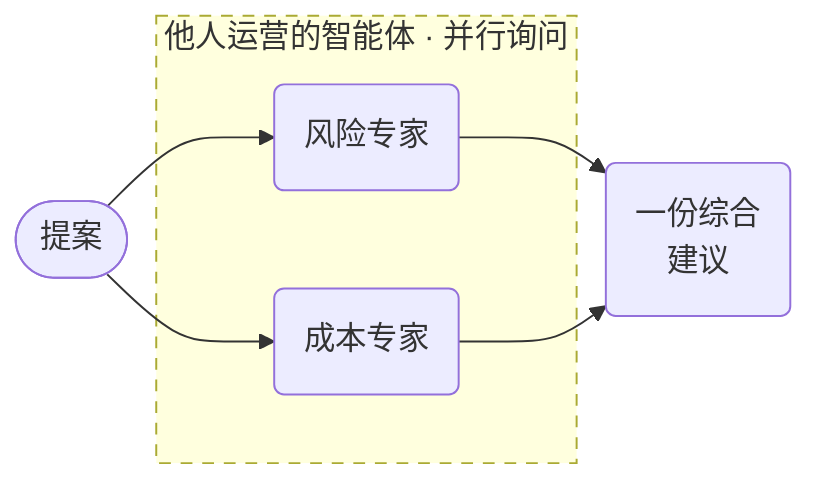

# A2A 智能体编排



**结果：** 一个由确定性任务掌控控制流、远程 A2A 智能体负责专家推理的工作流——委派前验证可达性，带幂等键并行调用，汇合，然后综合。

## 结构

这里的智能体由不同方独立运营：独立部署、独立版本化，只能通过 A2A 协议访问。工作流不知道它们如何推理，也不打算知道。它掌控的是它们周围的一切——是否可达、能运行多久、同时运行多少、其中一个失败时怎么办，以及它们的输出如何组合。

这种分工正是关键。每个 `AGENT` 分支都是独立的持久化任务：如果 Conductor 中途重启，两个进行中的委派都会恢复，而不是重新开始。如果成本智能体失败而风险智能体成功，`JOIN` 会暴露这种不对称，而不是丢弃好的结果。

`GET_AGENT_CARD` 首先作为预检运行。向一个已停机的端点委派，会在几分钟后才产生超时；提前发现则会得到一个立即且可读的失败。

标记 `optional: true` 是有意为之。没有这个标志，任务遇到不可达的智能体会以终止方式失败，并拖垮整个工作流，这意味着其下方的可达性 `SWITCH` 永远不会执行——这个分支读起来像安全网，实则是死代码。有了 `optional: true`，任务会落入 `COMPLETED_WITH_ERRORS`，执行继续，`SWITCH` 以 `remote_agent_unreachable` 输出终止，你可以据此采取行动。

## 本地可运行环境

你不需要外部端点来尝试这个。**任何 Conductor 工作流都可以作为 A2A 智能体对外提供服务**——在其定义上设置 `metadata: {"a2a.enabled": true}`，它就会暴露在 `{basePath}/{workflowName}`。被服务的工作流将调用方的文本作为 `${workflow.input._a2a_text}` 接收。

A2A 服务器是选择加入的，默认关闭。在你的服务器上启用它：

```properties
conductor.a2a.server.enabled=true
```

默认的 `conductor.a2a.server.basePath` 是 `/a2a`，因此下面两个专家工作流可以通过 `http://localhost:8080/a2a/risk_specialist_agent` 和 `http://localhost:8080/a2a/cost_specialist_agent` 访问。

将其保存为 `a2a-risk-specialist.json`：

```json
--8<-- "docs/devguide/ai/cookbook/assets/a2a-risk-specialist.json"
```

将其保存为 `a2a-cost-specialist.json`：

```json
--8<-- "docs/devguide/ai/cookbook/assets/a2a-cost-specialist.json"
```

## 可运行的定义

将其保存为 `a2a-orchestration.json`：

```json
--8<-- "docs/devguide/ai/cookbook/assets/a2a-orchestration.json"
```

## 注册与运行

!!! warning "通过 REST 注册两个专家，不要用 CLI"

    `conductor workflow create` 会丢弃 `metadata` 块。定义能正常注册，但 `metadata` 返回 `{}`，工作流永远不会作为 A2A 智能体暴露，所有 `/a2a/...` 路径都返回 404。对任何依赖 `metadata` 的工作流，使用 metadata API：

    ```bash
    curl -X POST 'http://localhost:8080/api/metadata/workflow?overwrite=true' \
      -H 'Content-Type: application/json' -d @a2a-risk-specialist.json
    curl -X POST 'http://localhost:8080/api/metadata/workflow?overwrite=true' \
      -H 'Content-Type: application/json' -d @a2a-cost-specialist.json
    ```

在编排之前确认每个智能体确实已暴露——这也是发现上述 metadata 问题最快的方式：

```bash
curl -s http://localhost:8080/a2a/risk_specialist_agent/.well-known/agent-card.json
```

存活的智能体返回一张包含 `protocolVersion`、`preferredTransport: JSONRPC` 和 `skills` 条目的卡片，其 `tags` 即定义中的 `a2a.tags`。404 表示 metadata 没有持久化。

编排器没有 `metadata`，所以用 CLI 注册它没问题：

```bash
conductor workflow create a2a-orchestration.json
conductor workflow start -w a2a_agent_orchestration -i '{"proposal":"Migrate the billing service to a new payments provider in Q3.","riskAgentUrl":"http://localhost:8080/a2a/risk_specialist_agent","costAgentUrl":"http://localhost:8080/a2a/cost_specialist_agent","requestId":"proposal-1042"}'
```

在 Conductor UI 中打开 **[Executions](http://localhost:8080/executions)**，选择新的执行以查看任务图以及每个任务的输入和输出。

两个 `AGENT` 任务应显示重叠的起止时间——这就是扇出在起作用。每个任务还记录了远程 `taskId`，如果某个委派需要重试，这就是你对其核对的依据。

针对两个本地提供的专家智能体，整个运行大约需要 12–18 秒，每次委派约 5 秒且两次重叠。将 `riskAgentUrl` 指向一个不存在的工作流即可看到不可达路径：卡片任务落入 `COMPLETED_WITH_ERRORS`，工作流在约 3 秒后以 `remote_agent_unreachable` 失败。

## 生产注意事项

- **`agentType` 选择的是协议，不是框架。** 只有 `a2a` 和 `conductor`，没有厂商专属类型。
- **幂等键必须能在重试后存活。** 它们来自调用方，每个分支从它派生出自己的幂等键。
- **远程智能体是别人的代码。** 验证它返回的内容；提示词不是 schema。
- **任何使用 `metadata` 的定义都通过 REST 注册。** CLI 会丢弃该块，智能体会悄无声息地永远不会被暴露。
- **给每个委派单独设限**，让慢智能体无法吃掉另一个的预算。
- **综合结果只是建议。** 将影响重大的动作经由 [HITL 审批](hitl-approval.md) 路由。
