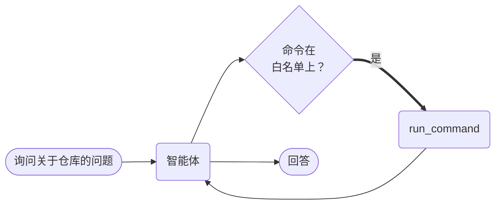

# 带 CLI 工具的智能体



**结果：** 智能体可以运行真实的 shell 命令来回答关于检出代码的问题，但只能运行你列出的命令，且每次运行都是一个事后可检查的持久化任务。

## 工作原理

- **`cli_commands=True` 附加一个 `run_command` 工具。** 你不需要编写包装器。
- **`cli_allowed_commands` 是边界。** 列表之外的任何命令都会在执行前被拒绝。
- **Shell 模式默认关闭，** 因此模型无法用管道或 `;` 串联命令。
- **每条命令都是独立的 Conductor 任务，** 因此你可以确切看到执行了什么、返回了什么。

## 前置条件

一台配置了 LLM 提供商的 Conductor 服务器，且已设置 `CONDUCTOR_SERVER_URL`。你允许的命令必须位于 worker 运行位置的 `PATH` 上。

## 智能体

将其保存为 `agent_cli_tools.py`：

```python
--8<-- "docs/devguide/ai/cookbook/assets/agent_cli_tools.py"
```

## 运行

```bash
python agent_cli_tools.py
```

一次经过验证的运行进行了两次工具调用，使用了 `ls`，并报告了工作目录的文件数量。打开 **[Executions](http://localhost:8080/executions)** 查看每次 `run_command` 调用及其参数和输出。

## 其他 SDK 中的相同示例

智能体 API 在每个 SDK 中形状相同。这些是本配方派生自的上游来源——Java 条目是一个端到端测试套件，而非编号示例，但它验证的是同一个 `CliConfig` API：

| SDK | 示例 |
|---|---|
| Python | [`16c_credentials_cli_tools.py`](https://github.com/conductor-oss/python-sdk/blob/main/examples/agents/16c_credentials_cli_tools.py) |
| Java | [`Suite3CliTools.java`](https://github.com/conductor-oss/java-sdk/blob/main/e2e/src/test/java/Suite3CliTools.java) |
| TypeScript | [`16c-credentials-cli-tools.ts`](https://github.com/conductor-oss/javascript-sdk/blob/main/examples/agents/16c-credentials-cli-tools.ts) |
| C# | [`Program.cs`](https://github.com/conductor-oss/csharp-sdk/blob/main/Conductor.AI.Examples/16c_CredentialsCliTools/Program.cs) |

## 生产注意事项

- **白名单就是影响范围。** `git` 包含 `git push`——列出能工作的最窄集合。
- **在可丢弃的环境中运行 worker。** 把工作目录当作不受信任的输出，而不是事实来源。
- **保持 `allow_shell` 关闭。** 启用它等于把任意命令组合权交给模型。
- **机密通过工具上的 `credentials=[...]` 传递，** 仅在调用期间注入——绝不放进提示词。
- **设置超时。** 否则卡住的命令会无限期占用 worker 槽位。
