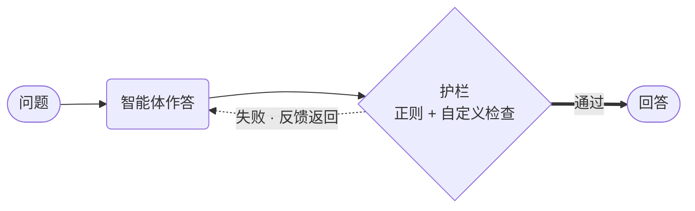

# 带护栏的智能体



**结果：** 智能体自身的输出在你看到之前就会被检查，检查失败会让模型带着原因返回重试。

## 工作原理

- **`RegexGuardrail` 零成本。** 它编译为 Conductor 的 `INLINE` 任务并在服务端运行——不涉及 Python 进程。
- **`@guardrail` 函数作为 worker 任务运行，** 用于正则无法表达的检查。
- **两者处于同一个持久化重试循环中。** `on_fail=OnFail.RETRY` 会把失败信息追加到对话中并重新生成。
- **`max_retries` 给它设界。** 没有上限的话，一个无法满足规则的智能体会一直循环到工作流超时。

## 前置条件

一台配置了 LLM 提供商的 Conductor 服务器，且已设置 `CONDUCTOR_SERVER_URL`。用 `python -m pip install conductor-python` 安装 SDK。

## 智能体

将其保存为 `agent_guardrails.py`：

```python
--8<-- "docs/devguide/ai/cookbook/assets/agent_guardrails.py"
```

## 运行

```bash
python agent_guardrails.py
```

提示词要求一个解释，指令禁止使用项目符号，`min_length` 要求至少 50 个词。一次经过验证的运行返回了 260 个完成 token 的三个散文段落——两条护栏首次尝试即通过，无需重试。

在 Conductor UI 中打开 **[Executions](http://localhost:8080/executions)**，查看智能体循环内的护栏任务，每个任务都有自己通过/失败的输出。

## 其他 SDK 中的相同示例

智能体 API 在每个 SDK 中形状相同。这些是本配方派生自的上游来源：

| SDK | 示例 |
|---|---|
| Python | [`36_simple_agent_guardrails.py`](https://github.com/conductor-oss/python-sdk/blob/main/examples/agents/36_simple_agent_guardrails.py) |
| Java | [`Example36SimpleAgentGuardrails.java`](https://github.com/conductor-oss/java-sdk/blob/main/agent-examples/src/main/java/org/conductoross/conductor/ai/examples/Example36SimpleAgentGuardrails.java) |
| TypeScript | [`36-simple-agent-guardrails.ts`](https://github.com/conductor-oss/javascript-sdk/blob/main/examples/agents/36-simple-agent-guardrails.ts) |
| C# | [`Program.cs`](https://github.com/conductor-oss/csharp-sdk/blob/main/Conductor.AI.Examples/36_SimpleGuardrails/Program.cs) |

## 生产注意事项

- **`OnFail` 有四种模式：** `retry`、`raise`、`fix` 和 `human`——最后一种会创建一个持久化的审批点。
- **凡廉价检查优先用服务端正则。** 它在为你支付模型调用之前就拒绝。
- **护栏对每次响应都运行，** 因此保持自定义检查快速且无副作用。
- **基于模型的护栏可能被绕开。** 用它管语气和策略，不要把它当安全控制。
- **通过的也记日志。** 只记失败的日志无法告诉你某个检查已经什么都不再拒绝了。
