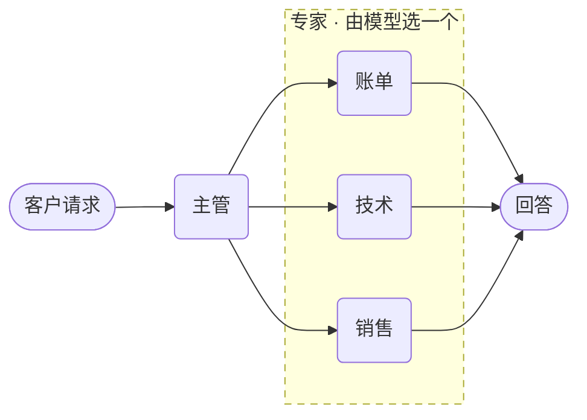

# 多智能体交接



**结果：** 一个主管智能体顶着一支专家团队。主管的模型把每个专家视为可调用工具并委派；每次委派都是独立的持久化执行。

## 工作原理

- **子智能体变成工具。** 配合 `Strategy.HANDOFF`，主管的模型按名称选择其中一个。
- **每个专家保留自己的工具和指令，** 因此它们的活动范围彼此隔离。
- **每次委派都是持久化执行。** 专家可以重试，而无需重新执行路由决策。

## 交接策略

`strategy=` 接受以下任意值。这些值来自 SDK 中的 `Strategy`：

| 策略 | 父智能体的行为 |
|---|---|
| `handoff` | 模型选择一个子智能体并把对话交给它 |
| `router` | 模型对请求分类并路由，不进行对话 |
| `sequential` | 按顺序运行子智能体，每个都能看到上一个的输出 |
| `parallel` | 同时运行所有子智能体并收集每个回答 |
| `swarm` | 子智能体之间传递控制权，直到其中一个完成 |
| `round_robin` | 按轮转顺序取下一个子智能体 |
| `random` | 随机挑选一个子智能体——适合 A/B 对比 |
| `plan_execute` | 规划一串子智能体调用，然后执行并重新规划 |
| `manual` | 由你在代码中选择子智能体，而不是模型 |

## 前置条件

一台配置了 LLM 提供商的 Conductor 服务器，且已设置 `CONDUCTOR_SERVER_URL`。

## 智能体

将其保存为 `agent_handoff.py`：

```python
--8<-- "docs/devguide/ai/cookbook/assets/agent_handoff.py"
```

## 运行

```bash
python agent_handoff.py
```

询问账户余额会被路由到 `billing`，它调用 `check_balance`。打开 **[Executions](http://localhost:8080/executions)**，可以看到主管和被选中的专家作为两个独立的执行。

## 其他 SDK 中的相同示例

智能体 API 在每个 SDK 中形状相同。这些是本配方派生自的上游来源：

| SDK | 示例 |
|---|---|
| Python | [`05_handoffs.py`](https://github.com/conductor-oss/python-sdk/blob/main/examples/agents/05_handoffs.py) |
| Java | [`Example05Handoffs.java`](https://github.com/conductor-oss/java-sdk/blob/main/agent-examples/src/main/java/org/conductoross/conductor/ai/examples/Example05Handoffs.java) |
| TypeScript | [`05-handoffs.ts`](https://github.com/conductor-oss/javascript-sdk/blob/main/examples/agents/05-handoffs.ts) |
| C# | [`Program.cs`](https://github.com/conductor-oss/csharp-sdk/blob/main/Conductor.AI.Examples/05_Handoffs/Program.cs) |

## 生产注意事项

- **专家的指令就是路由信号。** 描述重叠会导致交接错误。
- **单独限定每个专家的工具范围。** 账单智能体不应触达订单履约工具。
- **按问题的形状选策略，** 而不是为求新——不需要对话时 `router` 比 `handoff` 更省。
- **独立给每个专家设限**，让某一个无法耗尽整个预算。
- **交接决策是模型输出。** 记录哪个专家运行了以及为什么。
