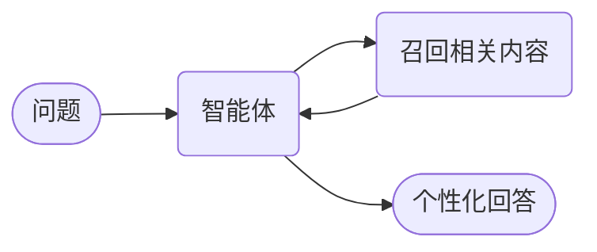

# 带记忆的智能体



**结果：** 智能体跨会话记住事实，只拉取与当前问题相关的部分，而不是回放一个不断增长的对话记录。

## 工作原理

- **`SemanticMemory` 存储事实并按相似度检索。** `max_results` 限制返回数量。
- **召回是智能体调用的工具，** 因此检索在执行中与其他步骤一样可见。
- **只有相关事实进入提示词。** 随记忆增长，成本保持平稳。
- **存储可替换。** 把它指向自己的后端，无需改动智能体。

## 前置条件

一台配置了 LLM 提供商的 Conductor 服务器，且已设置 `CONDUCTOR_SERVER_URL`。

## 智能体

将其保存为 `agent_memory.py`：

```python
--8<-- "docs/devguide/ai/cookbook/assets/agent_memory.py"
```

## 运行

```bash
python agent_memory.py
```

询问发票会召回企业版套餐、#1042 上未解决的差异，以及 1 小时 SLA——而不是时区或语言这类不相关的事实。打开 **[Executions](http://localhost:8080/executions)** 查看召回调用以及它返回的确切事实。

## 其他 SDK 中的相同示例

智能体 API 在每个 SDK 中形状相同。这些是本配方派生自的上游来源——Java 有 `SemanticMemory` 类型，但还没有编号示例，因此该行链接到类：

| SDK | 示例 |
|---|---|
| Python | [`25_semantic_memory.py`](https://github.com/conductor-oss/python-sdk/blob/main/examples/agents/25_semantic_memory.py) |
| Java | [`SemanticMemory.java`](https://github.com/conductor-oss/java-sdk/blob/main/conductor-client-ai/src/main/java/org/conductoross/conductor/ai/model/SemanticMemory.java) |
| TypeScript | [`25-semantic-memory.ts`](https://github.com/conductor-oss/javascript-sdk/blob/main/examples/agents/25-semantic-memory.ts) |
| C# | [`Program.cs`](https://github.com/conductor-oss/csharp-sdk/blob/main/Conductor.AI.Examples/25_SemanticMemory/Program.cs) |

## 生产注意事项

- **记忆是注入面。** 任何被存储的内容都会被读回提示词——写入前验证。
- **决定什么值得记住。** 存储整个对话记录会让检索变得更差，而不是更好。
- **给事实加上来源和时间戳**，以便日后过期或更正。
- **按客户或租户限定记忆范围。** 共享存储会在用户之间泄露上下文。
- **`max_results` 是成本控制。** 调高它会让每个提示词变大。
