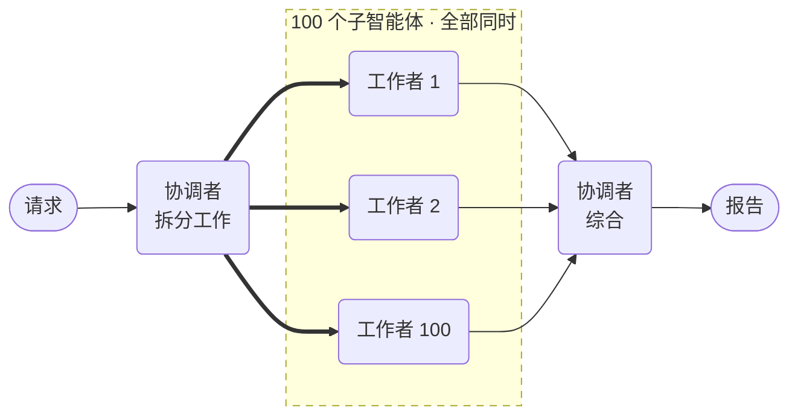

# 大规模并行智能体



**结果：** 一个协调者把一次请求分解为一百个独立的子任务，将它们全部作为持久化子工作流并行运行，并写出综合结果。

## 工作原理

- **`scatter_gather()` 替你构建协调者**——分解、扇出、综合。
- **扇出宽度在运行时由模型决定**，而不是硬编码在图中。
- **每个子任务都是独立的子工作流**，拥有自己的重试。
- **部分结果是默认行为。** `fail_fast=False` 意味着一个挂掉的工作者不会拖垮整批。
- **用更大的模型做综合。** 它必须一次读完全部一百个结果。

## 前置条件

一台配置了 LLM 提供商的 Conductor 服务器，且已设置 `CONDUCTOR_SERVER_URL`。这次运行会产生约 100 次工作者调用加一次大型综合调用——先检查你的提供商的速率限制。

## 智能体

将其保存为 `agent_scatter_gather.py`：

```python
--8<-- "docs/devguide/ai/cookbook/assets/agent_scatter_gather.py"
```

## 运行

```bash
python agent_scatter_gather.py
```

一次经过验证的运行在 **41 秒**内完成，使用了 56,371 个 token。检查执行可以看到实际发生的事：单个 `FORK`/`JOIN` 下的 **100 个 `SUB_WORKFLOW` 任务**，全部一起派发。

打开 **[Executions](http://localhost:8080/executions)** 并打开协调者——并行分支并排展开，你可以钻入一百个中的任意一个。

## 其他 SDK 中的相同示例

智能体 API 在每个 SDK 中形状相同。这些是本配方派生自的上游来源：

| SDK | 示例 |
|---|---|
| Python | [`58_scatter_gather.py`](https://github.com/conductor-oss/python-sdk/blob/main/examples/agents/58_scatter_gather.py) |
| Java | [`Example58ScatterGather.java`](https://github.com/conductor-oss/java-sdk/blob/main/agent-examples/src/main/java/org/conductoross/conductor/ai/examples/Example58ScatterGather.java) |
| TypeScript | [`58-scatter-gather.ts`](https://github.com/conductor-oss/javascript-sdk/blob/main/examples/agents/58-scatter-gather.ts) |
| C# | [`Program.cs`](https://github.com/conductor-oss/csharp-sdk/blob/main/Conductor.AI.Examples/58_ScatterGather/Program.cs) |

## 生产注意事项

- **速率限制会先于 Conductor 发作。** 一百个并发调用会远早于引擎吃力就撞上提供商配额。
- **给工作者的轮次设上限。** `max_turns` 防止一个工作者循环不止、一直吊着汇合。
- **留意综合的上下文。** 一百个啰嗦的工作者可能超出协调者的窗口；保持工作者输出简短。
- **部分成功需要决策。** 上线前决定 100 中 97 的成功对你的调用方意味着什么。
- **成本线性增长。** 先跑五个工作者验证形态，再跑一百个。
