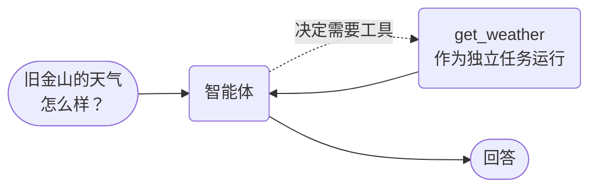

# 工具调用智能体



**结果：** 智能体声明两个工具，模型选择能回答问题的工具，每次工具调用都作为独立的持久化 Conductor 任务执行，你可以分别检查、重试和设置超时。

## 工作原理

你在智能体上注册两个工具。你不需要编写路由逻辑——模型读取每个工具的名称、描述和参数类型，然后决定问题需要哪一个。这里调用的是 `get_weather`，`get_stock_price` 没有被调用。

这与进程内工具循环的不同之处在于工具在哪里运行。每次工具调用都作为独立的 Conductor 任务派发，因此在 UI 中，调用、其输入和输出是一个离散的工作单元。它也是重试和超时的单位：不稳定的天气 API 可以重试，而无需重跑模型的推理；卡住的工具调用以自己的超时失败，而不是拖住整个智能体。

## 前置条件

一台配置了 LLM 提供商的 Conductor 服务器，并且 agent 运行时可访问一个模型。

每个 SDK 读取各自的环境变量。使用对应你语言的那一行：

| SDK | 模型变量 | 服务器变量 |
|---|---|---|
| Python | `CONDUCTOR_AGENT_LLM_MODEL` | `CONDUCTOR_SERVER_URL` |
| Java | `CONDUCTOR_AGENT_LLM_MODEL` | `CONDUCTOR_SERVER_URL` |
| TypeScript | `CONDUCTOR_AGENT_LLM_MODEL` | `CONDUCTOR_SERVER_URL` |
| C# | `CONDUCTOR_AGENT_LLM_MODEL` | `CONDUCTOR_SERVER_URL` |

下面的示例显式传递 `model`，因此不依赖于你的 SDK 读取哪个变量。

## 智能体

=== "Python"

    ```python
    from conductor.ai.agents import Agent, AgentRuntime, tool

    @tool
    def get_weather(city: str) -> dict:
        """Get the current weather for a city."""
        return {"city": city, "temp_f": 72, "condition": "Sunny"}

    @tool
    def get_stock_price(symbol: str) -> dict:
        """Get the current stock price for a ticker symbol."""
        return {"symbol": symbol, "price": 182.50, "change": "+1.2%"}

    agent = Agent(
        name="weather_stock_agent",
        model="openai/gpt-4o",
        tools=[get_weather, get_stock_price],
        instructions="You are a helpful assistant. Use tools to answer questions.",
    )

    if __name__ == "__main__":
        with AgentRuntime() as runtime:
            # The model will call get_weather, not get_stock_price.
            result = runtime.run(agent, "What's the weather like in San Francisco?")
            result.print_result()
    ```

=== "TypeScript"

    ```typescript
    import { Agent, AgentRuntime, tool } from '@io-orkes/conductor-javascript/agents';

    const getWeather = tool(
      async (args: { city: string }) => {
        return { city: args.city, temp_f: 72, condition: 'Sunny' };
      },
      {
        name: 'get_weather',
        description: 'Get the current weather for a city.',
        inputSchema: {
          type: 'object',
          properties: {
            city: { type: 'string', description: 'The city to get weather for' },
          },
          required: ['city'],
        },
      },
    );

    const getStockPrice = tool(
      async (args: { symbol: string }) => {
        return { symbol: args.symbol, price: 182.5, change: '+1.2%' };
      },
      {
        name: 'get_stock_price',
        description: 'Get the current stock price for a ticker symbol.',
        inputSchema: {
          type: 'object',
          properties: {
            symbol: { type: 'string', description: 'The stock ticker symbol' },
          },
          required: ['symbol'],
        },
      },
    );

    export const agent = new Agent({
      name: 'weather_stock_agent',
      model: 'openai/gpt-4o',
      tools: [getWeather, getStockPrice],
      instructions: 'You are a helpful assistant. Use tools to answer questions.',
    });

    async function main() {
      const runtime = new AgentRuntime();
      try {
        // The model will call get_weather, not get_stock_price.
        const result = await runtime.run(
          agent,
          "What's the weather like in San Francisco?",
        );
        result.printResult();
      } finally {
        await runtime.shutdown();
      }
    }

    main().catch(console.error);
    ```

=== "Java"

    ```java
    import java.util.List;
    import java.util.Map;

    import org.conductoross.conductor.ai.Agent;
    import org.conductoross.conductor.ai.AgentRuntime;
    import org.conductoross.conductor.ai.annotations.Tool;
    import org.conductoross.conductor.ai.internal.ToolRegistry;
    import org.conductoross.conductor.ai.model.AgentResult;
    import org.conductoross.conductor.ai.model.ToolDef;

    public class SimpleToolAgent {

        static class AssistantTools {
            @Tool(name = "get_weather", description = "Get the current weather for a city")
            public Map<String, Object> getWeather(String city) {
                return Map.of("city", city, "temp_f", 72, "condition", "Sunny");
            }

            @Tool(name = "get_stock_price", description = "Get the current stock price for a ticker symbol")
            public Map<String, Object> getStockPrice(String symbol) {
                return Map.of("symbol", symbol, "price", 182.50, "change", "+1.2%");
            }
        }

        public static void main(String[] args) {
            AgentRuntime runtime = new AgentRuntime();
            List<ToolDef> tools = ToolRegistry.fromInstance(new AssistantTools());

            Agent agent = Agent.builder()
                .name("weather_stock_agent")
                .model("openai/gpt-4o")
                .tools(tools)
                .instructions("You are a helpful assistant. Use tools to answer questions.")
                .build();

            // The model will call get_weather, not get_stock_price.
            AgentResult result = runtime.run(agent, "What's the weather like in San Francisco?");
            result.printResult();

            runtime.shutdown();
        }
    }
    ```

=== "C#"

    ```csharp
    using Conductor.AI;

    var tools = ToolRegistry.FromInstance(new SimpleToolHost());

    var agent = new Agent("weather_stock_agent")
    {
        Model = "openai/gpt-4o",
        Instructions = "You are a helpful assistant. Use tools to answer questions.",
        Tools = tools,
    };

    // The model will call GetWeather, not GetStockPrice.
    await using var runtime = new AgentRuntime();
    var result = await runtime.RunAsync(agent, "What's the weather like in San Francisco?");
    result.PrintResult();

    internal sealed class SimpleToolHost
    {
        [Tool("Get the current weather for a city.")]
        public Dictionary<string, object> GetWeather(string city)
            => new() { ["city"] = city, ["temp_f"] = 72, ["condition"] = "Sunny" };

        [Tool("Get the current stock price for a ticker symbol.")]
        public Dictionary<string, object> GetStockPrice(string symbol)
            => new() { ["symbol"] = symbol, ["price"] = 182.50, ["change"] = "+1.2%" };
    }
    ```

## 安装与运行

将上面的智能体保存为 `weather_agent.py`、`weather-agent.ts`、`SimpleToolAgent.java` 或 `Program.cs`，然后安装 SDK 并运行。

=== "Python"

    核心智能体 API 包含在基础包中。`[agents]` 附加项仅在需要 LangChain、ADK 和 OpenAI Agents 框架支持时才需要。

    ```bash
    python -m pip install conductor-python
    python weather_agent.py
    ```

=== "TypeScript"

    ```bash
    npm install @io-orkes/conductor-javascript
    npx tsx weather-agent.ts
    ```

=== "Java"

    将 AI 智能体 SDK 添加到你的构建中，然后运行 `SimpleToolAgent`。

    ```groovy
    dependencies {
        implementation 'org.conductoross:conductor-client-ai:<version>'
    }
    ```

=== "C#"

    ```bash
    dotnet add package conductor-ai
    dotnet run
    ```

## 其他 SDK 中的相同示例

上面的选项卡改编自这些上游来源：

| SDK | 示例 |
|---|---|
| Python | [`02a_simple_tools.py`](https://github.com/conductor-oss/python-sdk/blob/main/examples/agents/02a_simple_tools.py) |
| Java | [`Example02aSimpleTools.java`](https://github.com/conductor-oss/java-sdk/blob/main/agent-examples/src/main/java/org/conductoross/conductor/ai/examples/Example02aSimpleTools.java) |
| TypeScript | [`02a-simple-tools.ts`](https://github.com/conductor-oss/javascript-sdk/blob/main/examples/agents/02a-simple-tools.ts) |
| C# | [`Program.cs`](https://github.com/conductor-oss/csharp-sdk/blob/main/Conductor.AI.Examples/02a_SimpleTools/Program.cs) |

## 生产注意事项

- **工具描述就是路由契约。** 模糊的描述导致选错工具的频率远高于模型太弱。
- **在有了审批步骤之前，保持工具只读。** 会写入的工具前面必须有人工——参见 [智能体审批](human-approved-action.md)。
- **让每个工具都是幂等的。** 工具调用是可重试的任务，因此重试不得重复扣费或重复发送。
- **你注册的工具就是影响范围。** 逐个添加；不要暴露整个客户端库。
- **把负载内容挡在智能体之外。** 传递文档和图片的引用，而不是字节。
