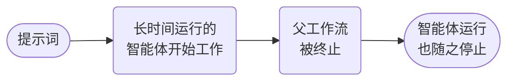

# 智能体取消



**结果：** 终止父工作流，并将取消传播到长时间运行的已部署 Conductor 智能体。

在运行此夹具之前，先启动本地 MCP Testkit 服务器并部署 cookbook 智能体。被部署的智能体使用 `gpt-4o`，仅出于本地演示目的暴露完整的 Testkit 目录；生产部署必须使用限定范围的白名单和逐工具策略。

## 可运行的定义

将其保存为 `conductor-agent-cancellation.json`：

```json
--8<-- "docs/devguide/ai/cookbook/assets/conductor-agent-cancellation.json"
```

## 注册与运行

下载 [`deploy_local_cookbook_agents.py`](assets/deploy_local_cookbook_agents.py) 到同一目录，然后：

```bash
python3 deploy_local_cookbook_agents.py deploy
python3 deploy_local_cookbook_agents.py serve
conductor workflow create conductor-agent-cancellation.json
conductor workflow start -w conductor_agent_cancellation -i '{"prompt":"Investigate a long-running incident."}'
```

`TERMINATE` 分支是有意包含在复制的源图中的。确认父工作流为 `TERMINATED`，并检查智能体执行记录以验证取消传播；不要把这次负路径执行计为一次成功的智能体动作。
