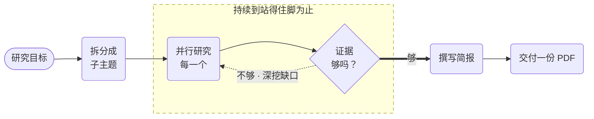

# 深度研究智能体



**结果：** 把一个研究目标变成一份可直接支撑决策的简报——拆解为子主题，用提供商原生的网页搜索并行研究，每轮之后审查覆盖度，证据站得住脚后渲染为 PDF。

## 循环即配方

单个启用网页搜索的研究提示词会返回读起来不错、但止步于模型第一轮所找到的东西。因为没有任何东西在检查，所以不存在"这太单薄了"的概念。

这个工作流把发现与评判分开，并让评判驱动下一轮：

1. **`decompose_goal`** 把目标拆分为 3–5 个可独立搜索的子主题。
2. **`prepare_research_fanout`** 用 JQ 为每个未解决的子主题构建一个 `LLM_CHAT_COMPLETE` 输入——子主题数量在运行时决定扇出的宽度。
3. **`research_subtopics`** 是针对带 `webSearch: true` 的 `LLM_CHAT_COMPLETE` 的 `FORK_JOIN_DYNAMIC`。子主题并发研究，每个都是独立的持久化、可重试任务。
4. **`review_coverage`** 运行在 `gpt-4o` 上，并明确禁止它撰写简报。它返回 `{sufficient, gaps, nextSubtopics}`。
5. 当 `sufficient` 为 false 时，`nextSubtopics` 成为下一轮的扇出——循环研究的是*缺口*，而不是再跑一遍原列表。

循环条件对两个维度都设界：

```text
$.research_loop['iteration'] < 5 && $.sufficient !== true
```

最多五轮，且 `!== true` 意味着缺失或畸形的判定不会让循环在假阳性上退出。无论循环结束时状态如何，`write_brief` 都会收到累积的证据*以及*未解决的 `gaps`，并被指示把它们带进"未决问题"章节，而不是凭自身知识去解决。一份承认自己没找到什么的简报，才是有用的输出。

## 前置条件

一个模型支持 `webSearch` 的 OpenAI 集成。PDF 渲染是内置的——`GENERATE_PDF` 不需要外部服务。

成本按 轮数 × 子主题 增长，因此这里的最坏情况是 5 × 5 = 25 次网页搜索调用加 5 次审查调用。研究调用使用 `gpt-4o-mini`；只有 `review_coverage` 和 `write_brief` 使用 `gpt-4o`。如果需要削减开支，先降低轮数上限，再考虑加宽扇出。

## 可运行的定义

将其保存为 `deep-research-agent.json`：

```json
--8<-- "docs/devguide/ai/cookbook/assets/deep-research-agent.json"
```

## 注册与运行

```bash
conductor workflow create deep-research-agent.json
conductor workflow start -w deep_research_agent --sync -i '{"goal":"Assess the market category for organic coffee in North America","audience":"engineering leadership"}'
```

在 Conductor UI 中打开 **[Executions](http://localhost:8080/executions)**，选择新的执行以查看任务图以及每个任务的输入和输出。

输出中的 `rounds` 告诉你这个目标实际需要多少工作。模糊的目标通常烧完全部五轮仍报告缺口；精确的目标一两轮就收敛。这个数字是关于问题的有用信号，而不只是关于这次运行。

## 生产注意事项

- **限制你携带的证据量。** 无限制的累积会超出上下文窗口，审查调用开始失败。
- **审查用你最好的模型。** 它是唯一决定工作是否完成的环节。
- **存储 PDF，传递 URI。** 不要把二进制文件塞进工作流状态。
- **保留来源 URL。** 六个月后无法重新推导的结论不是证据。
- **成本是 轮数 × 子主题。** 先降低轮数上限，再考虑加宽扇出。
- **网页结果是未受信任的输入。** 在传播任何受监管的内容之前，审查 Sources 章节。
- **它不发布任何东西。** 把审批放在对外交付之前。
