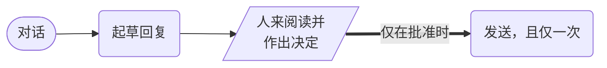

# HITL 工作流



**结果：** 模型起草一个面向客户的操作，工作流持久地暂停等待人的决定，只有显式批准才会到达发送——拒绝和超时会作为各自独立的结果被记录下来，而不是被静默地当作同意。

## 没有批准不等于批准

这个配方针对的故障模式是：工作流直接读取 `${human_decision.output.approved}` 并据此路由。如果审阅者完成任务时没有携带该字段，或者该字段以字符串 `"false"` 的形式到达，或者任务超时，真值检查就可能让操作通过。默认必须是拒绝。

`normalize_decision` 正是为此而存在的。它在进行任何路由之前，将人的载荷强制转换为严格的结构：

```text
{approved: ((.decision.approved // false) == true), approver: (.decision.approver // "unknown"), note: (.decision.note // "")}
```

缺失的字段变成 `false`。非布尔值变成 `false`。只有字面量 `true` 才是批准。随后 `SWITCH` 基于该归一化值进行路由，绝不基于人的原始输出。

三种结果都是持久的，并且在输出中都可以区分：

| 结果 | `delivery.status` |
|---|---|
| 审阅者批准 | 使用幂等键的 `sent` |
| 审阅者拒绝 | 附有其备注的 `withheld_by_reviewer` |
| 没有人及时决定 | 工作流超时；`approval.status` 保持 `pending` |

## 前置条件

一个 OpenAI 集成，以及一个用于投递的端点。`send_approved_action` 向你传入的 `deliveryUrl` 发起 POST 请求，并携带以 `actionKey` 为值的 `Idempotency-Key` 请求头——将其指向你自己的服务，该服务必须遵守这个请求头。`https://httpbin.org/post` 适用于试验运行，它会原样回显发送的内容。

`HUMAN` 任务在 86,400 秒（24 小时）的工作流中带有 20 小时的超时，这正是让真实审阅队列可行的关键。对于一个需要另一时区有人醒着才能批准的审批，1 小时的超时会在每晚过期。

## 可运行的定义

将此保存为 `hitl-approval.json`：

```json
--8<-- "docs/devguide/ai/cookbook/assets/hitl-approval.json"
```

## 注册并运行

```bash
conductor workflow create hitl-approval.json
conductor workflow start -w hitl_approved_action -i '{"customerId":"C-123","conversation":"Customer reports being charged twice for a returned order. Order 8891, two charges of $49.00 on 12 July.","actionKey":"refund-note-C-123-0001","deliveryUrl":"https://httpbin.org/post"}'
```

在 Conductor UI 中打开 **[执行](http://localhost:8080/executions)**，选择新的执行以查看任务图以及每个任务的输入和输出。

运行会在 `human_decision` 处暂停。先审阅草稿及其 `riskFlags`，然后完成该任务。在 UI 中你可以从执行视图完成它；在 OSS Conductor 上，等效的调用是（替换工作流 ID）：

```bash
curl -X POST 'http://localhost:8080/api/tasks/WORKFLOW_ID/human_decision/COMPLETED' \
  -H 'Content-Type: application/json' \
  -d '{"approved":true,"approver":"support-oncall","note":"Verified duplicate charge in the ledger."}'
```

有三种值得尝试的完成方式，因为三者都必须拒绝发送：

```bash
{"approved":false,"approver":"support-oncall","note":"Amount not verified."}   # explicit rejection
{}                                                                             # reviewer sent nothing
{"approved":"false","approver":"bot"}                                          # string, not boolean
```

每一种都会成功完成工作流，且 `delivery.status: withheld_by_reviewer`，执行中根本不存在 `send_action` 任务。成功完成但没有发送任何内容才是正确的结果，而不是失败。

## 生产环境注意事项

- **批准的必须正是发送的内容。** 批准后不要重新运行模型，否则人批准的其实是别的东西。
- **幂等键来自调用方。** 在工作流内部生成它，重试就会变成第二条消息。
- **任何不是字面量 `true` 的都是不。** 缺失的字段和字符串 `"false"` 都会导致扣留。
- **记录谁批准了，以及何时。** 对于受监管的工作，再加上策略版本和他们所看到内容的摘要。
- **约束草稿本身，而不仅仅是审阅环节。** 一小时清掉二十份草稿的审阅者不会发现编造的退款金额。
- **在构造提示前先脱敏。** 去除支付详情，以引用方式传递附件。
