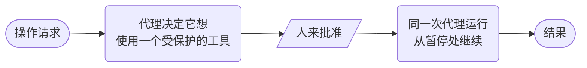

# 代理审批



**结果：** 在显式的工具审批边界处暂停一个已部署的代理，收集人的决定，然后恢复同一次代理执行。

## 前置条件与约定

启动本地 MCP Testkit 服务器并部署 cookbook 代理。输入是 `prompt`；当原生的 `request_notification` 工具需要审批时，第一个 AGENT 任务会返回 `waiting: true`。本地演示工具只记录一条通知请求——它并不证明一次外部写入。绝不在工作流输入中使用秘密。

## 可运行的定义

将此保存为 `human-approved-action.json`：

```json
--8<-- "docs/devguide/ai/cookbook/assets/human-approved-action.json"
```

## 注册并运行

```bash
conductor workflow create human-approved-action.json
conductor workflow start -w human_approved_external_action --sync -u collect_answer_ref -i '{"prompt":"Request a notification to oncall@example.com that incident INC-1001 needs attention."}'
```

只在审阅了待处理的工具请求之后，才完成 `collect_answer_ref`。在 OSS Conductor 上，使用按引用查找任务的端点，并提供代理应收到的答案：

```bash
curl -X POST 'http://localhost:8080/api/tasks/WORKFLOW_ID/collect_answer_ref/COMPLETED/sync' \
  -H 'Content-Type: application/json' \
  -d '{"answer":"approved"}'
```

## 生产环境注意事项

- **代理通过 `executionId` 恢复，** 因此批准后它无法重新规划另一个操作。
- **记录谁批准了、策略版本，以及他们所看到的内容。**
- **在换成一个可写入的工具之前，** 添加幂等键和重试前检查。
- **Testkit 工具只记录请求。** 它不能证明真实的写入可以工作。
