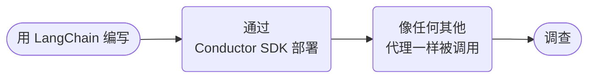

# LangChain 调查者



**结果：** 用 LangChain 编写一个权益调查者，用 Conductor SDK 部署它，并作为持久化能力调用它。

## 前置条件与编写路径

当前 Python SDK 快速入门将安装记录为 `pip install 'conductor-python[langchain]'`、`AgentRuntime` 和 `runtime.run(agent, input)`。在升级包或框架代理 API 之前，请先核对所属的 [Python SDK 框架指南](https://github.com/conductor-oss/python-sdk/blob/main/docs/agents/framework-agents.md)。

```python
from langchain.agents import create_agent

# The companion deployment provides these two real MCP adapters.
agent = create_agent(
    "openai:gpt-4o",
    tools=[list_mcp_testkit_tools, call_mcp_testkit_tool],
    system_prompt="Investigate entitlements from MCP evidence; recommend only.",
)
```

将配套的 [`deploy_local_cookbook_agents.py`](assets/deploy_local_cookbook_agents.py) 下载到工作目录；它会创建这个由 LangChain 编写的能力及其只读 fixture 工具。部署一次，并在调用父工作流之前保持工具工作者持续运行：

```bash
python3 deploy_local_cookbook_agents.py deploy
python3 deploy_local_cookbook_agents.py serve
```

输入是 `customerId` 和 `question`；输出是调查数据加代理执行 ID。给代理只读的权益工具；任何变更都必须走[人批准的对外操作](human-approved-action.md)。

## 可运行的定义

将此保存为 `langchain-entitlement-investigator.json`：

```json
--8<-- "docs/devguide/ai/cookbook/assets/langchain-entitlement-investigator.json"
```

## 注册并运行

```bash
conductor workflow create langchain-entitlement-investigator.json
conductor workflow start -w langchain_entitlement_investigator --sync -i '{"customerId":"C-123","question":"Which plan features are enabled?"}'
```

## 生产环境注意事项

- **`agentType` 是 `conductor`，而不是 `langchain`。** 由 Conductor SDK 运行它；协议不会改变。
- **在部署的代理中限制 token 数和工具调用次数，** 那里才是循环实际运行的地方。
- **传递文档引用，而不是载荷。**
- **按客户 ID 加请求 ID 核对重复运行。**
- **在提升包版本之前，先查看 SDK 源码。** 框架代理 API 会变动。
