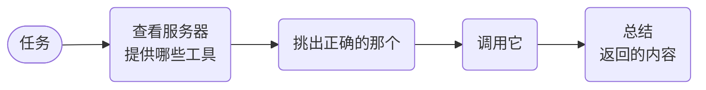

# MCP 工具调用



**结果：** 发现 MCP 服务器实际暴露了哪些工具，确定性地剔除变更型动词，让一个小模型圈出五个相关工具作为短名单，把该短名单与真正发现到的工具求交集，然后让一个能力强的模型挑一个——并且在调用发生之前再次核验这个选择。

## 工作原理

- **发现，而不是硬编码。** 工具列表在运行时读取，因此被改名的工具会大声失败，而不是静默失败。
- **剔除一切会写入的东西。** 一个普通过滤器在模型看到列表之前，就会去掉 delete/create/send 类型的工具。
- **小模型圈出五个候选，更大的模型来做挑选。** 候选更少意味着提示更便宜、选择更好。
- **工作流核验的是挑选结果，而不是提示。** 不在短名单上的工具无法被调用。

## 前置条件

一个 OpenAI 集成，以及一个 MCP 服务器。确定性的本地服务器请用 [mcp-testkit](https://pypi.org/project/mcp-testkit/)，它自带 65 个固定工具：

```bash
python -m pip install mcp-testkit
mcp-testkit --transport http
```

它监听在 `http://localhost:3001/mcp`。它的工具全部是纯只读辅助工具（`get_weather`、`math_*`、`string_*`、`conversion_*`、`validation_*`、`encoding_*`、`datetime_*`、`collection_*`），因此变更动词过滤器不会剔除其中任何一个——这正是你想要的测试服务器行为，也是为什么真正起收窄作用的是相关性短名单。

绝不把 MCP 凭证放在工作流输入中。将其作为请求头传递，并从平台的秘密存储中取值。

## 可运行的定义

将此保存为 `mcp-tool-calling.json`：

```json
--8<-- "docs/devguide/ai/cookbook/assets/mcp-tool-calling.json"
```

## 注册并运行

```bash
conductor workflow create mcp-tool-calling.json
conductor workflow start -w mcp_tool_calling --sync -i '{"mcpServerUrl":"http://localhost:3001/mcp","task":"What is the current weather in San Francisco?"}'
```

在 Conductor UI 中打开 **[执行](http://localhost:8080/executions)**，选择新的执行以查看任务图以及每个任务的输入和输出。

在 mcp-testkit 上这大约 20 秒内完成：发现 65 个工具，`excludedMutating: 0`，短名单收窄到 `get_weather`，`evidence` 携带该工具的确定性载荷（`77°F, sunny`）。检查 `shortlist` 可以看到模型被提供了哪些工具、哪些被 `rejected`，再看 `select_tool` 给出的 `reason`——两者一起构成你的审计线索，说明为什么某个特定的工具被执行了。

## 生产环境注意事项

- **读可以安全重试，写不行。** 如果你加入一个写工具，它需要幂等键和重试前检查。
- **保留原始工具结果。** 摘要是模型输出，无法审计；原始结果可以。
- **针对你的服务器收紧过滤器。** 前缀匹配是便利手段，不是保证——列出你实际允许的工具。
- **摘要不是决定。** 任何有重大影响的操作都应放在 [HITL 审批](hitl-approval.md) 之后。
- **秘密放在请求头里，绝不放在工作流输入中。** 从你的秘密存储中取值。
