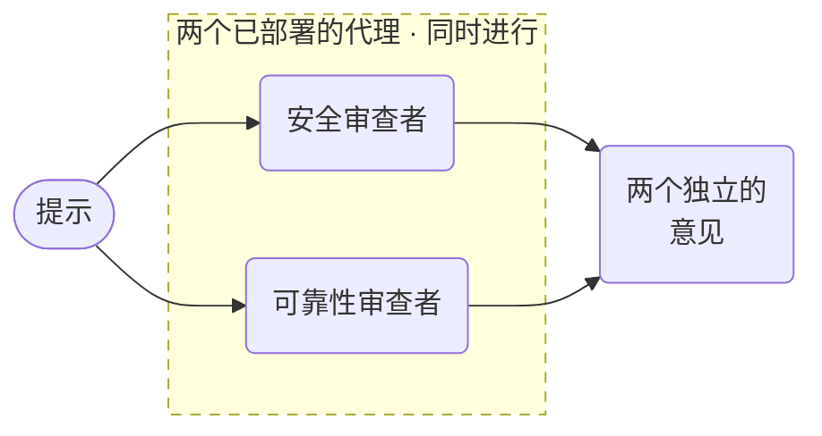

# 专家审查



**结果：** 并发地获得独立的安全与可靠性建议，然后汇聚它们持久化的结果。

## 前置条件与约定

将配套的 [`deploy_local_cookbook_agents.py`](assets/deploy_local_cookbook_agents.py) 下载到工作目录；它会连同其他 cookbook 代理一起部署并对外提供 `security-reviewer` 和 `reliability-reviewer`：

```bash
python3 deploy_local_cookbook_agents.py deploy
python3 deploy_local_cookbook_agents.py serve
```

输入是 `prompt`；输出包含两份建议。这个配方刻意没有综合或写入：在建议与操作之间保留一道人/策略的边界。

## 可运行的定义

将此保存为 `parallel-specialist-review.json`：

```json
--8<-- "docs/devguide/ai/cookbook/assets/parallel-specialist-review.json"
```

## 注册并运行

```bash
conductor workflow create parallel-specialist-review.json
conductor workflow start -w parallel_specialist_agent_review --sync -i '{"prompt":"Review this architecture proposal."}'
```

## 生产环境注意事项

- **为每个代理分别设置上限，** 以免一个专家耗尽另一个专家的预算。
- **按代理限定工具权限。** 独立的审查者不应共享触达范围。
- **保留每个执行 ID，** 并按关联 ID 核对重跑。
- **它产出的是意见，不是操作。** 在其后加一个决定步骤。
