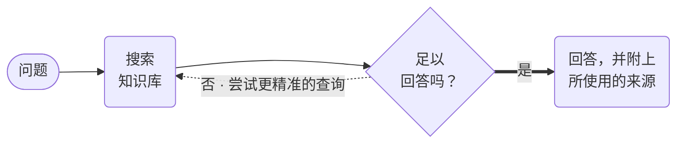

# RAG 代理



**结果：** 为一个问题检索上下文，让模型评判该上下文是否真的能回答它，不能时改写查询并重试，始终得不到依据时则拒绝回答。

## 为什么循环很重要

两步 RAG 链——先检索、再回答——完全不知道检索到的内容是否相关。模型被递上薄弱的上下文和一个问题，而它的指令告诉它去回答，于是它就回答了。这种失败是静默的，看起来与成功完全一样。

这个配方把两个职责拆开。`grade_retrieved_context` 是一个独立的调用，被明确禁止回答；它只决定证据是否充分，若不足则提出一个更好的查询措辞。随后循环用该措辞重新检索。三种结果都有可能，且三种都会被记录：

| 评判结果 | 会发生什么 |
|---|---|
| 充分 | 带引用回答，然后验证至少一个引用存在 |
| 不充分，还有重试次数 | 改写查询并再次检索 |
| 3 轮之后仍不充分 | 以 `insufficient_grounding` 和原因执行 `TERMINATE` |

第三行才是与生产环境相关的。大声失败的工作流是可以恢复的；返回一个自信却没有依据的回答的工作流则不然。

## 前置条件

一个配置好的向量数据库和一个 OpenAI 集成。建索引时与查询时的 embedding 模型必须完全一致——不同的 embedding 空间会产生无意义的相似度分数。

在运行之前先填充索引。对每个文档使用 `LLM_INDEX_TEXT` 并搭配稳定的 `docId` 和一个 `metadata` 对象，这样这个工作流返回的引用就指向后续可解析的东西：

```json
{
  "name": "index_policy_doc",
  "taskReferenceName": "index_policy_doc",
  "type": "LLM_INDEX_TEXT",
  "inputParameters": {
    "vectorDB": "REPLACE_VECTOR_DB",
    "index": "REPLACE_INDEX",
    "namespace": "REPLACE_NAMESPACE",
    "docId": "retention-policy-v4",
    "text": "REPLACE with the document body",
    "embeddingModelProvider": "openai",
    "embeddingModel": "text-embedding-3-small",
    "dimensions": 1536,
    "metadata": { "sourceVersion": "v4", "category": "policy" }
  }
}
```

把摄取放在独立的工作流中。每个问题都重建索引会浪费 embedding 开销，并让回答路径依赖写入可用性。

## 可运行的定义

将此保存为 `rag-agent.json`：

```json
--8<-- "docs/devguide/ai/cookbook/assets/rag-agent.json"
```

## 注册并运行

```bash
conductor workflow create rag-agent.json
conductor workflow start -w rag_agent --sync -i '{"question":"What is our data retention policy?","vectorDB":"REPLACE_VECTOR_DB","index":"REPLACE_INDEX","namespace":"REPLACE_NAMESPACE"}'
```

在 Conductor UI 中打开 **[执行](http://localhost:8080/executions)**，选择新的执行以查看任务图以及每个任务的输入和输出。

看看 `retrieval_loop` 迭代了多少次。一次迭代意味着第一个查询已经足够好。三次加上 `FAILED` 状态意味着你的索引不包含答案——这是关于你的语料库的真实且有用的信号，而不是工作流缺陷。

## 生产环境注意事项

- **`maxResults` 默认为 1。** 名字写错时你会静默地只检索到一个文档，看起来像是检索器很差。
- **用便宜的模型评判，用好的模型回答。** 评判每个问题最多运行三次，因此它决定了成本。
- **把引用当作契约。** 拒绝那些引用无法在你的索引中解析的回答，而不是展示它们。
- **只索引一次，放在独立的工作流中。** 每个问题都重建索引会浪费 embedding 开销，并把回答与写入可用性耦合在一起。
- **建索引与查询时使用相同的 embedding 模型。** 不同的 embedding 空间会让相似度分数失去意义。
- **以问题加索引版本作为缓存键，** 这样重新索引后的语料库会使缓存失效。
