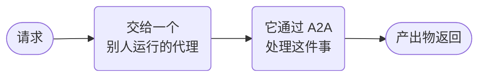

# A2A 委托



**结果：** 调用一个独立部署的 A2A 代理，同时保持持久化且可观测的工作流边界。

## 前置条件与约定

远程端点必须暴露一个兼容的 A2A Agent Card，并遵守幂等的请求 ID。输入是 `agentUrl`、`request` 和 `idempotencyKey`；输出是远程状态和产出物。`agentType: "a2a"` 选择远程协议运行时；它并不标识远程的编写框架。

## 可运行的定义

将此保存为 `remote-a2a-delegation.json`：

```json
--8<-- "docs/devguide/ai/cookbook/assets/remote-a2a-delegation.json"
```

## 注册并运行

```bash
conductor workflow create remote-a2a-delegation.json
conductor workflow start -w remote_a2a_agent_delegation --sync -i '{"agentUrl":"https://REPLACE.example/a2a","request":"Research durable execution.","idempotencyKey":"research-REPLACE"}'
```

## 生产环境注意事项

- **重试时复用同一个幂等键，** 并在再次发送之前查询远程任务。
- **把返回的内容视为不可信。** 在使用产出物之前先校验它们。
- **`pollIntervalSeconds` 控制 Conductor 轮询的频率。** 根据远程代理通常耗时来调整它。
- **把有重大影响的操作放在本地审批之后，** 而不是放在委托内部。
