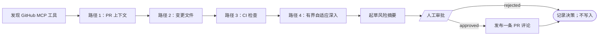

# 持久化自适应图

**构建会自适应的 agent。运行能经受住考验的图。**

自适应 agent 可以在运行时选择一条已批准的下一条路径。持久化图让这个选择成为持久化、可检查、可治理的东西，而不是单个进程内转瞬即逝的控制流。

<svg class="dag-hero" viewBox="0 0 960 500" role="img" aria-labelledby="dag-hero-title dag-hero-desc" xmlns="http://www.w3.org/2000/svg">
  <title id="dag-hero-title">带运维控制的持久化自适应图</title>
  <desc id="dag-hero-desc">agent 进行规划，以有界并行扇出运行已批准的工具，评估进度，然后循环或结束。运维控制平面提供检查、重试、审批、暂停、取消和恢复控制。</desc>
  <defs>
    <marker id="dag-hero-arrow" viewBox="0 0 10 10" refX="9" refY="5" markerWidth="7" markerHeight="7" orient="auto-start-reverse"><path d="M 0 0 L 10 5 L 0 10 z" class="dag-hero__arrowhead"/></marker>
    <marker id="dag-hero-teal-arrow" viewBox="0 0 10 10" refX="9" refY="5" markerWidth="7" markerHeight="7" orient="auto-start-reverse"><path d="M 0 0 L 10 5 L 0 10 z" class="dag-hero__arrowhead dag-hero__arrowhead--teal"/></marker>
  </defs>
  <rect width="960" height="500" rx="24" class="dag-hero__canvas"/>
  <text x="48" y="53" class="dag-hero__title" font-family="system-ui, sans-serif" font-size="25" font-weight="700">持久化自适应图</text>
  <text x="48" y="81" class="dag-hero__subtitle" font-family="system-ui, sans-serif" font-size="15">运行时选择成为持久化、可检查的执行。</text>
  <rect x="42" y="113" width="640" height="325" rx="18" class="dag-hero__zone dag-hero__zone--graph" stroke-width="2"/>
  <text x="64" y="145" class="dag-hero__zone-label dag-hero__zone-label--graph" font-family="system-ui, sans-serif" font-size="14" font-weight="700">执行图</text>
  <g font-family="system-ui, sans-serif" text-anchor="middle">
    <rect x="82" y="190" width="115" height="58" rx="10" class="dag-hero__node" stroke-width="2"/><text x="139" y="215" class="dag-hero__node-label" font-size="15" font-weight="700">规划</text><text x="139" y="234" class="dag-hero__detail" font-size="12">校验后的 JSON</text>
    <path d="M197 219 H252" class="dag-hero__arrow" stroke-width="2" marker-end="url(#dag-hero-arrow)"/>
    <rect x="258" y="165" width="170" height="110" rx="10" class="dag-hero__node" stroke-width="2"/><text x="343" y="192" class="dag-hero__node-label" font-size="15" font-weight="700">有界执行</text><text x="343" y="213" class="dag-hero__detail" font-size="12">仅已批准的工具</text><text x="343" y="234" class="dag-hero__detail" font-size="12">扇出 ≤ 3</text><text x="343" y="255" class="dag-hero__detail" font-size="12">写入前审批</text>
    <path d="M428 219 H483" class="dag-hero__arrow" stroke-width="2" marker-end="url(#dag-hero-arrow)"/>
    <rect x="489" y="190" width="115" height="58" rx="10" class="dag-hero__node" stroke-width="2"/><text x="546" y="215" class="dag-hero__node-label" font-size="15" font-weight="700">评估</text><text x="546" y="234" class="dag-hero__detail" font-size="12">继续或结束</text>
    <path d="M546 248 V328 H139 V254" class="dag-hero__loop" stroke-width="2" marker-end="url(#dag-hero-teal-arrow)"/>
    <text x="342" y="353" class="dag-hero__loop-note" font-size="13" font-weight="700">对每个决策和结果做检查点</text>
    <path d="M604 219 H645" class="dag-hero__arrow" stroke-width="2" marker-end="url(#dag-hero-arrow)"/>
    <circle cx="658" cy="219" r="35" class="dag-hero__node" stroke-width="2"/><text x="658" y="224" class="dag-hero__node-label" font-size="14" font-weight="700">完成</text>
  </g>
  <rect x="714" y="113" width="204" height="325" rx="18" class="dag-hero__zone dag-hero__zone--control" stroke-width="2"/>
  <text x="738" y="145" class="dag-hero__zone-label dag-hero__zone-label--control" font-family="system-ui, sans-serif" font-size="14" font-weight="700">控制平面</text>
  <g class="dag-hero__control-chips" stroke-width="1.5" font-family="system-ui, sans-serif" font-size="14" text-anchor="middle">
    <rect x="739" y="168" width="70" height="38" rx="8"/><rect x="822" y="168" width="70" height="38" rx="8"/>
    <rect x="739" y="219" width="70" height="38" rx="8"/><rect x="822" y="219" width="70" height="38" rx="8"/>
    <rect x="739" y="270" width="70" height="38" rx="8"/><rect x="822" y="270" width="70" height="38" rx="8"/>
  </g>
  <g class="dag-hero__control-labels" font-family="system-ui, sans-serif" font-size="13" font-weight="650" text-anchor="middle">
    <text x="774" y="192">检查</text><text x="857" y="192">重试</text><text x="774" y="243">审批</text><text x="857" y="243">暂停</text><text x="774" y="294">取消</text><text x="857" y="294">恢复</text>
  </g>
  <path d="M714 326 H682" class="dag-hero__control-arrow" stroke-width="2" marker-end="url(#dag-hero-arrow)"/>
  <text x="816" y="357" class="dag-hero__control-note" font-family="system-ui, sans-serif" font-size="12" text-anchor="middle">可观察状态、策略边界，</text>
  <text x="816" y="376" class="dag-hero__control-note" font-family="system-ui, sans-serif" font-size="12" text-anchor="middle">持久化恢复</text>
</svg>

旗舰示例是一个**受治理的 GitHub PR 评审器**。在请人发布一条评审摘要之前，它先运行四个持久化证据路径：

1. 读取 PR 上下文和意图。
2. 检查变更文件面。
3. 检查 CI check 运行。
4. 用前三个持久化评估来选择一两个已批准的深入读取——diff、reviews 或 review comments——并以有界并行运行。

每个路径都会在工作流变量中产出一个紧凑、经过校验的评估。最终评论从那个持久化台账中合成，而不是来自无界的聊天历史。

## 构建受治理的图

完整可运行的定义是[AI 示例目录](https://github.com/conductor-oss/conductor/tree/main/ai/examples)中的 `35-governed-adaptive-agent.json`。



该图只使用内置任务：`LIST_MCP_TOOLS`、`CALL_MCP_TOOL`、`LLM_CHAT_COMPLETE`、`JSON_JQ_TRANSFORM`、`FORK_JOIN_DYNAMIC`、`JOIN`、`HUMAN`、`SWITCH`、`SET_VARIABLE` 和 `DO_WHILE`。它没有 `SIMPLE` 任务，因此无需注册自定义 worker。

### 前置条件

使用一个可通过 HTTP 访问、已认证的 GitHub MCP 端点，它暴露 `pull_request_read` 和 `add_issue_comment`。官方 GitHub MCP server 记录了这两个工具及可用的 `pull_request_read` 方法，包括 `get`、`get_files`、`get_check_runs`、`get_diff`、`get_reviews` 和 `get_review_comments`。[GitHub MCP Server](https://github.com/github/github-mcp-server)

把它跑在一个你自有的 fixture PR 上。GitHub 凭证要放在工作流输入和源码控制之外。本例把 `workflow.env.GH_TOKEN` 读入 MCP `Authorization` 头。使用默认的环境变量支撑配置时，在**Conductor 服务端进程**启动之前设置 `CONDUCTOR_ENV_GH_TOKEN`（或配置等效的服务端环境提供器）。不要把 token 加为 `workflow.input.githubToken`——工作流输入会随执行一起被记录。需要更强的密钥隔离时，改用注入凭证的 MCP 网关或服务端密钥提供器；`workflow.env` 在任务被调度时是急切（eager）解析的。

### 运行它

```shell
conductor workflow create ai/examples/35-governed-adaptive-agent.json
conductor workflow start -w governed_github_pr_reviewer -i '{
  "mcpServerUrl": "https://your-authenticated-github-mcp.example/mcp",
  "owner": "your-org",
  "repo": "pr-review-fixture",
  "pullNumber": 42,
  "llmProvider": "openai",
  "model": "gpt-4o-mini"
}'
```

运行在第四个路径后暂停在人工审批任务处。检查拟发布的评论和持久化台账，然后在 OSS Conductor 上用以下命令完成该任务：

```shell
conductor task update-execution \
  --workflow-id <workflow-id> \
  --task-ref-name approve_pr_comment \
  --status COMPLETED \
  --output '{"approved":true,"reviewer":"operator@example.com","feedback":"Approved after review"}'
```

要拒绝该评论，发送 `{"approved":false,"reviewer":"operator@example.com","feedback":"Needs manual follow-up"}`。拒绝会以一个持久化决策完成工作流，并且不调用 GitHub。

## 为什么这个图是自适应的——而且仍受治理

前三个路径被有意设计为不可协商。它们让每次执行都可比较，并保证示例可见地完成四个循环迭代。第四个路径是自适应的：模型只能从固定的深入集合中选择一两个条目，JQ 防护在 `FORK_JOIN_DYNAMIC` 创建 `CALL_MCP_TOOL` 任务之前对输入做校验、去重和限上。

这个区分很重要。agent 在运行时选择已批准的路径和扇出；它不修改运行中的工作流快照，也不发明新能力。PR 文本、评论和 diff 在每个 LLM prompt 中都只作为不可信证据处理，绝不当作指令。

## 安全与持久化模型

| 关注点 | 示例中的护栏 |
|---|---|
| 能力缺失 | 循环开始前，工具发现会核验两个必需的 GitHub MCP 工具。 |
| 失控 agent | `DO_WHILE` 固定为四次迭代；深入扇出上限为两次调用；工作流有 20 分钟超时。 |
| 超大上下文 | 每个 MCP 结果都被持久化保留，但在 LLM 评估之前缩减为有界的证据摘录。 |
| 畸形模型输出 | 无效 JSON 会在 LLM 任务处失败并重试；可解析但无效的评估通过 JQ 契约防护变成显式的未知结果。无效的终稿在审批前失败关闭。 |
| 外部写入 | `HUMAN` 任务必须返回 `approved: true`，`add_issue_comment` 才能运行。 |
| 重复评论 | 生成的评论包含工作流 ID 标记；图在发布前检查现有 PR 评论是否有该标记。 |
| 模糊的写入失败 | 评论创建没有幂等键，因此其重试次数为零。通过搜索标记来核对模糊的失败；不要盲目重试写入。 |
| 取消 | 在已批准的写入前终止不会产生评论。进行中的写入期间取消，同样需要基于标记的核对。 |

评审器有意保留全部四个迭代。不要在这里设置 `keepLastN`：`keepLastN` 会删除较旧的循环输出和任务历史，对于短的审计轨迹这是错误的取舍。对于长循环，只有在该历史丢失可接受时才使用它。

## 恢复与运维

- 基础设施恢复和常规的任务级重试会保留已完成的上游任务。失败的读取和 LLM 调用有有界的重试策略。
- 重试失败的 `DO_WHILE` 则不同：它会重启该循环的迭代历史。设计更长的循环时，使用录制的证据台账和幂等的外部接口。
- 从 UI 或 CLI 暂停、恢复、检查或终止一次执行。输出暴露 `passesCompleted`、证据台账、风险级别、审批决策和发布状态。

## 下一步

- **[生产 Agent 架构](production-agent-architecture.md)**——把这个受治理的图带过评估、部署、恢复和运维。
- **[生产 Agent 架构](production-agent-architecture.md)**——关于重试、记忆、等待和补偿的更广泛架构。
- **[失败语义](failure-semantics.md)**——任务重试、至少一次投递、等待和循环失败行为。
- **[MCP 指南](mcp-guide.md)**——从工作流配置和调用 MCP 工具。
- **[JSON + 代码原生工作流编排](../../architecture/json-native.md)**——快照、版本化，以及安全的运行时生成定义。
