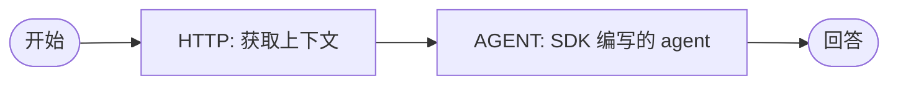

# 构建你的第一个 Agent 工作流图

<section class="integration-hero integration-hero--first-agent" aria-label="Build your first agentic workflow graph">
  <p>一个 <strong>Agent 工作流图</strong>是把 agent 作为其中一个步骤的工作流。agent 负责推理，工作流负责其周围的一切：收集上下文、分支、重试和审批。在本页中，你将构建最小的可用版本：一个 HTTP 任务获取上下文，一个可复用的 <code>AGENT</code> 任务把它传递给你用 SDK 部署的 agent。</p>
  <div class="integration-action-grid integration-action-grid--three">
    <a class="integration-action-card" href="#step-1-build-and-deploy-an-agent-with-the-sdk">
      <span class="integration-action-card__title">编写 agent</span>
      <span>使用 SDK 创建并部署一个可复用的 Conductor Agent。</span>
    </a>
    <a class="integration-action-card" href="#step-2-create-the-agentic-workflow-graph">
      <span class="integration-action-card__title">组合工作流图</span>
      <span>在同一个工作流中使用一个 HTTP 任务和一个 <code>AGENT</code> 任务。</span>
    </a>
    <a class="integration-action-card" href="#step-3-register-and-run-the-graph">
      <span class="integration-action-card__title">运行与检视</span>
      <span>在 Conductor 中看到每个步骤、重试和输出。</span>
    </a>
  </div>
</section>



这是有用的职责划分：

- **SDK agent：** Conductor Agent 或框架 agent 的推理、工具和模型行为。
- **工作流图：** 上下文收集、分支、重试、人工关卡、扇出/扇入、定时任务和取消。

## 步骤 1：使用 SDK 构建并部署 agent

使用 Conductor Agent SDK 路径创建你的可复用 agent。在交互式开发过程中使用 `run`；对于将被其他工作流调用的图，使用 `deploy`，并通过 `serve` 保持所需的工作者进程可用。

从以下经过维护、可直接运行的 SDK 路径之一开始：

- [运行你的第一个 Conductor Agent](../../quickstart/first-agent.md) — Python 示例；Conductor Agents 还支持 Java、TypeScript/JavaScript 和 C#。
- [框架 Agent 快速入门](../../quickstart/framework-agents.md) — OpenAI Agents、Google ADK、LangChain/LangChain4j、LangGraph/LangGraph4j 以及 Vercel AI SDK。
- [框架 Agents](agent-framework-recipes.md) — 每个框架受支持的 SDK、生命周期和可运行示例。

对于本教程，部署一个名为 `greeter` 的 agent。该 agent 接收一个 prompt 并返回简洁的回答。框架代码应放在受维护的 SDK 示例中；下面的工作流只需要稳定的已部署 agent 契约。

### 使用 Python Agent SDK 定义并部署 `greeter`

安装 SDK 并将其指向你的本地服务器：

```shell
pip install conductor-python
export CONDUCTOR_SERVER_URL=http://localhost:8080/api
export CONDUCTOR_AGENT_LLM_MODEL=openai/gpt-4o-mini
```

在 Conductor 服务器上配置模型提供方的凭据。然后把下面代码保存为 `greeter.py`，并在部署步骤中运行一次：

```python
from conductor.ai.agents import Agent, AgentRuntime

greeter = Agent(
    name="greeter",
    model="openai/gpt-4o-mini",
    instructions="You are a friendly assistant. Keep responses brief.",
)

if __name__ == "__main__":
    with AgentRuntime() as runtime:
        runtime.deploy(greeter)
```

在长生命周期的工作者进程中保持 agent 可用：

```python
from conductor.ai.agents import AgentRuntime
from greeter import greeter

with AgentRuntime() as runtime:
    runtime.serve(greeter)
```

`deploy` 会注册可复用的 `greeter` 图而不执行它；`serve` 会运行所需的工作者进程，直到被中断。对于一次性的交互式运行，把 `deploy` 换成 `runtime.run(greeter, "Say hello.")`。

!!! note "使用正确的 `agentType`"
    SDK 编写的 Conductor Agent 使用 `agentType: "conductor"`。A2A 模式（`agentType: "a2a"`）用于调用远程的 Agent2Agent 服务；它不会选择 LangChain、OpenAI Agents 或其他框架。

## 步骤 2：创建 Agent 工作流图

把此定义保存为 `first_agentic_graph.json`。公开的 HTTP 任务让这个图容易理解和运行；`AGENT` 任务通过已部署的 SDK agent 把获取到的上下文变成回答。

```json
{
  "name": "first_agentic_graph",
  "description": "Fetch public context, then ask a deployed Conductor Agent to explain it",
  "version": 1,
  "schemaVersion": 2,
  "inputParameters": ["question"],
  "tasks": [
    {
      "name": "fetch_example_context",
      "taskReferenceName": "fetch_context",
      "type": "HTTP",
      "inputParameters": {
        "http_request": {
          "uri": "https://jsonplaceholder.typicode.com/todos/1",
          "method": "GET"
        }
      }
    },
    {
      "name": "ask_greeter",
      "taskReferenceName": "ask_agent",
      "type": "AGENT",
      "inputParameters": {
        "agentType": "conductor",
        "name": "greeter",
        "prompt": "Question: ${workflow.input.question}\n\nContext fetched by the workflow: ${fetch_context.output.response.body.title}",
        "pollIntervalSeconds": 5
      }
    }
  ],
  "outputParameters": {
    "context": "${fetch_context.output.response.body}",
    "answer": "${ask_agent.output.text}",
    "agentExecutionId": "${ask_agent.output.executionId}"
  }
}
```

### 这个图做了什么

| 步骤 | 类型 | 为什么属于图中 |
|---|---|---|
| `fetch_context` | `HTTP` | 在 agent 运行之前获取上下文。你可以把它替换成你的 API、数据库工作者、搜索或检索步骤。 |
| `ask_agent` | `AGENT` | 调用已部署的 SDK 编写的 `greeter` agent，并记录它的子执行 ID、状态、文本和结构化输出。 |

`AGENT` 任务按 `name` 启动已部署的 agent。设置 `version` 可以固定 agent 版本；省略它则使用最新的部署。完成时，其输出包含 `executionId`、`agentName`、`state`、`text`，以及当 agent 提供了结构化 `output` 时包含该 `output`。

## 步骤 3：注册并运行这个图

注册工作流，然后同步运行它：

```shell
conductor workflow create first_agentic_graph.json

curl -s -X POST 'http://localhost:8080/api/workflow/execute/first_agentic_graph/1' \
  -H 'Content-Type: application/json' \
  -d '{
    "question": "What does this fetched task ask someone to do?"
  }' | jq .
```

或者使用 CLI：

```shell
conductor workflow start -w first_agentic_graph --sync \
  --input '{"question":"What does this fetched task ask someone to do?"}'
```

打开 [http://localhost:8080](http://localhost:8080) 来检视这个图。你会看到 HTTP 响应、`AGENT` 任务的子执行 ID 和最终回答，它们作为独立的持久化记录存在。

## 你构建了什么

你现在拥有了一个把确定性工作流工作与 agent 推理结合起来的 Agent 工作流图：

- 在 agent 启动之前获取上下文。
- 把可复用的、SDK 编写的 agent 作为一个工作流步骤来调用。
- 独立地检视和重试 HTTP 步骤与 agent 步骤。
- 把确定性的上下文和 agent 的回答都作为稳定的工作流输出契约返回。

从这里开始，围绕同一个 agent 添加普通的 Conductor 能力：`HUMAN` 审批关卡、`SWITCH` 路由、使用 `FORK_JOIN` 的并行专家 agent、定时任务，或取消传播。

## 后续步骤

- [Conductor Agents](conductor-agents.md) — 完整的 `AGENT` 输入、输出、等待/恢复、超时和取消契约。
- [框架 Agents](agent-framework-recipes.md) — 为你的框架选择受支持的 Conductor SDK。
- [Human-in-the-Loop](human-in-the-loop.md) — 暂停图以供审阅，并安全地恢复 agent。
- [A2A 集成](a2a-integration.md) — 使用远程 A2A agent 代替 SDK 编写的 Conductor Agent。
