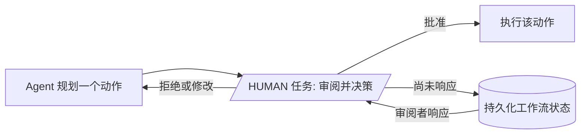

# Human-in-the-loop

<section class="integration-hero integration-hero--hitl" aria-label="Human-in-the-loop">
  <p><strong>Human-in-the-loop</strong>（人在回路）是指在原本自动化的运行过程中，由人做出某个决策：批准一个高风险动作、审阅一份草稿，或补充缺失的输入。在 Conductor 中，暂停是一个工作流任务。执行在该任务处停下，完整状态被保留下来，等待审阅者响应，然后恢复同一次运行 — 无论答案是几秒后还是几天后到达。</p>
  <div class="integration-action-grid integration-action-grid--three">
    <a class="integration-action-card" href="#pre-execution-review">
      <span class="integration-action-card__title">行动前审批</span>
      <span>在 agent 提议的动作改变现实世界之前审阅它。</span>
    </a>
    <a class="integration-action-card" href="#conditional-post-execution-review">
      <span class="integration-action-card__title">选择性升级</span>
      <span>仅对高风险、低置信度或敏感的结果要求审阅。</span>
    </a>
    <a class="integration-action-card" href="#llm-as-judge-automated-review">
      <span class="integration-action-card__title">自动化初审</span>
      <span>使用 LLM 评审把例外情况路由给人工决策。</span>
    </a>
  </div>
</section>

生产级 agent 需要监督。Conductor 的 `HUMAN` 任务是一次持久化暂停 — 工作流停止、持久化其状态，只有当人类通过 Task Update API 响应时才恢复。这次暂停可以熬过服务器重启、部署和基础设施变更。无论审阅者是 5 秒还是 5 天后响应，工作流状态都会被保留，执行会精确地从它停下的地方恢复。

Conductor 支持两种截然不同的人工监督模式，另外还有 LLM-as-judge 用于自动化评审。




## 执行前审阅

LLM 规划一个动作，人类在它执行**之前**审阅它。没有审批，agent 无法继续。

```json
[
  {
    "name": "plan_action",
    "type": "LLM_CHAT_COMPLETE",
    "taskReferenceName": "plan",
    "inputParameters": {
      "llmProvider": "anthropic",
      "model": "claude-sonnet-4-20250514",
      "messages": [
        { "role": "user", "message": "Decide what action to take for: ${workflow.input.task}" }
      ]
    }
  },
  {
    "name": "human_approval",
    "type": "HUMAN",
    "taskReferenceName": "approval",
    "inputParameters": {
      "plannedAction": "${plan.output.result}",
      "reason": "Review before executing tool call"
    }
  },
  {
    "name": "execute_action",
    "type": "CALL_MCP_TOOL",
    "taskReferenceName": "execute",
    "inputParameters": {
      "mcpServer": "${workflow.input.mcpServerUrl}",
      "method": "${plan.output.result.method}",
      "arguments": "${plan.output.result.arguments}"
    }
  }
]
```

当动作有现实世界后果（发送邮件、修改数据、进行购买）且你希望在任何事情发生之前有人工关卡时，使用此模式。


## 有条件的执行后审阅

工具执行，但结果**仅在满足条件时**才送给人工审阅 — 例如置信度低、金额超过阈值，或输出涉及敏感数据时。

```json
[
  {
    "name": "execute_action",
    "type": "CALL_MCP_TOOL",
    "taskReferenceName": "execute",
    "inputParameters": {
      "mcpServer": "${workflow.input.mcpServerUrl}",
      "method": "${workflow.input.method}",
      "arguments": "${workflow.input.arguments}"
    }
  },
  {
    "name": "check_if_review_needed",
    "type": "SWITCH",
    "taskReferenceName": "review_gate",
    "evaluatorType": "javascript",
    "expression": "($.execute.output.confidence < 0.8 || $.execute.output.amount > 1000) ? 'needs_review' : 'auto_approve'",
    "decisionCases": {
      "needs_review": [
        {
          "name": "human_review",
          "type": "HUMAN",
          "taskReferenceName": "review",
          "inputParameters": {
            "toolResult": "${execute.output}",
            "reason": "Low confidence or high-value action"
          }
        }
      ]
    },
    "defaultCase": []
  }
]
```

当大多数动作可以安全地自动批准、但某些条件需要人工监督时，使用此模式。`SWITCH` 任务评估条件；`HUMAN` 任务只在需要时触发。


## LLM-as-judge：自动化评审

除了人类审阅者（或作为其补充），你可以添加一个 LLM 任务来评估另一个 LLM 或工具调用的输出。这对质量检查、安全审查，或在继续之前校验结构化输出很有用。

```json
[
  {
    "name": "generate_response",
    "type": "LLM_CHAT_COMPLETE",
    "taskReferenceName": "response",
    "inputParameters": {
      "llmProvider": "anthropic",
      "model": "claude-sonnet-4-20250514",
      "messages": [
        { "role": "user", "message": "Draft a customer reply for: ${workflow.input.complaint}" }
      ]
    }
  },
  {
    "name": "judge_response",
    "type": "LLM_CHAT_COMPLETE",
    "taskReferenceName": "judge",
    "inputParameters": {
      "llmProvider": "openai",
      "model": "gpt-4o",
      "messages": [
        {
          "role": "system",
          "message": "You are a quality reviewer. Evaluate the response for tone, accuracy, and policy compliance. Respond with JSON: {\"approved\": true/false, \"reason\": \"...\"}"
        },
        {
          "role": "user",
          "message": "Customer complaint: ${workflow.input.complaint}\n\nDraft response: ${response.output.result}"
        }
      ],
      "temperature": 0.1
    }
  },
  {
    "name": "check_approval",
    "type": "SWITCH",
    "taskReferenceName": "gate",
    "evaluatorType": "javascript",
    "expression": "$.judge.output.result.approved ? 'approved' : 'rejected'",
    "decisionCases": {
      "rejected": [
        {
          "name": "escalate_to_human",
          "type": "HUMAN",
          "taskReferenceName": "escalation",
          "inputParameters": {
            "draftResponse": "${response.output.result}",
            "judgeReason": "${judge.output.result.reason}"
          }
        }
      ]
    },
    "defaultCase": []
  }
]
```

**会发生什么：**

1. 第一个 LLM 生成响应。
2. 第二个 LLM（可能是不同的提供方或模型）从质量、语气或政策合规的角度审阅它。
3. 如果通过，工作流继续。如果被拒绝，则升级到 `HUMAN` 任务，并附上评审者的推理。

生成和审阅可以使用不同的模型 — 例如用快速模型起草、用能力更强的模型评审。你也可以串联多个评审者，或者把 LLM-as-judge 与人工审阅组合成最终关卡。由于每个 LLM 调用都是独立的持久化任务，即使评审或人工审阅步骤失败，生成也不会重跑。


## 组合模式

这些模式可以自然地组合。一个工作流可以同时使用全部三种：

1. **LLM-as-judge** 自动筛查每一个输出。
2. **条件式 HITL** 仅在评审拒绝或置信度低时升级到人类。
3. **执行前审阅** 无论评审结果如何，都为高风险动作把关。

由于每个审阅步骤都是独立的持久化任务，即使某个审阅步骤失败或耗时，上游工作也不会重复。那个花了 10 秒、消耗了 token 的 LLM 生成会被保留 — 只需要做出审阅决策。


## 后续步骤

- **[生产级 Agent 架构](production-agent-architecture.md)** &mdash; 把审批连接到治理、评估、恢复和运维。
- **[生产级 Agent 架构](production-agent-architecture.md)** &mdash; 在生产级 agent 边界内的审批、持久化、恢复与多 agent 组合。
- **[动态工作流](dynamic-workflows.md)** &mdash; Agent 循环、动态工作流生成与工具使用示例。
- **[HUMAN 任务参考](../../documentation/configuration/workflowdef/systemtasks/human-task.md)** &mdash; HUMAN 系统任务的完整配置选项。
