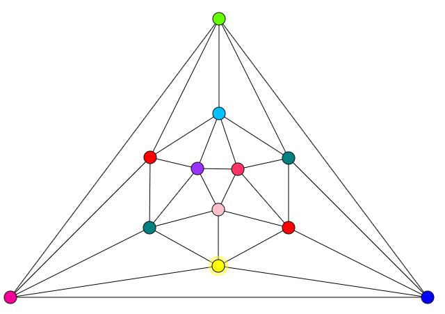
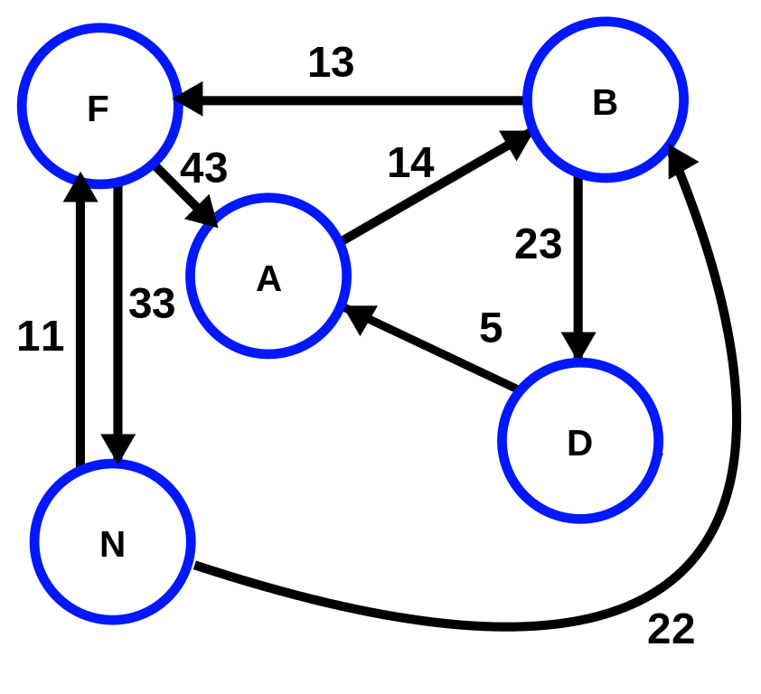
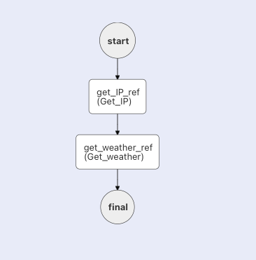
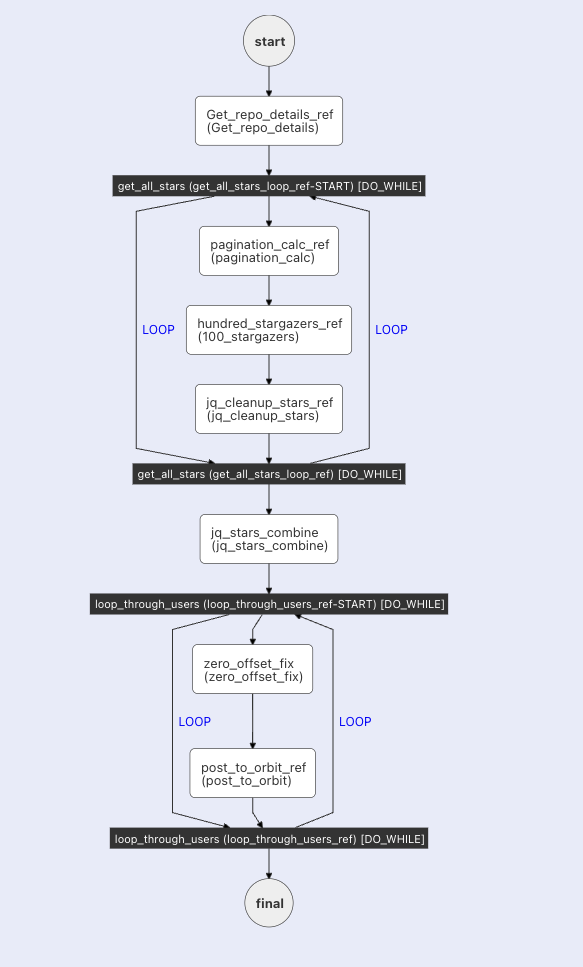

# 有向无环图（DAG）

所有 Conductor 工作流都是有向无环图（DAG）。有向无环图（DAG）是一组顶点，其连接是单向的且没有任何重复。DAG 工作流只能"向前移动"，无法重做某一步（或一系列步骤）。

下面是对 DAG 含义的逐词拆解：

- **图（Graph）**

    对 DAG 而言，图指的是"一组顶点（或点）和边（或线）的集合，表示顶点之间的连接关系。"

    

    想象上面图中每个顶点都是一个微服务。这些线表示每个微服务之间的依赖关系。然而，这个图不是有向图，因为每条依赖都没有方向。

- **有向（Directed）**

    有向图意味着每条连接都有方向。例如，下面这个图就是有向的：

    

    每条线都有一个方向。在上面例子中，点 N 可以直接到达 B，但 B 不能直接到达 N。

- **无环（Acyclic）**

    无环意味着没有循环或成环的路径。上面所示的例子包含有向环，例如 A -> B -> D -> A。相比之下，有向无环图只能从某个点开始，并在另一个不同的点结束（A -> B -> D）。

## 作为 DAG 的工作流

由于 Conductor 工作流是一系列只能按特定方向连接、不能成环的任务，所以它就是一个有向无环图：

任务的流向在一个名为工作流定义的 JSON 文件的 `tasks` 数组中指定，它也可以用代码编写（Python、Java、JavaScript、C#、Go、Clojure）。

### 工作流包含循环还能是 DAG 吗？

可以。以以下包含 Do While 循环的 Conductor 工作流为例：

这个工作流仍然是 DAG，因为循环只是对重复运行同一任务多个实例的简化表示。例如，如果上面工作流中的第 2 个循环运行三次，那么工作流路径将是：

1. zero_offset_fix_1
2. post_to_orbit_ref_1
3. zero_offset_fix_2
4. post_to_orbit_ref_2
5. zero_offset_fix_3
6. post_to_orbit_ref_3

路径朝着不同的任务实例向前延伸，每个实例都有自己唯一的输入和输出。Do While 循环只是让表示这条路径变得更加容易。
