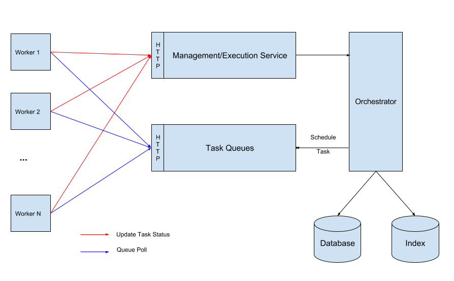

# 架构概览

下图展示了 Conductor 系统架构的概览：

在 Conductor 中，工作流运行在工作者-任务队列（worker-task queue）架构上，每种任务类型（HTTP、Event、Wait、*example_simple_task* 等）都有自己的专用任务队列。Conductor 核心编排引擎的关键组件包括：

* **状态机评估器（State machine evaluator）**——通过将任务调度到相应队列，并在工作者轮询时将其分派给活跃工作者来编排工作流。监控每个任务的状态，确保它按需完成、重试或失败。
* **任务队列（Task queues）**——为每种任务类型提供的分布式队列，任务按先进先出（FIFO）的方式完成。
* **任务工作者（Task workers）**——通过 HTTP 或 gRPC 向 Conductor 服务器轮询任务、执行任务，并向服务器更新任务状态。每个工作者负责执行一种特定的任务类型。
* **数据存储（Data stores）**（默认 Redis）——高可用的持久化存储，维护工作流和任务的元数据、任务队列以及执行历史。
* **API**——用于以编程方式访问 Conductor 服务器的 REST API。

默认情况下，Conductor 使用 Redis 作为数据存储，并使用 Elasticsearch 作为其索引后端。这些[存储层是可插拔的](../../documentation/advanced/extend.md)，让你可以使用替代的后端和队列服务提供商。

## 任务执行

采用工作者-任务队列架构，Conductor 根据任务类型把任务调度并分派到其指定的任务队列。Conductor 遵循基于 RPC 的通信模型，任务工作者运行在与服务器分离的机器上，通过基于 HTTP 的端点与服务器通信。

工作者采用轮询模型来管理其指定的队列，并向 Conductor 更新任务状态。

### 工作者-服务器轮询机制

每个工作者事先声明它能执行哪些任务。在运行时，任务工作者轮询其指定的任务队列，以接收并执行已调度的工作。Conductor 把任务输入传递给工作者执行，并收集任务输出，按照工作流定义继续该过程。

默认情况下，工作者每 100ms 无限轮询 Conductor。每种工作者类型的轮询间隔值可以根据工作负载等因素相应调整。以下是轮询机制的细节：

1. 应用通过与 Conductor 交互来启动一个工作流执行，Conductor 返回一个 workflow（执行）ID。它可以用于跟踪工作流的进度并管理其执行。
2. Conductor 把工作流中的第一个任务调度到其任务队列。
3. 负责执行工作流中第一个任务的工作者正在通过 HTTP 或 gRPC 轮询 Conductor 以获取要执行的任务。当一个任务被调度时，Conductor 把它发送给下一个可用工作者，该工作者随后执行所需的工作。
4. 工作者定期把任务状态返回给 Conductor（例如 IN PROGRESS、FAILED、COMPLETED 等）。
5. 工作流实例中的第一个任务完成后，工作者把任务输出返回给服务器，Conductor 随即调度下一批要执行的任务。

Conductor 管理并维护工作流状态，跟踪哪些任务已完成、哪些仍在等待。这确保了工作流被正确执行，每个任务都在恰当的时刻被精确触发。

应用可以随时随地使用 workflow ID 检查 Conductor 服务器上的工作流状态。这对于异步或长生命周期工作流尤其有用，因为它允许应用监控工作流的进度并採取适当行动，例如在需要时暂停或终止工作流。
