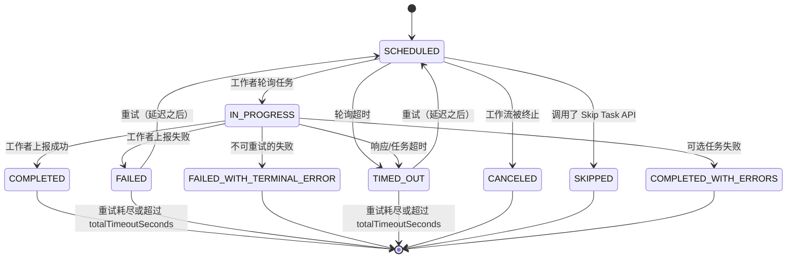
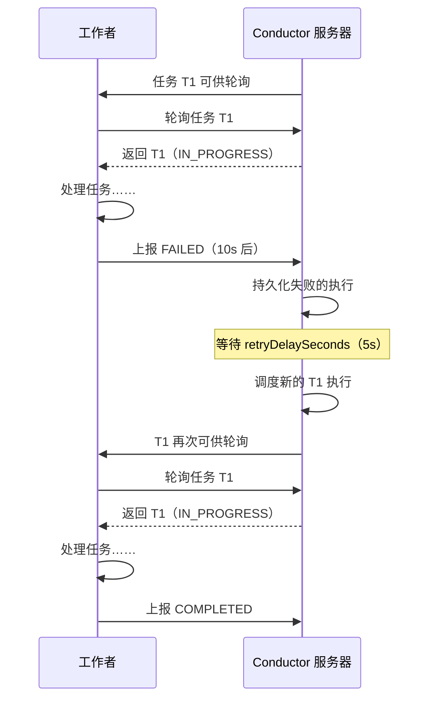
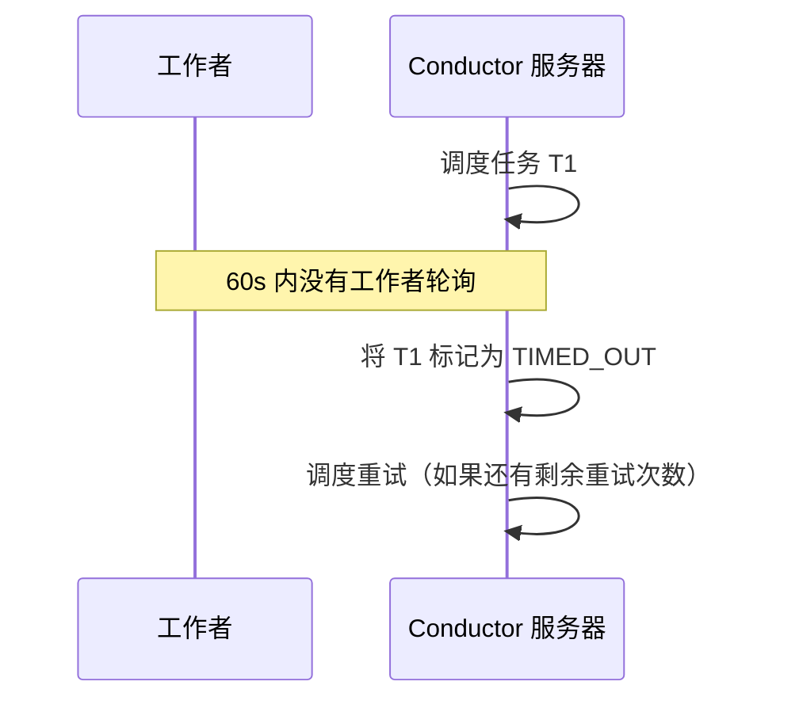
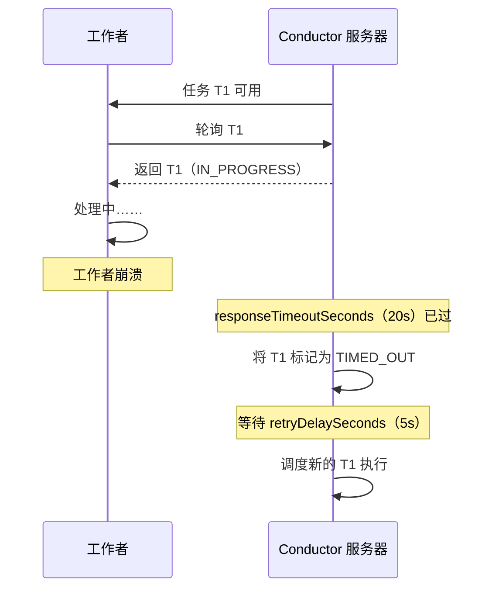
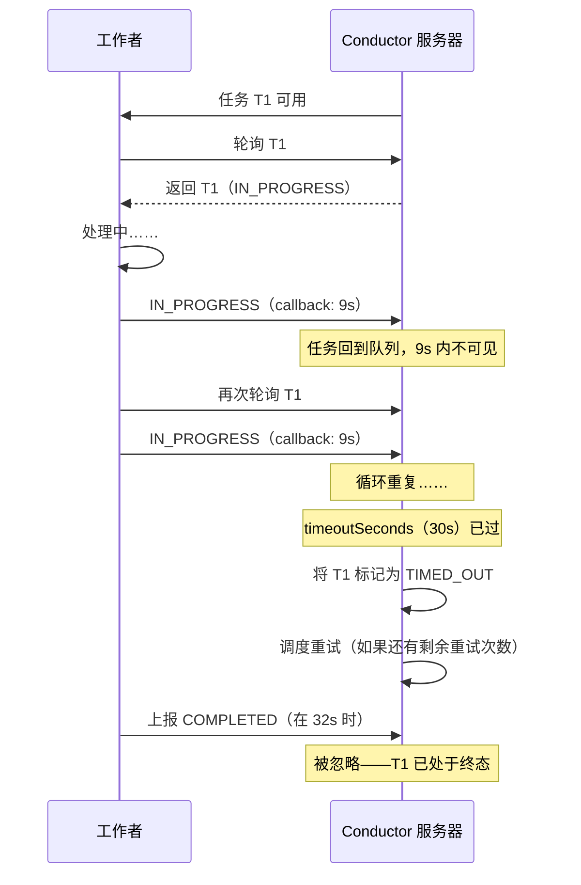
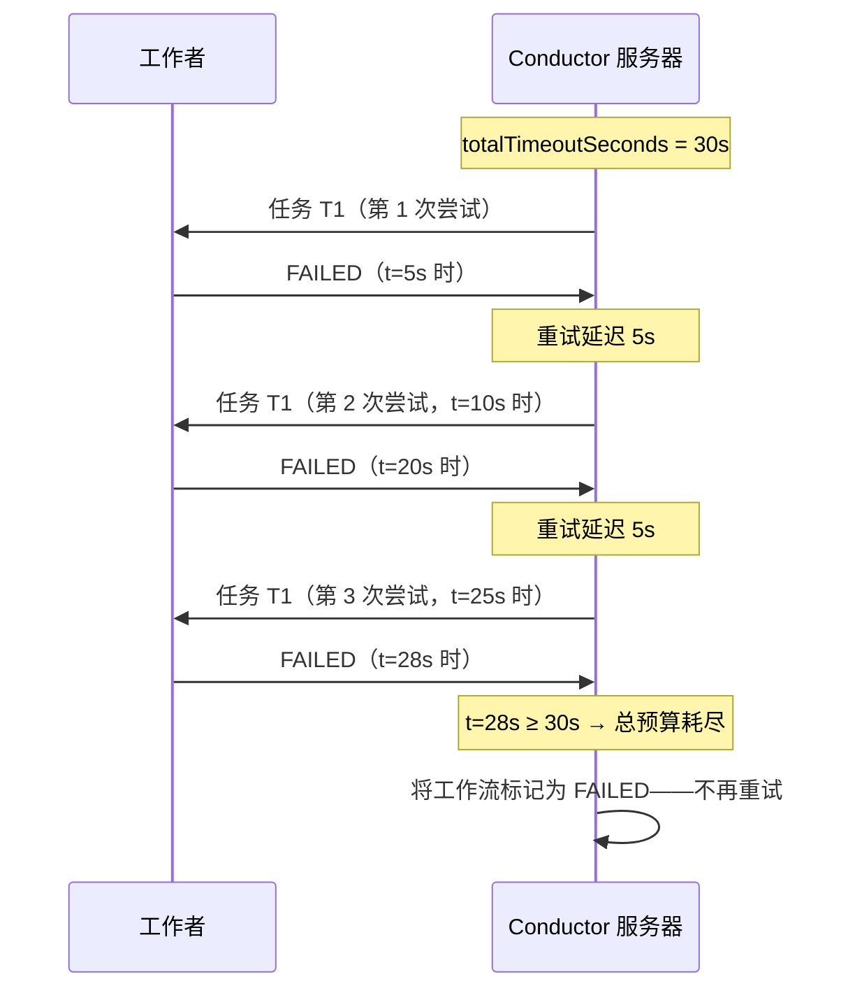

# 任务生命周期

在工作流执行期间，每个任务都会经历一系列状态的转换。理解这些转换是正确配置重试、超时和错误处理的关键。

## 状态图

每个任务进入队列时都从 `SCHEDULED` 状态开始。工作者轮询会将其移到 `IN_PROGRESS`，成功的结果则将其移到 `COMPLETED`。其他转换覆盖失败场景：`FAILED` 和 `TIMED_OUT` 的任务会返回 `SCHEDULED` 进行重试，直到重试次数耗尽，其余所有状态都是终态。

## 任务状态 { #task-statuses }

| 状态 | 说明 |
| :--- | :--- |
| `SCHEDULED` | 任务在队列中，等待工作者轮询。 |
| `IN_PROGRESS` | 工作者已领取该任务，正在执行。 |
| `COMPLETED` | 任务成功完成。 |
| `FAILED` | 任务因错误而失败。Conductor 会根据任务定义的重试配置进行重试。 |
| `FAILED_WITH_TERMINAL_ERROR` | 任务以不可重试的错误失败。不会再尝试重试。 |
| `TIMED_OUT` | 任务超过了配置的超时。Conductor 会根据重试配置进行重试。 |
| `CANCELED` | 任务被取消，因为工作流被终止了。 |
| `SKIPPED` | 任务通过 Skip Task API 被跳过。工作流继续到下一个任务。 |
| `COMPLETED_WITH_ERRORS` | 任务失败，但在工作流定义中被标记为可选。工作流继续。 |

## 重试行为

当任务以可重试的错误失败时，Conductor 会在配置的延迟之后自动重新调度它。

重试行为由任务定义控制：

| 参数 | 说明 |
| :--- | :--- |
| `retryCount` | 最大重试次数。 |
| `retryLogic` | `FIXED`、`EXPONENTIAL_BACKOFF` 或 `LINEAR_BACKOFF`。参见 [重试逻辑](../../documentation/configuration/taskdef.md#retry-logic)。 |
| `retryDelaySeconds` | 重试之间的基础延迟。 |
| `maxRetryDelaySeconds` | 限制计算出的延迟上限。防止指数增长变得任意大。 |
| `backoffJitterMs` | 给每次延迟加上随机毫秒数，把并发重试分散到时间上。 |
| `totalTimeoutSeconds` | 跨所有尝试的硬性墙钟预算。参见 [总超时](#total-timeout)。 |

## 超时场景 { #timeout-scenarios }

### 轮询超时

如果在工作者于 `pollTimeoutSeconds` 内轮询该任务之前没有发生轮询，任务会被标记为 `TIMED_OUT`。

这通常表示任务队列积压或工作者不足。

### 响应超时

如果工作者轮询了任务但没有在 `responseTimeoutSeconds` 内上报，任务会被标记为 `TIMED_OUT`。这处理了工作者在执行中途崩溃的情况。

工作者可以通过发送带 `callbackAfterSeconds` 值的 `IN_PROGRESS` 状态更新来延长响应超时。

### 任务超时

`timeoutSeconds` 是任务完成的总体 SLA。即使工作者不断发送 `IN_PROGRESS` 更新，一旦超过这个时长，任务也会被标记为 `TIMED_OUT`。

### 总超时 { #total-timeout }

`totalTimeoutSeconds` 限制跨**所有**重试尝试的总墙钟时间。一旦该预算耗尽，无论 `retryCount` 中还剩多少次，都不会再调度重试。

当你需要对一个任务跨所有尝试最长能运行多久设定硬性 SLA，而与配置了多少次重试无关时，这很有用。

## 超时配置汇总

| 参数 | 说明 | 默认值 |
| :--- | :--- | :--- |
| `pollTimeoutSeconds` | 工作者轮询该任务的最长时间。 | 无超时 |
| `responseTimeoutSeconds` | 工作者轮询后上报的最长时间。 | 600s |
| `timeoutSeconds` | 单次尝试的 SLA（从首次 `IN_PROGRESS` 到终态）。 | 无超时 |
| `totalTimeoutSeconds` | 跨所有尝试合并计算的硬性预算。覆盖 `retryCount`。 | 无超时 |
| `timeoutPolicy` | 超时时采取的动作：`RETRY`、`TIME_OUT_WF`（失败工作流）或 `ALERT_ONLY`。 | `TIME_OUT_WF` |
