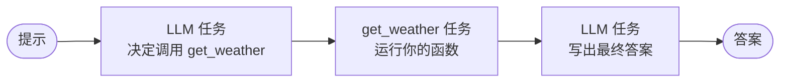

# 智能体概念

智能体使用 LLM 决定下一步做什么，以轮次的方式工作直到达成目标。[Agents & AI 概览](../ai/index.md) 解释了那个循环。本页解释其底层的概念：Conductor 如何表示一个智能体、工作流和智能体如何相互调用，以及编写智能体的三种方式。

<section class="agent-concepts-hero" aria-label="How a workflow invokes an agent">
  <svg class="agent-concepts-hero__diagram" viewBox="0 0 570 315" role="img" aria-labelledby="agent-concepts-diagram-title agent-concepts-diagram-desc">
    <title id="agent-concepts-diagram-title">工作流通过 AGENT 任务调用智能体</title>
    <desc id="agent-concepts-diagram-desc">工作流到达一个 AGENT 任务，该任务调用一个 Conductor Agent（已编译为 LLM 轮次和工具调用的工作流图）或一个远程 A2A 智能体。结果返回到工作流。</desc>
    <defs>
      <marker id="agent-concepts-arrow" markerWidth="8" markerHeight="8" refX="6" refY="4" orient="auto"><path class="agent-concepts-hero__arrowhead" d="M 0 0 L 8 4 L 0 8 z" /></marker>
    </defs>
    <rect class="agent-concepts-hero__conductor" x="18" y="24" width="220" height="160" rx="14" />
    <text class="agent-concepts-hero__conductor-detail" x="128" y="44" text-anchor="middle">你的工作流</text>
    <rect class="agent-concepts-hero__source agent-concepts-hero__source--workflow" x="42" y="52" width="172" height="40" rx="8" />
    <text class="agent-concepts-hero__title" x="128" y="77" text-anchor="middle">任务</text>
    <path class="agent-concepts-hero__arrow" d="M 128 92 V 106" marker-end="url(#agent-concepts-arrow)" />
    <rect class="agent-concepts-hero__source agent-concepts-hero__source--sdk" x="42" y="108" width="172" height="44" rx="8" />
    <text class="agent-concepts-hero__title" x="128" y="135" text-anchor="middle">AGENT 任务</text>
    <path class="agent-concepts-hero__arrow" d="M 214 122 H 296" marker-end="url(#agent-concepts-arrow)" />
    <text class="agent-concepts-hero__detail" x="255" y="114" text-anchor="middle">调用</text>
    <path class="agent-concepts-hero__arrow" d="M 300 142 H 222" marker-end="url(#agent-concepts-arrow)" />
    <text class="agent-concepts-hero__detail" x="258" y="158" text-anchor="middle">结果</text>
    <rect class="agent-concepts-hero__conductor" x="300" y="47" width="250" height="170" rx="14" />
    <text class="agent-concepts-hero__conductor-title" x="425" y="75" text-anchor="middle">Conductor Agent</text>
    <text class="agent-concepts-hero__conductor-detail" x="425" y="95" text-anchor="middle">编译为工作流图</text>
    <rect class="agent-concepts-hero__source agent-concepts-hero__source--workflow" x="324" y="108" width="202" height="36" rx="8" />
    <text class="agent-concepts-hero__title" x="425" y="131" text-anchor="middle">LLM 轮次</text>
    <path class="agent-concepts-hero__arrow" d="M 425 144 V 156" marker-end="url(#agent-concepts-arrow)" />
    <rect class="agent-concepts-hero__source agent-concepts-hero__source--workflow" x="324" y="158" width="202" height="36" rx="8" />
    <text class="agent-concepts-hero__title" x="425" y="181" text-anchor="middle">工具调用</text>
    <path class="agent-concepts-hero__arrow" d="M 526 176 C 550 176 550 126 526 126" marker-end="url(#agent-concepts-arrow)" />
    <text class="agent-concepts-hero__detail" x="425" y="207" text-anchor="middle">循环直到完成</text>
    <path class="agent-concepts-hero__arrow" d="M 128 152 V 274 H 288" marker-end="url(#agent-concepts-arrow)" stroke-dasharray="5 4" />
    <text class="agent-concepts-hero__detail" x="140" y="236" text-anchor="start">或远程调用</text>
    <rect class="agent-concepts-hero__source agent-concepts-hero__source--a2a" x="300" y="245" width="250" height="58" rx="10" />
    <text class="agent-concepts-hero__title" x="316" y="270">远程 A2A 智能体</text>
    <text class="agent-concepts-hero__detail" x="316" y="290">独立部署的服务</text>
  </svg>
</section>

## 智能体底层就是工作流

Conductor Agent 与工作流一样，始于一个定义。该定义指明要使用的模型、指令，以及智能体可以调用的工具。下面是该定义在 Python SDK 中的样子：

```python
from conductor.ai.agents import Agent, AgentRuntime, tool

@tool
def get_weather(city: str) -> str:
    return f"Weather for {city}"

agent = Agent(name="weather", model="openai/gpt-4o-mini",
              instructions="Answer concisely.", tools=[get_weather])
with AgentRuntime() as runtime:
    print(runtime.run(agent, "Weather in Seattle?").output)
```

运行时，Conductor 将智能体编译为工作流图并执行它。该图没有任何特殊之处：每次模型调用是一个任务，每次工具调用是一个任务，它们之间的循环就是工作流控制流。一次只调用一次工具的运行会产生如下任务序列：



这个设计正是关键。因为智能体的一次运行就是工作流执行，所以你所知道的工作流的一切规则都适用。每个轮次都被持久化，因此崩溃或重启会从最后完成的步骤恢复。重试和超时遵循相同的策略。人可以通过相同的人工任务批准或拒绝某个步骤。并且每次运行都会留下一份完整的、可检查和回放的历史。

## 工作流与智能体如何组合

工作流通过 `AGENT` 任务调用智能体。对父工作流而言，一个智能体就是一个持久化步骤：工作流到达 `AGENT` 任务，智能体运行其轮次，结果作为任务输出返回。在工作流定义中，它看起来与其他任务无异：

```json
{
  "name": "run_agent",
  "taskReferenceName": "run_agent_ref",
  "type": "AGENT",
  "inputParameters": {
    "agentType": "conductor",
    "name": "planner",
    "prompt": "${workflow.input.prompt}"
  }
}
```

同样的 `AGENT` 任务也可以指向一个使用 Agent2Agent（A2A）协议的远程智能体。在这种情况下，智能体的实现保持远程，而 Conductor 持久地跟踪交接及其结果。

组合也可以是反向的。智能体的工具可以是 MCP 工具或你用 SDK 注册的函数，每次调用都作为任务运行。因此一个流程可以在单个持久化图中混合普通任务、原生 AI 任务、已部署的智能体和远程智能体。

## 编写智能体的三种方式

你选择哪条路径取决于行为应该放在哪里。

- **声明式 AI 工作流** 将整个循环放在工作流定义本身中，使用原生 LLM、MCP 和控制流任务。当你希望完整编排可见并作为工作流进行版本管理时，选择这种方式。从 [LLM 编排](../ai/llm-orchestration.md) 开始。
- **Conductor Agent** 用代码编写，使用 Conductor SDK 或受支持的框架，例如 OpenAI Agents、LangChain、LangGraph 或 Google ADK。Conductor 将其编译为工作流图，你部署它并通过 `AGENT` 任务复用。当智能体逻辑已经在代码中时，选择这种方式。从 [Conductor Agents](../ai/conductor-agents.md) 开始。
- **远程 A2A 智能体** 是一个独立的服务，你通过持久化的 `AGENT` 任务调用它。当智能体在 Conductor 之外被拥有、部署和扩展时，选择这种方式。从 [A2A 集成](../ai/a2a-integration.md) 开始。

## 进入下一步

<div class="agent-concepts-next-steps">
  <a class="agent-concepts-next-step" href="../ai/first-ai-agent.html"><strong>直接构建</strong><span>创建原生 LLM、工具和控制流工作流。</span></a>
  <a class="agent-concepts-next-step" href="../../quickstart/first-agent.html"><strong>带入现有智能体代码</strong><span>运行第一个用 SDK 编写的 Conductor Agent，然后部署它供工作流复用。</span></a>
  <a class="agent-concepts-next-step" href="../ai/a2a-integration.html"><strong>集成远程智能体</strong><span>通过持久化的工作流边界调用或暴露 A2A 智能体。</span></a>
</div>
