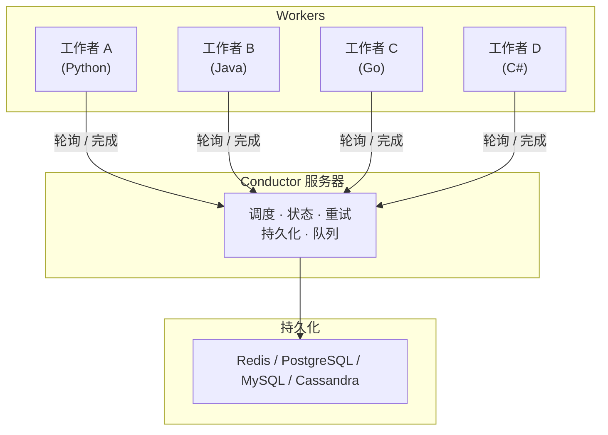

# 为什么选择 Conductor

Conductor 是一个跨服务、跨语言编排工作流的引擎。它记录每一次状态转换，自动重试失败，并保留完整的"发生了什么、为什么"的历史。

## 问题

每个分布式进程都必须能经受住故障。没有协调机制时，每个服务都要各自携带自己的重试、超时和恢复逻辑。这些逻辑到处重复，却没有人为其负责。

一个常见的提议方案是**编舞（choreography）**，即服务之间相互响应彼此的事件，没有中央协调者。这在纸面上保持了服务的解耦，但整体业务过程的逻辑不可见。流程只以隐含的事件契约链存在，因此更改一个服务可能会破坏它看不到的消费者。观察该过程也很困难。例如，调试一次故障意味着要在所有服务之间关联日志。

**编排（orchestration）** 是 Conductor 的方式。整体业务过程在一个地方定义，而工作本身保持分布式。Conductor 是编排者。它拥有流程、状态和恢复，因此工作者保持无状态且相互独立。

## 工作原理

Conductor 作为一个服务器运行，你的工作者连接到它。服务器调度任务、持久化每次状态变更，并应用重试和超时。工作者从服务器轮询任务，以任何受支持的语言运行你的业务逻辑，并上报结果。状态存放在你选择的持久化存储中。

详情参见 [架构](../architecture/index.md)。

## Conductor 提供什么

### 持久化执行
每次工作流执行都被持久化，因此进度可以经受故障。失败的任务在可配置的回退策略下重试，崩溃工作者的任务被重新调度到另一个工作者，服务器重启后执行从最后记录的状态恢复。你的代码不包含任何重试逻辑，因为 Conductor 会替你应用。同样的保证也扩展到智能体。

### 语言无关的工作者
工作者可以用 Python、Java、Go、JavaScript、C# 或 Clojure 编写，工作流中的每个任务都可以使用不同的语言。工作者通过 REST 或 gRPC 与 Conductor 通信，因此可以运行在容器、虚拟机、无服务器函数或笔记本电脑上。

### 内置系统任务
常见步骤随服务器一起提供：HTTP 调用、内联脚本、JSON 转换、事件发布、等待定时器和人工审批门。它们都不需要工作者。参见 [系统任务](../../documentation/configuration/workflowdef/systemtasks/index.md)。

### 流程控制运算符
运算符在定义本身中表达控制流：Fork 和 Join 实现并行，Switch 实现分支，Do-While 实现循环，子工作流实现组合。动态任务让图可以在运行时解析。参见 [运算符](../../documentation/configuration/workflowdef/operators/index.md)。

### AI 任务与智能体
LLM 调用作为原生系统任务运行。在任务上配置提供商和模型，或将框架编写的智能体带入持久的 Conductor 图中。[LLM 编排指南](../ai/llm-orchestration.md) 是提供商和功能的参考。

MCP 支持是内置的。`LIST_MCP_TOOLS` 发现服务器上的工具，`CALL_MCP_TOOL` 调用其中一个，具备与其他任务相同的重试和状态跟踪。

向量搜索任务支持 Pinecone、pgvector 和 MongoDB Atlas，因此单个工作流可以索引嵌入、执行相似度搜索，并将结果传递给 LLM。内容生成任务可以生成图像、音频、视频和 PDF。所有 AI 任务共享标准的持久化保证：自动重试、超时和完整的执行记录。

### 事件驱动工作流
工作流可以由外部事件触发，也可以发布自己的事件。支持 Kafka、NATS、AMQP 和 SQS。参见 [事件编排](../how-tos/event-bus.md)。

### 完整的运营控制
任何执行都可以被暂停、恢复、重启、重试或终止。执行可以按状态、时间、关联 ID 或自定义标签搜索，并且每个任务都记录其输入、输出、时间戳、重试历史和工作者身份。

### 水平扩展
服务器和工作者独立扩展。任务域、速率限制、并发限制和持久化配置控制吞吐量和隔离，指标暴露每个队列的运行状况。

## 何时使用 Conductor

| 用例 | 示例 |
| :--- | :--- |
| **[微服务编排](../cookbook/microservice-orchestration.md)** | 订单处理：支付 → 库存 → 发货 → 通知 |
| **[工作流自动化](../workflows/index.md)** | 以持久化执行、重试和完整可观测性自动化业务流程 |
| **[持久化智能体](../ai/durable-agents.md)** | 带函数调用、工具使用、RAG 和 human-in-the-loop 的多步 LLM 链——可经受崩溃的持久化智能体 |
| **[长时间运行工作流](../cookbook/wait-and-timers.md)** | 保险理赔、贷款审批、跨越数天或数周的入职流程——可经受部署的异步工作流 |
| **[事件驱动自动化](../cookbook/event-driven.md)** | 响应 Kafka 事件、触发工作流、回发结果 |
| **[批处理](../cookbook/dynamic-parallelism.md)** | 使用动态 Fork 将工作扇出到数千个并行工作者 |
| **[Saga 模式](../cookbook/saga-compensation.md)** | 失败时带补偿的分布式事务 |
| **[RAG 应用](../ai/cookbook/rag-agent.md)** | 以向量搜索、嵌入生成和 LLM 补全作为工作流任务，构建检索增强生成流水线 |
| **[内容生成流水线](../ai/llm-orchestration.md)** | 使用 AI 模型生成图像、音频、视频和 PDF，编排为持久化工作流 |

## 下一步

- [快速开始](../../quickstart/first-workflow.md) — 2 分钟内运行你的第一个工作流
- [工作流](workflows.md) — 工作流定义如何工作
- [任务](tasks.md) — 任务类型与配置
- [工作者](workers.md) — 以任何语言构建工作者
