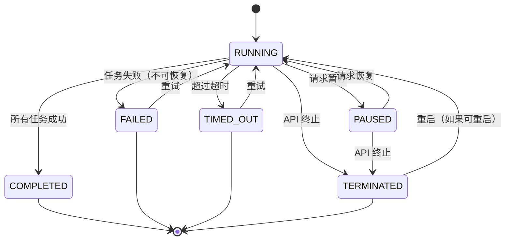

# 工作流

<section class="concept-hero concept-hero--workflows">
  <svg class="concept-hero__graphic" viewBox="0 36 440 122" role="img" aria-label="A workflow definition runs tasks through durable checkpoints to a completed outcome">
    <defs><marker id="workflow-arrow" markerWidth="8" markerHeight="8" refX="7" refY="4" orient="auto"><path d="M0,0 L8,4 L0,8 Z" fill="currentColor" /></marker></defs>
    <rect x="18" y="65" width="112" height="54" rx="10" class="concept-hero__node" />
    <text x="74" y="89" text-anchor="middle" class="concept-hero__label">定义</text>
    <text x="74" y="107" text-anchor="middle" class="concept-hero__detail">JSON 或代码</text>
    <path d="M130 92 H176" class="concept-hero__line" marker-end="url(#workflow-arrow)" />
    <rect x="184" y="45" width="116" height="94" rx="10" class="concept-hero__node concept-hero__node--accent" />
    <text x="242" y="74" text-anchor="middle" class="concept-hero__label">任务</text>
    <path d="M209 91 H275 M209 112 H275" class="concept-hero__line concept-hero__line--inside" />
    <text x="242" y="128" text-anchor="middle" class="concept-hero__detail">持久化状态</text>
    <path d="M300 92 H346" class="concept-hero__line" marker-end="url(#workflow-arrow)" />
    <circle cx="386" cy="92" r="32" class="concept-hero__outcome" />
    <path d="M371 93 l10 10 20 -22" class="concept-hero__check" />
    <text x="386" y="145" text-anchor="middle" class="concept-hero__detail">结果</text>
  </svg>
</section>

一个**工作流**是具有定义顺序和执行的任务序列。每个工作流封装一个特定过程，例如：

- 分类文档
- 从自助结账服务下单
- 升级云基础设施
- 转码视频
- 审批报销

在 Conductor 中，工作流可以被定义然后执行。下面了解两个不同但相关的概念：**工作流定义**和**工作流执行**。


## 什么让 Conductor 工作流与众不同

Conductor 工作流在几个关键方面区别于传统编排方法：

- **持久化执行** — 工作流可以经受进程故障、重启和基础设施中断。Conductor 在每一步持久化状态，因此长时间运行的工作流或异步工作流会恰好从停止的地方继续——即使在数天或数周之后。
- **JSON 原生定义** — 每个工作流都是 JSON 工作流定义，你可以将其存储在版本控制中、跨发布做 diff、并以编程方式生成。不需要编译型 DSL 或专有格式。
- **动态工作流** — 工作流可以在运行时以代码优先或 JSON 定义的方式创建和修改，适用于任务图事先未知的用例（例如，当并行分支的数量取决于 API 响应时）。
- **版本化** — 每个工作流定义都带有显式版本号，因此你可以增量推出更改并同时运行多个版本。
- **语言无关** — 执行任务的工作者可以用任何语言编写——Java、Python、Go、JavaScript、C# 或 Clojure——并部署到任何地方。工作流定义本身与实现解耦。


## 工作流定义

工作流定义描述你业务逻辑的流程和行为。把它看作一份蓝图，规定运行时应该如何执行直到达到终止状态。工作流定义包括：

- 工作流的输入/输出键。
- 一组 [任务配置](tasks.md#task-configuration)，规定任务条件、顺序和数据流，直到工作流完成。
- 工作流的运行时行为，例如超时策略和补偿流程。


### 示例 JSON 工作流定义

下面是一个真实的三任务工作流：从 API 获取数据，用内联脚本转换，然后将结果交给工作者任务进一步处理。

```json
{
  "name": "process_order",
  "description": "Fetch order details, enrich them, and hand off to fulfillment",
  "version": 1,
  "schemaVersion": 2,
  "ownerEmail": "team-platform@example.com",
  "timeoutPolicy": "ALERT_ONLY",
  "timeoutSeconds": 3600,
  "restartable": true,
  "failureWorkflow": "handle_order_failure",
  "inputParameters": ["orderId"],
  "outputParameters": {
    "enrichedOrder": "${enrich_order.output.result}",
    "fulfillmentStatus": "${fulfill_order.output.status}"
  },
  "tasks": [
    {
      "name": "fetch_order",
      "taskReferenceName": "fetch_order",
      "type": "HTTP",
      "inputParameters": {
        "http_request": {
          "uri": "https://api.example.com/orders/${workflow.input.orderId}",
          "method": "GET",
          "connectionTimeOut": 5000,
          "readTimeOut": 5000
        }
      }
    },
    {
      "name": "enrich_order",
      "taskReferenceName": "enrich_order",
      "type": "INLINE",
      "inputParameters": {
        "order": "${fetch_order.output.response.body}",
        "evaluatorType": "graaljs",
        "expression": "(function() { var o = $.order; o.region = o.country === 'US' ? 'domestic' : 'international'; return o; })()"
      }
    },
    {
      "name": "fulfill_order",
      "taskReferenceName": "fulfill_order",
      "type": "SIMPLE",
      "inputParameters": {
        "enrichedOrder": "${enrich_order.output.result}"
      }
    }
  ]
}
```


### 工作流定义参数

| 参数 | 类型 | 描述 |
|---|---|---|
| **name** | `string` | 唯一标识工作流的名称。在启动执行时使用。 |
| **version** | `integer` | 工作流定义的版本。允许多个版本共存。 |
| **tasks** | `array[object]` | 定义工作流执行图的 [任务配置](tasks.md#task-configuration) 有序列表。 |
| **inputParameters** | `array[string]` | 工作流触发时期望的输入键列表。 |
| **outputParameters** | `object` | 输出键到从任务输出提取值的表达式的映射。 |
| **failureWorkflow** | `string` | 当此工作流转为 FAILED 时要触发的工作流名称。用于补偿或告警。 |
| **timeoutPolicy** | `string` | 工作流超过 `timeoutSeconds` 时应用的策略。支持的取值：`TIME_OUT_WF`（使工作流失败）或 `ALERT_ONLY`（标记为超时但继续运行）。 |
| **timeoutSeconds** | `integer` | 在工作流超时策略应用之前允许运行的最长时间（秒）。设为 `0` 表示无超时。 |
| **restartable** | `boolean` | 工作流在完成或失败后能否重启。默认为 `true`。 |
| **ownerEmail** | `string` | 工作流负责人的邮箱地址。用于通知和审计跟踪。 |
| **schemaVersion** | `integer` | 工作流定义格式的 schema 版本。当前版本为 `2`。 |


## 工作流执行

工作流执行是工作流定义的执行实例。

每当用给定输入调用一个工作流定义时，就会创建一个具有唯一 ID 的新工作流执行。工作流由定义的状态（如 RUNNING 或 COMPLETED）管理，使跟踪工作流变得直观。


### 工作流执行状态

每个工作流执行会经过一组明确定义的状态：

| 状态 | 描述 |
|---|---|
| **RUNNING** | 工作流正在积极执行任务。 |
| **COMPLETED** | 所有任务成功完成，工作流达到其终止状态。 |
| **FAILED** | 一个或多个任务失败，且工作流无法恢复。如果配置了 `failureWorkflow`，它将触发。 |
| **TIMED_OUT** | 工作流超过了其配置的 `timeoutSeconds`，且 `timeoutPolicy` 被设置为 `TIME_OUT_WF`。 |
| **TERMINATED** | 工作流被 API 调用或系统操作显式停止。 |
| **PAUSED** | 工作流已被暂停，在恢复之前不会调度新任务。 |

下图说明工作流如何在状态之间转换：




## 下一步

- [任务](tasks.md) — 了解构成工作流的构建块，包括系统任务、工作者任务和运算符。
- [工作者](workers.md) — 了解如何用任何编程语言实现任务工作者。
- [处理错误](../how-tos/Workflows/handling-errors.md) — 配置重试、失败工作流和补偿策略。
