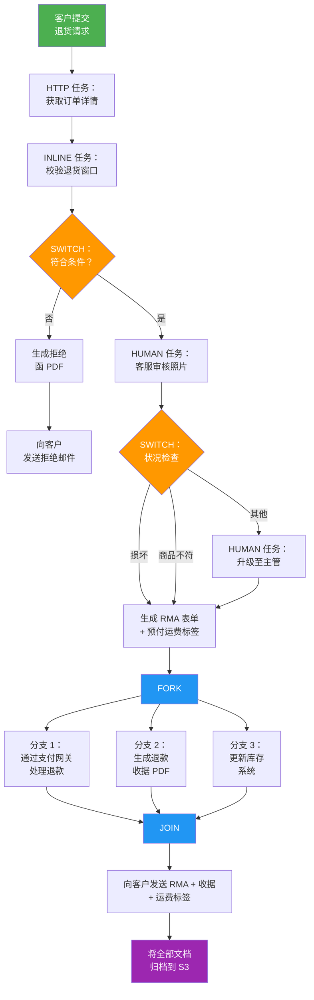
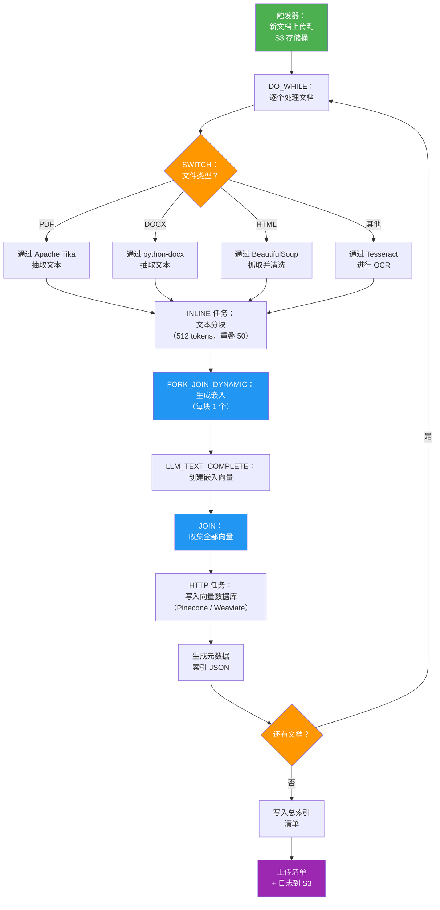
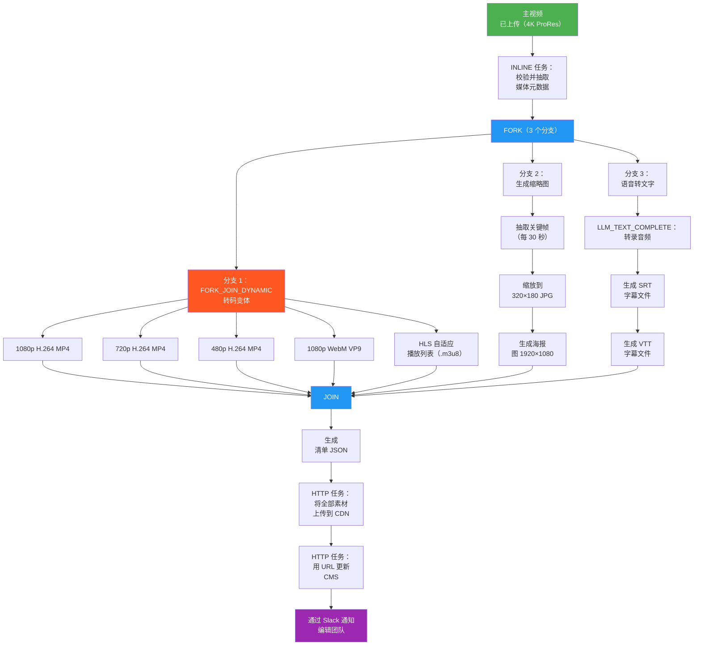
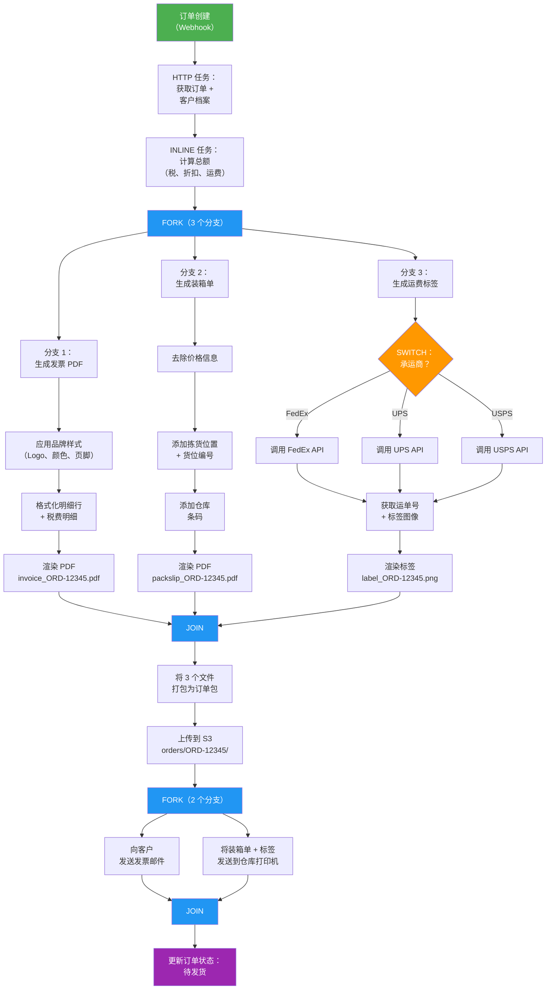
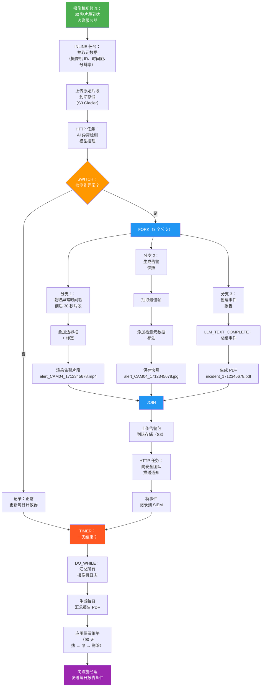

# Conductor OSS — 文件管理用例

五个真实场景，展示 Conductor 如何在多个工作流阶段中编排文件的创建、处理与交付。

---

## 1. 退货与退款单据处理

客户发起产品退货。Conductor 编排退货照片/文档的接收、资格审核、RMA（Return Merchandise Authorization，退货授权）表单的生成，以及最终退款收据的产出——全部作为单个可追踪的工作流。

### 工作流

### 产出文件

| 阶段 | 文件 | 格式 |
|-------|------|--------|
| RMA 生成 | `rma_RET-9001.pdf` | PDF |
| 运费标签 | `label_RET-9001.png` | 4×6 ZPL/PNG |
| 退款收据 | `receipt_RET-9001.pdf` | PDF |
| 拒绝函 | `denial_RET-9001.pdf` | PDF（如不符合条件） |

### Conductor 原语

SWITCH, HUMAN, FORK/JOIN, HTTP, INLINE, SUB_WORKFLOW

---

## 2. AI 驱动的知识库构建器（RAG 流水线）

组织将文档（PDF、Word 文件、网页）摄取到 AI 就绪的知识库中。Conductor 编排爬取、抽取、分块、嵌入生成和向量库索引——为聊天机器人和搜索提供检索增强生成（RAG）能力。

### 工作流

### 产出文件

| 阶段 | 文件 | 格式 |
|-------|------|--------|
| 抽取文本 | `extracted_{doc_id}.txt` | 纯文本 |
| 分块清单 | `chunks_{doc_id}.jsonl` | JSONL |
| 嵌入向量 | `embeddings_{doc_id}.npy` | NumPy 二进制 |
| 元数据索引 | `index_{doc_id}.json` | JSON |
| 总清单 | `kb_manifest_{run_id}.json` | JSON |
| 流水线日志 | `pipeline_log_{run_id}.txt` | 文本 |

### Conductor 原语

DO_WHILE, SWITCH, FORK_JOIN_DYNAMIC, LLM_TEXT_COMPLETE, HTTP, INLINE

---

## 3. 多格式媒体转码与发布

媒体公司上传一个主视频文件。Conductor 扇出转码任务以产出多种分辨率和格式，生成缩略图，通过语音转文字提取字幕，并将所有内容发布到 CDN——尽可能全部并行进行。

### 工作流

### 产出文件

| 阶段 | 文件 | 格式 |
|-------|------|--------|
| 转码视频 | `video_{res}.mp4`、`video_1080p.webm` | MP4、WebM |
| HLS 播放列表 | `stream.m3u8` + 分片 `.ts` 文件 | HLS |
| 缩略图 | `thumb_{timestamp}.jpg` | JPEG |
| 海报图 | `poster.jpg` | JPEG 1920×1080 |
| 字幕 | `subs_en.srt`、`subs_en.vtt` | SRT、VTT |
| 清单 | `publish_manifest.json` | JSON |

### Conductor 原语

FORK/JOIN, FORK_JOIN_DYNAMIC, LLM_TEXT_COMPLETE, HTTP, INLINE

---

## 4. 订单发票、装箱单与运费标签生成

一个电商订单触发 Conductor 获取订单数据，然后并行扇出生成三份文档——面向客户的发票、仓库装箱单（不含价格）和承运商运费标签——最后打包并分发。

### 工作流

### 产出文件

| 阶段 | 文件 | 格式 |
|-------|------|--------|
| 发票 | `invoice_ORD-12345.pdf` | PDF |
| 装箱单 | `packslip_ORD-12345.pdf` | PDF |
| 运费标签 | `label_ORD-12345.png` | 4×6 ZPL/PNG |

### Conductor 原语

FORK/JOIN, SWITCH, HTTP, INLINE, SUB_WORKFLOW

---

## 5. 企业视频监控归档与告警流水线

一组安防摄像机将视频流推送到边缘服务器。Conductor 编排整条流水线：摄取视频片段、运行基于 AI 的异常检测、生成带标注的告警片段、按保留策略归档原始录像，并产出每日汇总报告。

### 工作流

### 产出文件

| 阶段 | 文件 | 格式 |
|-------|------|--------|
| 原始片段 | `raw_CAM04_1712345678.mp4` | MP4（60 秒） |
| 告警片段 | `alert_CAM04_1712345678.mp4` | MP4（30 秒，带标注） |
| 告警快照 | `alert_CAM04_1712345678.jpg` | JPEG（带标注） |
| 事件报告 | `incident_1712345678.pdf` | PDF |
| 每日汇总 | `daily_report_2026-04-08.pdf` | PDF |

### Conductor 原语

FORK/JOIN, SWITCH, DO_WHILE, TIMER, LLM_TEXT_COMPLETE, HTTP, INLINE

---

*为 Conductor OSS 文件管理用例探索而生成。*
