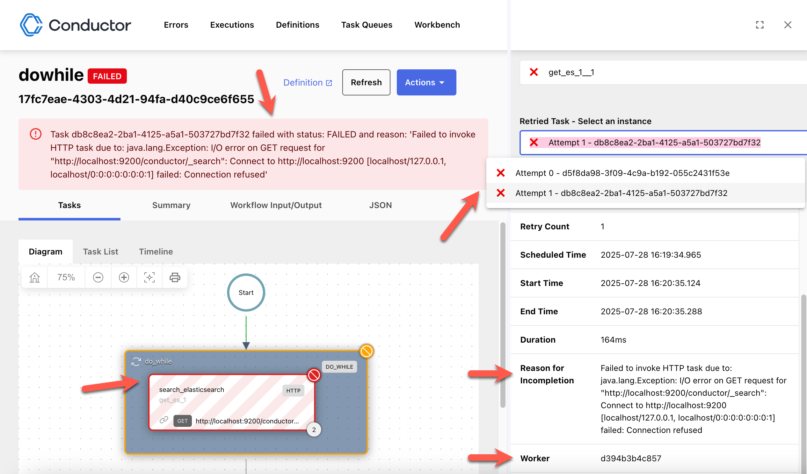

# 调试工作流

Conductor UI 中的[工作流执行视图](viewing-workflow-executions.md)有助于调试工作流问题。了解如何调试失败执行并重新运行它们。

## 调试步骤

从持久化的执行开始：

```bash
conductor workflow get-execution <workflow-id> -c
```

识别处于 `FAILED`、`TIMED_OUT` 或终态的任务，并记录其 `reasonForIncompletion`、输入、输出、工作者 ID 和重试次数。在更改执行状态之前，先修复底层的工作者、依赖、凭据或定义。

查看工作流执行详情时，工作流失败的原因会显示在顶部。转到 **任务 > 图** 选项卡可快速识别失败任务，失败任务以红色标记。你可以选择该失败任务以调查失败详情。

任务详情中以下选项卡视图或字段对调试有用：

| 字段或选项卡名称 | 说明 |
|-------------------------------------------------|-------------------------------------------------------------------------------------------------------------------------------|
| **任务详情** > **摘要** 中的 _未完成原因_ | 工作者的错误消息，或任务超时或终止时引擎的消息。参见 [理解 reasonForIncompletion](#understanding-reasonforincompletion)。 |
| **任务详情** > **摘要** 中的 _工作者_ | 包含发生失败的工作者实例 ID。若 Conductor 尚未捕获，可用于挖掘详细日志。 |
| **任务详情** > **输入** | 用于验证任务输入是否被正确计算并提供给任务。 |
| **任务详情** > **输出** | 用于验证任务产生的输出内容。 |
| **任务详情** > **日志** | 若任务工作者提供了日志，则包含任务日志。 |
| **任务详情** > **重试任务 - 选择一个实例** | （如果任务已被多次重试）在以下拉列表中包含所有重试尝试。每个列表项包含某次尝试的任务详情。 |




## 理解 reasonForIncompletion { #understanding-reasonforincompletion }

`reasonForIncompletion` 是任务和 workflow 执行上的自由文本字段。执行健康时为空，执行未成功即停止时会被填充。UI 在任务摘要和工作流执行视图顶部将其显示为 **未完成原因**，搜索结果（`WorkflowSummary`、`TaskSummary`）也包含该字段。

### 谁写入它

| 写入方 | 内容 |
|---|---|
| 你的工作者 | 工作者返回 `FAILED` 或 `FAILED_WITH_TERMINAL_ERROR` 时写入 `TaskResult.reasonForIncompletion` 的值。SDK 在工作者抛出异常时会将其设为异常消息。 |
| 事件处理器的 `fail_task` 操作 | 该操作的 `reasonForIncompletion` 值；若操作未设置则为空。 |
| 系统任务 | 它们各自的错误文本。例如，HTTP 任务会在非 2xx 响应时记录响应体，或 `No response from the remote service`、`Missing HTTP URI.  See documentation for HttpTask for required input parameters`、`Failed to invoke HTTP task due to: <exception>`。 |
| 引擎 | 超时、终止和定义错误，使用下方模板。 |

### 引擎生成的消息

| 情形 | 消息 |
|---|---|
| 任务超过 `timeoutSeconds` | `Task timed out after {elapsed} seconds. Timeout configured as {timeoutSeconds} seconds. Timeout policy configured to {timeoutPolicy}` |
| 任务在 `pollTimeoutSeconds` 内未被轮询 | `Task poll timed out after {elapsed} seconds. Poll timeout configured as {pollTimeoutSeconds} seconds. Timeout policy configured to {timeoutPolicy}` |
| 工作者停止更新任务（`responseTimeoutSeconds`） | `responseTimeout: {responseTimeoutSeconds} exceeded for the taskId: {taskId} with Task Definition: {taskDefName}` |
| 重试耗尽总预算（`totalTimeoutSeconds`） | `Task {taskDefName}/{taskId} exceeded total timeout of {totalTimeoutSeconds} seconds (elapsed {elapsed} seconds across all attempts including retry delays). Timeout policy: {timeoutPolicy}` |
| 工作流超过其 `timeoutSeconds` | `Workflow timed out after {elapsed} seconds. Timeout configured as {timeoutSeconds} seconds. Timeout policy configured to {timeoutPolicy}` |
| 任务失败导致工作流失败 | 在工作流上：`Task {taskId} failed with status: {status} and reason: '{task reasonForIncompletion}'`。失败的 `JOIN` 携带其失败扇出任务的拼接原因。 |
| 子工作流未成功结束 | 在 `SUB_WORKFLOW` 任务上：`Sub workflow {subWorkflowId} failure reason: {sub-workflow reasonForIncompletion}` |
| `TERMINATE` 任务 | 任务的 `terminationReason` 输入；若未给出，则为 `Workflow is {terminationStatus} by TERMINATE task: {taskId}`。即使 `terminationStatus` 为 `COMPLETED` 也会设置。 |
| 终止 API | `DELETE /api/workflow/{workflowId}` 的 `reason` 查询参数。 |
| 任务定义缺失 | `Invalid task specified. Cannot find task by name {name} in the task definitions` |

超时字段在[任务生命周期](../../architecture/tasklifecycle.md#timeout-scenarios)中有描述。

### 生命周期与限制

* 重试、重启和重新运行会清空工作流的原因，并以空原因开始新的任务尝试。原始尝试保留其原因；可在任务详情中从 **重试任务** 打开它。
* 任务上的值上限为 500 个字符；更长的消息会被截断。工作流级原因没有上限。
* 该字段随执行一起存储，并由 `GET /api/workflow/{workflowId}`、`GET /api/tasks/{taskId}` 以及搜索 API 返回。

## 从失败中恢复

解决执行失败的底层问题后，可以使用 Conductor UI 或 API 手动重启或重试失败的工作流执行。

恢复选项如下：

| 恢复操作 | 说明 |
|---------------------|----------------------------|
| 使用当前定义重启 | 使用原始执行所用的同一工作流定义从头重启工作流。若工作流定义已变更且希望使用原始定义运行该执行实例，此选项很有用。 |
| 使用最新定义重启 | 使用最新的工作流定义从头重启工作流。若工作流定义有改动且希望以最新定义运行该执行实例，此选项很有用。 |
| 从特定任务重新运行 | 从特定任务重新执行工作流，复用之前所有任务的输出。当工作流中部的某个任务失败、希望在不重新执行其之前所有内容的情况下修复并重新运行它时，此选项很有用。 |
| 重试 - 从失败任务 | 从最后一个失败的任务重试工作流。 |

对应的 CLI 命令：

```bash
conductor workflow retry <workflow-id>
conductor workflow restart <workflow-id>
conductor workflow rerun <workflow-id> --task-id <task-id>
```

恢复后，运行 `conductor workflow status <workflow-id>`，验证预期任务正在运行，或工作流已达到预期的终态。

!!! 注意
    可以设置任务在出现瞬时失败时自动重试。更多信息参见[任务定义](../../../documentation/configuration/taskdef.md)。

### 使用 Conductor UI

**如何从失败中恢复**：

1. 在工作流执行详情页，选择右上角的**操作**。
2. 选择以下选项之一：
    - 使用当前定义重启
    - 使用最新定义重启
    - 从特定任务重新运行
    - 重试 - 从失败任务

### 使用 API

可以使用"重启工作流" API（`POST api/workflow/{workflowId}/restart`）或"批量重启工作流" API（`POST api/workflow/bulk/restart`）重启工作流执行。

可以使用"重新运行工作流" API（`POST api/workflow/{workflowId}/rerun`）从特定任务重新运行工作流，请求体中需指定 `reRunFromTaskId`。

类似地，可以使用"重试工作流" API（`POST api/workflow/{workflowId}/retry`）或"批量重试工作流" API（`POST api/workflow/bulk/retry`）从最后一个失败的任务重试工作流执行。

所有三种恢复操作 —— 重启、重新运行和重试 —— 都适用于处于任何终态（COMPLETED、FAILED、TIMED_OUT、TERMINATED）的工作流，且可无限期使用。Conductor 保留完整的执行历史，因此即使在原始运行数月之后，仍可重放任何工作流。

## 限制与下一步

恢复可能会重复产生副作用。仅在已完成的外部操作是幂等的或具有明确的补偿策略时，才进行重试或重新运行。继续阅读[可靠性与错误处理](handling-errors.md)，让瞬时故障的恢复自动化。
