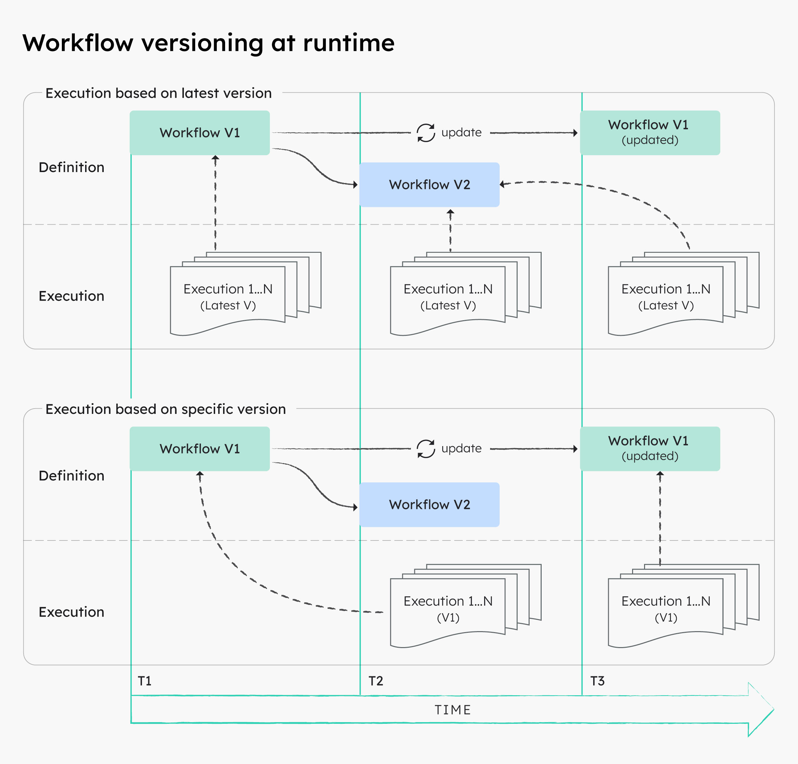
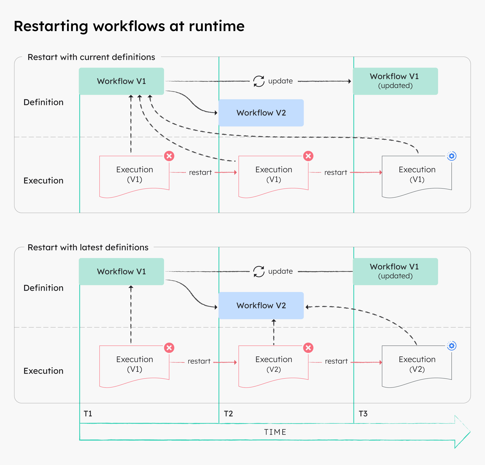

# 管理工作流版本

每个工作流定义都带有一个 `version` 编号，Conductor 可以并行运行同一工作流的多个版本。本页介绍何时创建新版本、版本在运行时的行为，以及如何发布新版本而不干扰正在进行的执行。

## 何时为工作流建立版本

当输入、输出、任务顺序或失败行为发生调用方可观察到的变化时，创建新版本。注册机制参见[安全地更新和版本管理](creating-workflows.md#updating-workflows)。

版本管理也适用于渐进式发布。例如，假设核心工作流的新版本增加了一项 _customerA_ 需要的能力，但 _customerB_ 还要 6 个月才能准备好采用。借助版本管理，现在就可以将 _customerA_ 的流量切到版本 2，_customerB_ 继续留在版本 1，之后再迁移 _customerB_。

## 多版本工作流的运行时行为

在运行时，每个执行都引用启动时的工作流定义快照。对定义的修改永远不影响已在运行的执行。

下图示意了运行时的版本行为：基于最新版本运行工作流，与基于特定版本运行工作流的对比。



在上图中：

- 在 T1，一个执行在版本 V1 上启动，因此使用 T1 时刻存在的 V1 定义。
- 在 T2，注册了版本 V2。基于最新版本启动的新执行现在使用 V2。
- 在 T3，V1 定义本身被就地更新。T1 的执行继续在其 T1 快照上运行，而任何固定到 V1 的新执行则使用更新后的 T3 定义。

### 重启时的运行时行为

默认情况下，重启、重试和任务重新运行也使用首次执行尝试开始时创建的快照。如有需要，也可以改用最新定义重启工作流。

下图示意了使用当前定义重启工作流与使用最新定义重启工作流时，运行时的版本行为。



在上图中：

- 使用**当前定义**重启 V1 执行时，它会在原始的 T1 快照上重新运行，即使 V2 已存在、V1 已在 T3 更新也是如此。
- 使用**最新定义**重启 V1 执行时，它会在最新注册的版本 V2 上重新运行。

## 发布步骤

1. 注册新版本，而不是覆盖生产调用方正在使用的版本：递增定义中的 `version` 字段并注册。

    ```bash
    conductor workflow create workflow.json
    ```

2. 验证并进行模拟测试，然后以固定版本运行一次真实的生产验证（canary）执行：

    ```bash
    conductor workflow start -w <workflow-name> --version 2 -i '{"orderId": "test-1"}'
    ```

3. 有意识地将调用方、定时计划和父工作流引用切换到新版本。
4. 比较两个版本之间的完成、失败、延迟和输出。
5. 保持旧版本处于注册状态，直到调用方完成迁移且其执行不再需要重启或重放支持。

成功的标志是：新调用方启动预期版本，而现有执行继续针对其记录的定义快照运行。

## 升级运行中的工作流

由于定义变更永远不影响正在进行的执行，如有需要，运行中的工作流必须显式升级。升级是先终止，再按最新定义重启。

!!! 警告
    终止并重启可能会重复产生副作用。除非工作流是幂等的或已定义补偿，否则建议让运行中的执行在其快照上运行完毕。

### 使用 Conductor UI

**如何升级运行中的工作流**：

1. 在左侧导航中打开**执行**并选择**工作流**，然后选择要升级的进行中执行。
2. 在右上角选择**操作**，然后选择**终止**。
3. 终止后，选择**操作**，然后选择**使用最新定义重启**。

### 使用 Conductor API

API 方式可以批量升级运行中的工作流。先用批量终止 API 终止这些执行，再用批量重启 API 重启它们，并传入 `useLatestDefinitions=true`：

```bash
curl -X POST 'http://localhost:8080/api/workflow/bulk/terminate' \
  -H 'Content-Type: application/json' \
  -d '["<workflow-id-1>", "<workflow-id-2>"]'

curl -X POST 'http://localhost:8080/api/workflow/bulk/restart?useLatestDefinitions=true' \
  -H 'Content-Type: application/json' \
  -d '["<workflow-id-1>", "<workflow-id-2>"]'
```

如果不传 `useLatestDefinitions=true`，重启会使用每个执行原始的快照定义，不会发生升级。

## 限制与下一步

启动时省略版本会选择最新注册的版本，这是以发布可控性换取便利。当确定性部署重要时，在定时计划和父工作流中固定版本。接下来，针对当前版本和上一版本演练[调试与恢复](debugging-workflows.md)。
