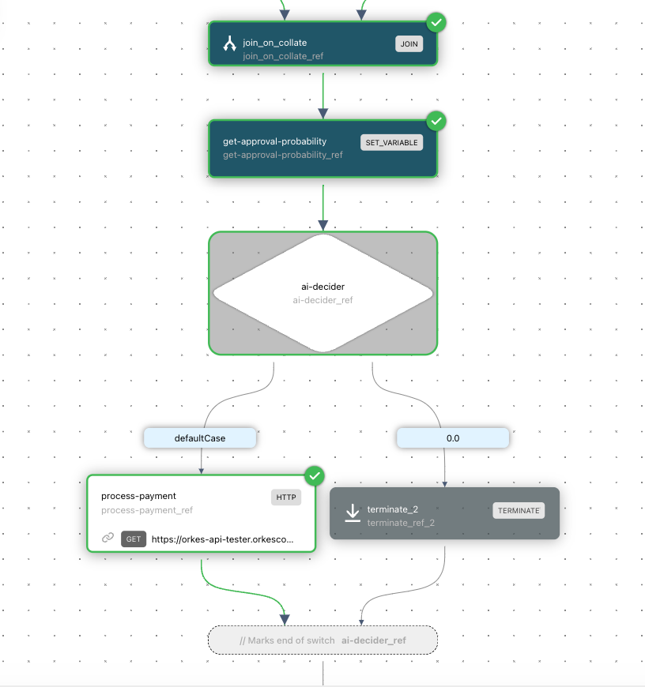
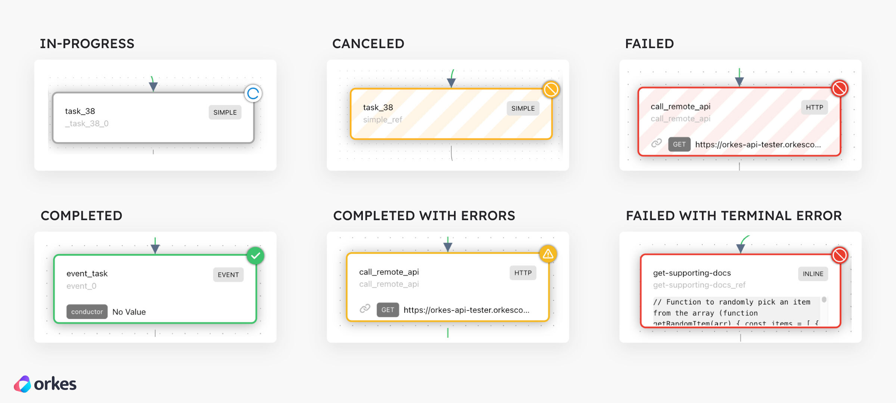

# 查看工作流执行

使用启动时返回的工作流 ID 来检查确切的执行。

## 使用 CLI 检查

```bash
conductor workflow status <workflow-id>
conductor workflow get-execution <workflow-id> -c
```

紧凑的执行视图应显示工作流名称/版本、当前状态、输入/输出以及每个任务尝试。对于 API 自动化，使用 `GET /api/workflow/{workflowId}?includeTasks=true`；响应契约以[工作流 API](../../../documentation/api/workflow.md)为准。

成功意味着执行的标识、状态和任务状态与你打算检查的运行一致。对于失败，恢复前先记录失败任务的 `reasonForIncompletion`、重试次数和工作者 ID。

## 使用 UI 检查

Conductor UI 以图和时间线呈现同一持久执行。你可以从以下入口打开：

- 在[搜索工作流](searching-workflows.md)之后，通过**[执行](http://localhost:8080/executions)**。
- 通过**[工作台](http://localhost:8080/workbench)** > **执行历史**

**如何查看工作流执行**：

在**[执行](http://localhost:8080/executions)**或**[工作台](http://localhost:8080/workbench)**中，选择工作流 ID 超链接。


## 工作流执行详情

每个工作流执行都提供以下选项卡：

| 选项卡名称 | 说明 |
|----------------------------|-------------------------------------------------------------------------------------------------------------------|
| **任务** > **图** | 工作流及其任务的可视化图。 |
| **任务** > **任务列表** | 该工作流中任务执行的列表，包括任务名称、任务 ID、状态等详情。 |
| **任务** > **时间线** | 展示工作流中每个任务持续时间和顺序的时间线。 |
| **摘要** | 工作流执行的摘要视图，包括工作流 ID、状态、持续时间等。 |
| **工作流输入/输出** | 工作流输入、输出和变量的 JSON 负载视图。 |
| **JSON** | 完整的工作流执行 JSON 视图，包括所有任务、输入、输出等。 |


### 工作流图视图

在**任务** > **图**中，可以查看工作流的精确执行路径。已执行的路径以绿色显示，其他备选路径则置灰。



每个任务的状态也会清晰标记，突出显示任何任务错误。



### 任务执行详情

也可以通过从以下选项卡选择任务来查看任务的执行详情：

- **任务** > **图**
- **任务** > **任务列表**
- **任务** > **时间线**

此操作会打开一个左侧面板，包含以下选项卡：

| 选项卡名称 | 说明 |
|------------|-----------------------------------------------------------------------------------------------------------------------------------------------------|
| **摘要** | 任务执行的摘要视图，包括任务执行 ID、状态、持续时间等 |
| **输入** | 任务输入的 JSON 负载视图。 |
| **输出** | 任务输出的 JSON 负载视图。 |
| **日志** | 任务记录的日志消息视图（如有）。 |
| **JSON** | 完整的任务执行 JSON 视图，包括重试次数、开始时间、工作者 ID 等。 |
| **定义** | 执行任务时所使用的任务配置视图。 |

## 限制与下一步

执行视图报告的是 Conductor 持久化的内容；除非工作者添加了任务日志，否则详细的应用日志仍保留在工作者的日志系统中。不知道工作流 ID 时，继续阅读[搜索执行](searching-workflows.md)；对于失败的运行，参见[调试与恢复](debugging-workflows.md)。
