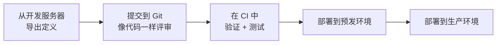

# CI/CD 集成

工作流定义、任务定义和事件处理器都是数据。你完全可以在生产服务器的 UI 中编辑它们，但那样生产就成了它们唯一存在的地方：没有评审，也无法回退。替代方案是把它们放在 Git 里，让流水线把它们放到每台服务器上。

这条流水线的形状永远相同：



## 导出定义

从你一直在迭代的那台服务器上拉取当前定义。CLI 和 API 都可以；在脚本里 CLI 更易读。

```shell
conductor workflow get-all > definitions/workflows.json
conductor task get-all     > definitions/taskdefs.json
```

等价的 REST 调用（如果你不想在 CI 中依赖 CLI）：

```shell
curl -s "$CONDUCTOR_SERVER_URL/metadata/workflow" > definitions/workflows.json
curl -s "$CONDUCTOR_SERVER_URL/metadata/taskdefs" > definitions/taskdefs.json
curl -s "$CONDUCTOR_SERVER_URL/event"             > definitions/eventhandlers.json
```

只导出单个定义而不是全部：

```shell
conductor workflow get order_fulfillment 3
conductor task get charge_payment
```

```shell
curl -s "$CONDUCTOR_SERVER_URL/metadata/workflow/order_fulfillment?version=3"
curl -s "$CONDUCTOR_SERVER_URL/metadata/taskdefs/charge_payment"
```

每个定义提交一个文件，而不是一个大的整块文件。400 行的 `workflows.json` 会产生无法阅读的 diff，而且你无法只晋级一个工作流而不晋级所有工作流。

## 在 CI 中验证

在部署任何东西之前，让服务器检查定义。`POST /metadata/workflow/validate` 执行与注册相同的检查，但不存储任何东西：

```shell
curl -s -X POST "$CONDUCTOR_SERVER_URL/metadata/workflow/validate" \
  -H 'Content-Type: application/json' \
  -d @definitions/workflows/order_fulfillment.json
```

合法的定义返回 `200` 和空响应体。非法的定义返回 `400` 并指明出错的字段：

```json
{
  "status": 400,
  "message": "Validation failed, check below errors for detail.",
  "validationErrors": [
    {
      "path": "validateWorkflowDef.arg0",
      "message": "taskReferenceName: same should be unique across tasks for a given workflowDefinition: dup_wf"
    }
  ]
}
```

它能发现结构性问题——缺失的 `name`、为空的 `tasks` 列表、重复的 `taskReferenceName` 值。但它**不会**检查所引用的任务定义是否存在、`${...}` 表达式能否解析，因此一个定义可能通过验证却在运行时失败。把它当作一道廉价的初筛，而不是运行工作流的替代品。

除了验证之外，值得在 CI 中测试的是那些只在运行时才会出问题的事物：每个 `SWITCH` 分支、任何带 `failureWorkflow` 的任务的失败路径，以及工作者的幂等性。一旦出现失败，参见[调试工作流](Workflows/debugging-workflows.md)来缩小范围。

## 部署

有两个 HTTP 动词，它们的行为差异对流水线很重要。

| 端点 | 请求体 | 行为 |
|---|---|---|
| `POST /metadata/workflow` | 单个 `WorkflowDef` | 创建。如果该名称和版本已存在则返回 `409`，除非带 `?overwrite=true`。 |
| `PUT /metadata/workflow` | `WorkflowDef` 的**列表** | 逐个创建或更新。幂等。 |
| `POST /metadata/taskdefs` | `TaskDef` 的**列表** | 创建。 |
| `PUT /metadata/taskdefs` | 单个 `TaskDef` | 创建或更新。 |

在流水线中使用 `PUT`。它是幂等的，所以部分失败后重新运行部署是安全的，而且不需要 `overwrite` 标志：

```shell
# Task definitions first — a workflow referencing an unregistered task
# registers fine but fails when it runs.
for f in definitions/taskdefs/*.json; do
  curl -sf -X PUT "$CONDUCTOR_SERVER_URL/metadata/taskdefs" \
    -H 'Content-Type: application/json' -d @"$f"
done

# Then workflows. Note the array wrapper.
for f in definitions/workflows/*.json; do
  curl -sf -X PUT "$CONDUCTOR_SERVER_URL/metadata/workflow" \
    -H 'Content-Type: application/json' \
    -d "[$(cat "$f")]"
done
```

`curl -sf` 很关键：没有 `-f` 时，curl 遇到 `4xx` 也会以 `0` 退出，一个坏掉的部署看起来却是绿的。

## 认证

OSS Conductor 默认不带认证，所以上面的调用不需要凭据——这也意味着任何能访问服务器的东西都能改写你的定义。把服务器放在私有网络上，并把流水线保留在内部。

Orkes Conductor 需要 token。用应用密钥换取 token，然后作为 `X-Authorization` 发送：

```shell
TOKEN=$(curl -s -X POST "$CONDUCTOR_SERVER_URL/token" \
  -H 'Content-Type: application/json' \
  -d "{\"keyId\":\"$CONDUCTOR_AUTH_KEY\",\"keySecret\":\"$CONDUCTOR_AUTH_SECRET\"}" \
  | python3 -c 'import sys,json;print(json.load(sys.stdin)["token"])')

curl -sf -X PUT "$CONDUCTOR_SERVER_URL/metadata/workflow" \
  -H "X-Authorization: $TOKEN" \
  -H 'Content-Type: application/json' -d @workflows.json
```

<!-- TODO: verify the /token exchange against a live Orkes server; OSS has no such endpoint -->

## 版本、顺序与回滚

**用注册新版本代替就地编辑。** 正在运行的执行会继续使用它启动时所用的定义版本。注册版本 `4` 不会影响版本 `3` 的在途执行，所以发布新版本是安全的部署，而就地编辑当前版本则不是。参见[管理工作流版本](Workflows/versioning-workflows.md)。

**按保持两侧兼容的顺序部署。** 先部署的哪一侧都必须能配合另一侧的旧代码工作：

| 变更 | 先部署 |
|---|---|
| 需要新工作者行为的新工作流版本 | 工作者——它们必须先能处理新定义，而新定义还不存在 |
| 工作者读取定义现在才提供的新输入字段 | 元数据 |
| 两侧互不依赖 | 任意 |

**回滚就是部署上一个制品。** 因为定义是 Git 里的文件，回滚意味着重新 `PUT` 上一个提交的 JSON 并重新部署上一个工作者镜像 tag。把这两步都写进发布流程的一部分，并优先重新注册旧版本而不是删除新版本——`DELETE /metadata/workflow/{name}/{version}` 会删除定义，但不会删除引用它的执行。

## 相关页面

- [管理工作流版本](Workflows/versioning-workflows.md)
- [元数据 API 参考](../../documentation/api/metadata.md)
- [事件处理器](../../documentation/configuration/eventhandlers.md)
- [最佳实践](../bestpractices.md)
