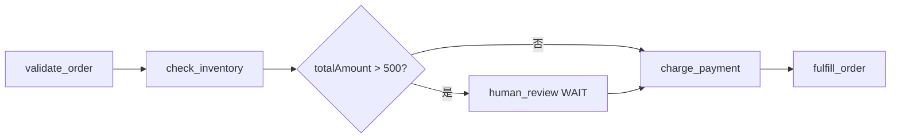

# 用你的 AI 编码智能体来构建

**时间：** 安装大约需要 2 分钟。

[Conductor Skills](https://github.com/conductor-oss/conductor-skills) 教会你的 AI 编码智能体创建、运行、监控和管理 Conductor 工作流与智能体（agent）。用自然语言描述你想要的东西，智能体就会帮你构建出来。

兼容 Claude Code、Cursor、GitHub Copilot、Gemini CLI、Codex、Windsurf、Cline、Amazon Q、Aider、Roo Code、Amp 和 OpenCode。

你也可以让任何 AI 助手直接指向这些文档：[面向 AI 助手的 Conductor](../ai/conductor-for-ai-assistants.md) 是权威的指引页面，[/llms.txt](../../llms.txt) 是机器可读的索引，[/llms-full.txt](../../llms-full.txt) 是完整文档的单文件版本。

## 前置条件：一个 Conductor 服务器

你的智能体需要一个可以通信的服务器。如果没有，先启动一个本地服务器：

```bash
npm install -g @conductor-oss/conductor-cli
conductor server start
```

也可以使用免费托管的 [Developer Edition](https://developer.orkescloud.com/)。参见[连接到 Conductor](../../quickstart/connect.md)。

## 安装

一条命令即可检测你机器上已安装的 AI 编码智能体，并为每一个安装 Conductor Skills：

=== "macOS / Linux"

    ```bash
    curl -sSL https://conductor-oss.github.io/conductor-skills/install.sh | bash -s -- --all
    ```

=== "Windows (PowerShell)"

    ```powershell
    irm https://conductor-oss.github.io/conductor-skills/install.ps1 -OutFile install.ps1; .\install.ps1 -All
    ```

只为单个智能体安装时，用 `--agent` 传入其标志——例如 Claude Code：

```bash
curl -sSL https://conductor-oss.github.io/conductor-skills/install.sh | bash -s -- --agent claude
```


## 连接到你的服务器

安装完成后，告诉你的智能体 Conductor 服务器的位置：

```text
Connect to my Conductor server at http://localhost:8080/api
```

或者直接设置环境变量：

```bash
export CONDUCTOR_SERVER_URL=http://localhost:8080/api
```


## 你的智能体能做什么

以下是你可以用来提示编码智能体的示例。

| 能力 | 提示词 | 结果 |
|---|---|---|
| **创建工作流** | *"创建一个调用 GitHub API 并发送 Slack 通知的工作流"* | 智能体生成完整的工作流定义，包含 HTTP 任务、输入表达式和输出参数 |
| **运行工作流** | *"用输入 userId 123 运行 my-workflow"* | 智能体启动执行并返回执行 ID |
| **监控执行** | *"显示过去一小时所有失败的工作流"* | 智能体按状态、时间或关联 ID 搜索执行 |
| **调试失败** | *"执行 abc-123 出了什么问题？"* | 智能体取回该执行，定位失败的任务并显示错误 |
| **重试与恢复** | *"重试 order-processing 的所有失败执行"* | 智能体批量重试失败的执行 |
| **管理生命周期** | *"暂停执行 xyz-456"* | 智能体暂停、恢复、终止或重启工作流 |
| **给任务发信号** | *"批准执行 abc-123 中的支付等待任务"* | 智能体向 WAIT 或 HUMAN 任务发送信号以推进工作流 |
| **编写工作者** | *"写一个验证电子邮件地址的 Python 工作者"* | 智能体使用合适的 SDK 生成工作者代码 |
| **可视化** | *"给我看 order-processing 工作流的图"* | 智能体渲染该工作流的 Mermaid 图 |


## 示例演练：构建一个订单处理系统

本示例展示如何通过对编码智能体使用自然语言提示来构建一个 Conductor 应用。

### 第 1 步：创建工作流

**提示词：**

```text
Create an order processing workflow with these steps: validate the order, check inventory, charge payment, and fulfill the order. If payment fails, compensate by releasing the inventory hold. Add a HUMAN task before payment so a human can review high-value orders.
```

你的智能体创建工作流定义：

```json
{
  "name": "order_processing",
  "description": "Process customer orders with inventory check, payment, and fulfillment",
  "version": 1,
  "schemaVersion": 2,
  "inputParameters": ["orderId", "customerId", "items", "totalAmount"],
  "tasks": [
    {
      "name": "validate_order",
      "taskReferenceName": "validate",
      "type": "HTTP",
      "inputParameters": {
        "http_request": {
          "uri": "https://api.example.com/orders/${workflow.input.orderId}/validate",
          "method": "POST",
          "body": { "items": "${workflow.input.items}" }
        }
      }
    },
    {
      "name": "check_inventory",
      "taskReferenceName": "inventory",
      "type": "HTTP",
      "inputParameters": {
        "http_request": {
          "uri": "https://api.example.com/inventory/hold",
          "method": "POST",
          "body": { "items": "${workflow.input.items}" }
        }
      }
    },
    {
      "name": "review_gate",
      "taskReferenceName": "review_gate",
      "type": "SWITCH",
      "evaluatorType": "graaljs",
      "expression": "$.totalAmount > 500 ? 'needs_review' : 'auto_approve'",
      "inputParameters": {
        "totalAmount": "${workflow.input.totalAmount}"
      },
      "decisionCases": {
        "needs_review": [
          {
            "name": "human_review",
            "taskReferenceName": "review",
            "type": "HUMAN",
            "inputParameters": {
              "orderId": "${workflow.input.orderId}",
              "amount": "${workflow.input.totalAmount}"
            }
          }
        ]
      },
      "defaultCase": []
    },
    {
      "name": "charge_payment",
      "taskReferenceName": "payment",
      "type": "HTTP",
      "inputParameters": {
        "http_request": {
          "uri": "https://api.example.com/payments/charge",
          "method": "POST",
          "body": {
            "customerId": "${workflow.input.customerId}",
            "amount": "${workflow.input.totalAmount}",
            "holdId": "${inventory.output.response.body.holdId}"
          }
        }
      }
    },
    {
      "name": "fulfill_order",
      "taskReferenceName": "fulfillment",
      "type": "HTTP",
      "inputParameters": {
        "http_request": {
          "uri": "https://api.example.com/fulfillment/ship",
          "method": "POST",
          "body": {
            "orderId": "${workflow.input.orderId}",
            "items": "${workflow.input.items}",
            "paymentId": "${payment.output.response.body.paymentId}"
          }
        }
      }
    }
  ],
  "failureWorkflow": "order_processing_compensation",
  "outputParameters": {
    "orderId": "${workflow.input.orderId}",
    "paymentId": "${payment.output.response.body.paymentId}",
    "trackingNumber": "${fulfillment.output.response.body.trackingNumber}"
  }
}
```

智能体还应该自动注册该工作流。

### 第 2 步：创建补偿工作流

**提示词：**

```text
Create the compensation workflow for order_processing. It should release the inventory hold and refund the payment if it was charged.
```

你的智能体用反向操作创建 `order_processing_compensation`。

### 第 3 步：编写自定义工作者

**提示词：**

```text
Write a Python worker that validates orders by checking that all items exist and quantities are positive
```

你的智能体使用 Conductor Python SDK 生成工作者代码：

```python
from conductor.client.worker.worker_task import worker_task

@worker_task(task_definition_name="validate_order")
def validate_order(task):
    items = task.input_data.get("items", [])

    for item in items:
        if not item.get("productId"):
            return {"valid": False, "reason": f"Missing productId"}
        if item.get("quantity", 0) <= 0:
            return {"valid": False, "reason": f"Invalid quantity for {item['productId']}"}

    return {"valid": True, "itemCount": len(items)}
```

### 第 4 步：运行工作流

**提示词：**

```text
Run order_processing with orderId ORD-001, customerId CUST-42, items [{productId: SKU-100, quantity: 2}], totalAmount 750
```

**输出：**

``` { .text .no-copy }
Workflow started.
- Execution ID: f8a2b3c4-d5e6-7890-abcd-ef1234567890
- Status: RUNNING
- The order total ($750) exceeds $500, so it's waiting for human review.
```

### 第 5 步：批准审核

**提示词：**

```text
Approve the review task in execution f8a2b3c4
```

**输出：**

``` { .text .no-copy }
Task signaled: review → COMPLETED
Workflow is now executing charge_payment.
```

### 第 6 步：监控与调试

**提示词：**

```text
Show me all failed order_processing executions from today
```

**输出：**

``` { .text .no-copy }
Found 2 failed executions:
1. exec-abc — Failed at charge_payment (HTTP 402: Insufficient funds)
2. exec-def — Failed at check_inventory (HTTP 409: Item SKU-200 out of stock)
```

**提示词：**

```text
Retry exec-abc
```

**输出：**

``` { .text .no-copy }
Execution exec-abc retried. Status: RUNNING.
```

### 第 7 步：可视化

**提示词：**

```text
Show me a diagram of order_processing
```

你的智能体渲染如下：




## 受支持的智能体

| 智能体 | 安装标志 | 全局安装 | 项目安装 |
|---|---|---|---|
| [Claude Code](https://docs.anthropic.com/en/docs/claude-code) | `claude` | 原生技能 | — |
| [Codex CLI](https://github.com/openai/codex) | `codex` | `~/.codex/AGENTS.md` | `AGENTS.md` |
| [Gemini CLI](https://github.com/google-gemini/gemini-cli) | `gemini` | `~/.gemini/GEMINI.md` | `GEMINI.md` |
| [Cursor](https://cursor.com) | `cursor` | `~/.cursor/skills/` | `.cursor/rules/` |
| [Windsurf](https://codeium.com/windsurf) | `windsurf` | `~/.codeium/windsurf/` | `.windsurfrules` |
| [GitHub Copilot](https://github.com/features/copilot) | `copilot` | — | `.github/copilot-instructions.md` |
| [Cline](https://github.com/cline/cline) | `cline` | — | `.clinerules` |
| [Amazon Q](https://aws.amazon.com/q/developer/) | `amazonq` | — | `.amazonq/rules/` |
| [Aider](https://aider.chat) | `aider` | `~/.conductor-skills/` | `.conductor-skills/` |
| [Roo Code](https://github.com/RooVetGit/Roo-Code) | `roo` | `~/.roo/rules/` | `.roo/rules/` |
| [Amp](https://ampcode.com) | `amp` | `~/.config/AGENTS.md` | `.amp/instructions.md` |
| [OpenCode](https://opencode.ai) | `opencode` | `~/.config/opencode/skills/` | `AGENTS.md` |


## 升级

```bash
curl -sSL https://conductor-oss.github.io/conductor-skills/install.sh | bash -s -- --all --upgrade
```


## 后续步骤

**下一步：** 用[你的第一个工作流与工作者](../../quickstart/first-worker.md)自己构建一个，或直接跳到[你的第一个智能体](../../quickstart/first-agent.md)。

- **[conductor-skills 仓库](https://github.com/conductor-oss/conductor-skills)** &mdash; 完整文档、更多示例和源代码。
- **[智能体概览](../ai/index.md)** &mdash; 在 Conductor 上构建持久化的 AI 智能体工作流。
- **[客户端 SDK](../../documentation/clientsdks/index.md)** &mdash; 用于编写工作者和程序化访问的语言 SDK。
