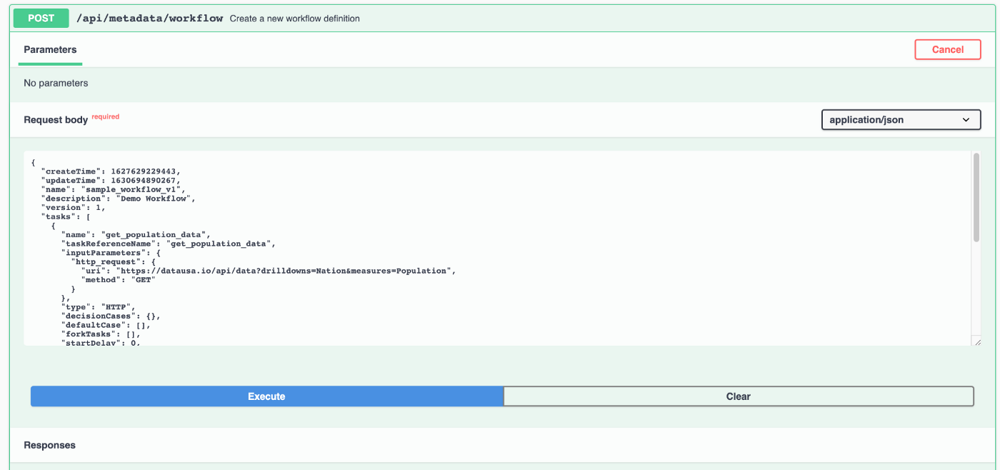
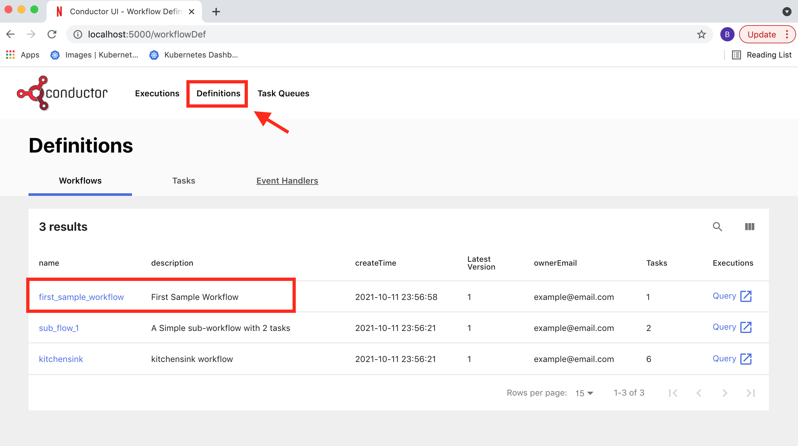
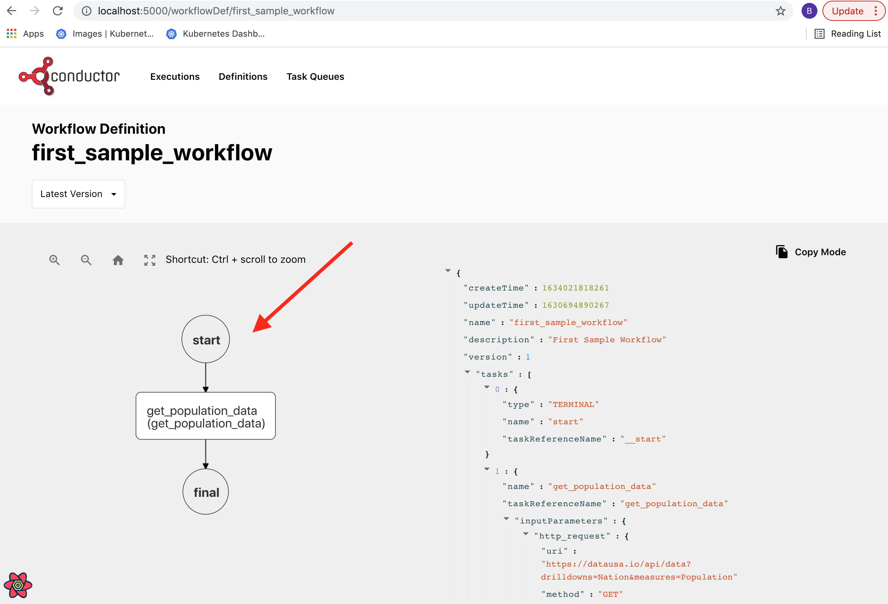
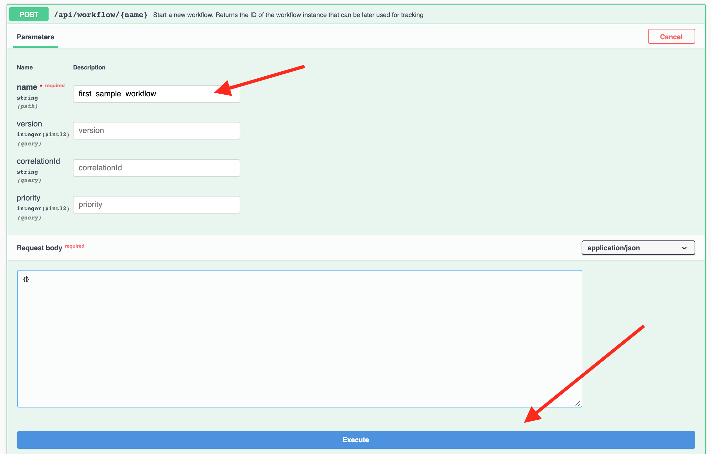
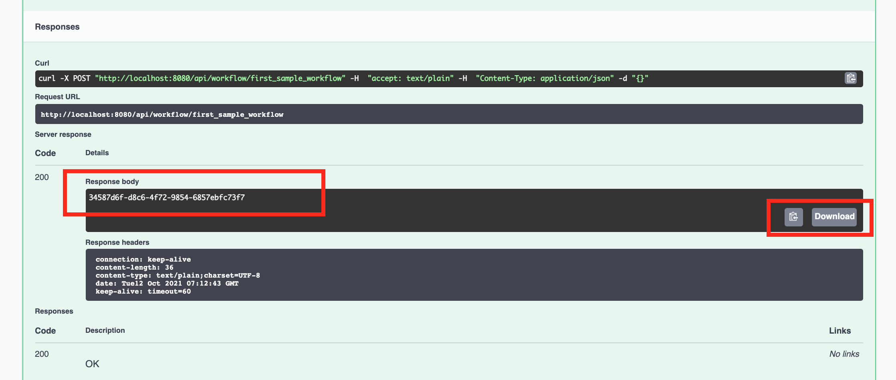
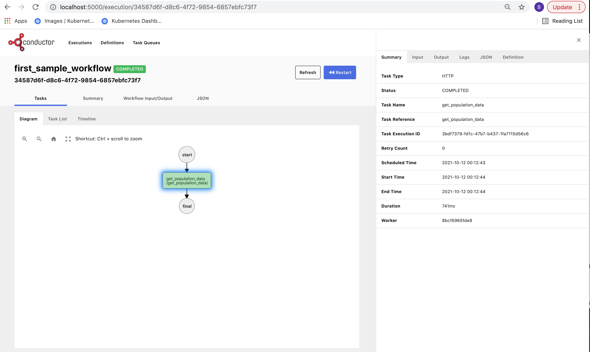

# 第一个工作流

在本文中，我们将探索如何运行一个非常简单的工作流，它无需部署任何新的微服务。

Conductor 开箱即用即可编排 HTTP 服务，无需实现任何代码。我们将利用这一点来创建并运行第一个工作流。

此类内置任务的列表参见 [系统任务](../../documentation/configuration/workflowdef/systemtasks/index.md)。
使用系统任务是在生产环境中运行我们大量代码的好方法。

## 配置我们的第一个工作流

下面是一个我们可以用于测试的示例工作流。

```json
{
  "name": "first_sample_workflow",
  "description": "First Sample Workflow",
  "version": 1,
  "tasks": [
    {
      "name": "get_population_data",
      "taskReferenceName": "get_population_data",
      "inputParameters": {
        "http_request": {
          "uri": "https://datausa.io/api/data?drilldowns=Nation&measures=Population",
          "method": "GET"
        }
      },
      "type": "HTTP"
    }
  ],
  "inputParameters": [],
  "outputParameters": {
    "data": "${get_population_data.output.response.body.data}",
    "source": "${get_population_data.output.response.body.source}"
  },
  "schemaVersion": 2,
  "restartable": true,
  "workflowStatusListenerEnabled": false,
  "ownerEmail": "example@email.com",
  "timeoutPolicy": "ALERT_ONLY",
  "timeoutSeconds": 0
}
```

这是一个查询公共 JSON API 以获取一些数据的示例工作流。由于该工作流中的任务由系统本身管理，因此它不需要任何工作者实现。这是 Conductor 的一个出色特性。对于很多典型的工作，我们完全不需要写任何代码。

让我们多聊聊这个工作流，以便获得一些上下文。

```json
"name" : "first_sample_workflow"
```

这一行就是我们给工作流命名的方式。在这种情况下，我们的工作流名称是 `first_sample_workflow`

这个工作流只包含一个工作者。工作者定义在 `tasks` 键下。下面是该工作者定义及最重要的字段：

```json
{
  "name": "get_population_data",
  "taskReferenceName": "get_population_data",
  "inputParameters": {
    "http_request": {
      "uri": "https://datausa.io/api/data?drilldowns=Nation&measures=Population",
      "method": "GET"
    }
  },
  "type": "HTTP"
}
```

以下是各字段及其作用的列表：

1. `"name"` : 我们工作者的名称
2. `"taskReferenceName"` : 这是该工作者在这个特定工作流实现中的引用。我们的工作流中可以有多个同名工作者，但需要为每个工作者使用唯一的任务引用名。任务
   引用名在整个工作流中应该是唯一的。
3. `"inputParameters"` : 这是传入我们工作者的输入。我们可以像这里一样硬编码输入。我们
   也可以提供动态输入，例如来自工作流输入，或基于另一个工作者的输出。我们可以在文档中找到
   这方面的示例。
4. `"type"` : 这是定义工作者类型的字段。在我们的示例中——它是 `HTTP`。Conductor 文档中还有更多任务
   类型可供查找。
5. `"http_request"` : 这是类型为 `HTTP` 的任务所需的输入。在我们的示例中，我们提供了一个众所周知的
   互联网 JSON API 网址，以及要调用的 HTTP 方法类型——`GET`

我们还没有讨论定义中可以使用的其他字段，因为它们要么是元数据，要么是可以
在详细文档中进一步学习的更高级概念。

好的，既然我们已经走完了工作流的细节，就来运行它并看看它如何工作。

要配置工作流，请前往 conductor 服务器的 swagger API，并访问 metadata workflow create API：

[http://{{ server_host }}/swagger-ui/index.html?configUrl=/api-docs/swagger-config#/metadata-resource/create](http://{{ server_host }}/swagger-ui/index.html?configUrl=/api-docs/swagger-config#/metadata-resource/create)

如果链接没有打开正确的 Swagger 部分，我们可以导航到 Metadata-Resource
→ `POST {{ api_prefix }}/metadata/workflow`



把工作流载荷粘贴到 Swagger API 中，然后点 Execute。

现在如果我们去 UI，可以看到这个工作流定义已经创建好了：



点击进去可以看到工作流的可视化表示：



## 运行我们的第一个工作流

让我们运行这个工作流。为此，我们可以使用 workflow-resources 下的 swagger API

[http://{{ server_host }}/swagger-ui/index.html?configUrl=/api-docs/swagger-config#/workflow-resource/startWorkflow_1](http://{{ server_host }}/swagger-ui/index.html?configUrl=/api-docs/swagger-config#/workflow-resource/startWorkflow_1)



点击 **Execute**！

Conductor 会返回一个 workflow id。我们需要用这个 id 在 UI 上加载它。如果我们的 UI 安装
启用了搜索，就不需要复制它了。如果没有启用搜索（使用 Elasticsearch），就从
Swagger UI 复制。



好的，我们应该很快就能看到它运行并完成。让我们去 UI 看看发生了什么。

要直接加载工作流，使用这个 URL 格式：

```
http://localhost:5000/execution/<WORKFLOW_ID>
```

将 `<WORKFLOW_ID>` 替换为上一步中的 workflow id。我们应该会看到类似下面的界面。点击不同的标签页查看所有输入和输出以及任务列表等。尽情探索吧！



## 小结

在本文中——我们学习了如何在我们的 Conductor 安装中运行一个示例工作流。涉及到的概念：

1. 创建工作流
2. HTTP 等系统任务
3. 通过 API 运行工作流
