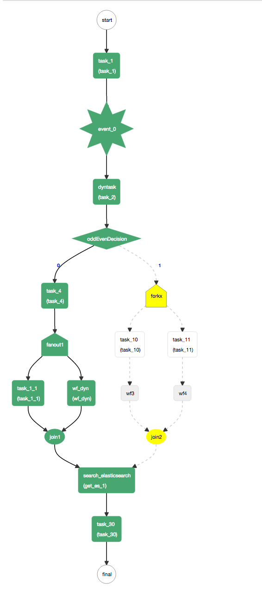

# Kitchen Sink（示例大全）
一个示例 kitchen sink 工作流，演示所有 schema 结构的用法。

### 定义

```json
{
  "name": "kitchensink",
  "description": "kitchensink workflow",
  "version": 1,
  "tasks": [
    {
      "name": "task_1",
      "taskReferenceName": "task_1",
      "inputParameters": {
        "mod": "${workflow.input.mod}",
        "oddEven": "${workflow.input.oddEven}"
      },
      "type": "SIMPLE"
    },
    {
      "name": "event_task",
      "taskReferenceName": "event_0",
      "inputParameters": {
        "mod": "${workflow.input.mod}",
        "oddEven": "${workflow.input.oddEven}"
      },
      "type": "EVENT",
      "sink": "conductor"
    },
    {
      "name": "dyntask",
      "taskReferenceName": "task_2",
      "inputParameters": {
        "taskToExecute": "${workflow.input.task2Name}"
      },
      "type": "DYNAMIC",
      "dynamicTaskNameParam": "taskToExecute"
    },
    {
      "name": "oddEvenDecision",
      "taskReferenceName": "oddEvenDecision",
      "inputParameters": {
        "oddEven": "${task_2.output.oddEven}"
      },
      "type": "DECISION",
      "caseValueParam": "oddEven",
      "decisionCases": {
        "0": [
          {
            "name": "task_4",
            "taskReferenceName": "task_4",
            "inputParameters": {
              "mod": "${task_2.output.mod}",
              "oddEven": "${task_2.output.oddEven}"
            },
            "type": "SIMPLE"
          },
          {
            "name": "dynamic_fanout",
            "taskReferenceName": "fanout1",
            "inputParameters": {
              "dynamicTasks": "${task_4.output.dynamicTasks}",
              "input": "${task_4.output.inputs}"
            },
            "type": "FORK_JOIN_DYNAMIC",
            "dynamicForkTasksParam": "dynamicTasks",
            "dynamicForkTasksInputParamName": "input"
          },
          {
            "name": "dynamic_join",
            "taskReferenceName": "join1",
            "type": "JOIN"
          }
        ],
        "1": [
          {
            "name": "fork_join",
            "taskReferenceName": "forkx",
            "type": "FORK_JOIN",
            "forkTasks": [
              [
                {
                  "name": "task_10",
                  "taskReferenceName": "task_10",
                  "type": "SIMPLE"
                },
                {
                  "name": "sub_workflow_x",
                  "taskReferenceName": "wf3",
                  "inputParameters": {
                    "mod": "${task_1.output.mod}",
                    "oddEven": "${task_1.output.oddEven}"
                  },
                  "type": "SUB_WORKFLOW",
                  "subWorkflowParam": {
                    "name": "sub_flow_1",
                    "version": 1
                  }
                }
              ],
              [
                {
                  "name": "task_11",
                  "taskReferenceName": "task_11",
                  "type": "SIMPLE"
                },
                {
                  "name": "sub_workflow_x",
                  "taskReferenceName": "wf4",
                  "inputParameters": {
                    "mod": "${task_1.output.mod}",
                    "oddEven": "${task_1.output.oddEven}"
                  },
                  "type": "SUB_WORKFLOW",
                  "subWorkflowParam": {
                    "name": "sub_flow_1",
                    "version": 1
                  }
                }
              ]
            ]
          },
          {
            "name": "join",
            "taskReferenceName": "join2",
            "type": "JOIN",
            "joinOn": [
              "wf3",
              "wf4"
            ]
          }
        ]
      }
    },
    {
      "name": "search_elasticsearch",
      "taskReferenceName": "get_es_1",
      "inputParameters": {
        "http_request": {
          "uri": "http://localhost:9200/conductor/_search?size=10",
          "method": "GET"
        }
      },
      "type": "HTTP"
    },
    {
      "name": "task_30",
      "taskReferenceName": "task_30",
      "inputParameters": {
        "statuses": "${get_es_1.output..status}",
        "workflowIds": "${get_es_1.output..workflowId}"
      },
      "type": "SIMPLE"
    }
  ],
  "outputParameters": {
    "statues": "${get_es_1.output..status}",
    "workflowIds": "${get_es_1.output..workflowId}"
  },
  "ownerEmail": "example@email.com",
  "schemaVersion": 2
}
```
### 可视化流程


### 运行 Kitchen Sink 工作流
1. 如果你在本地运行 Conductor，启动服务器时使用 `-DloadSample=true` Java 系统属性。这会创建一个 kitchensink 工作流、
相关的任务定义，并启动一个 kitchensink 工作流实例。否则，你可以复制上面的示例，在 UI 中创建一个新的工作流定义。
2. 工作流启动后，第一个任务会停留在 `SCHEDULED` 状态。这是因为当前没有 worker 在轮询该任务。
3. 我们将直接使用 REST 端点来轮询任务并更新状态。

#### 启动工作流执行
启动 kitchensink 工作流的执行：

```bash
conductor workflow start -w kitchensink -i '{"task2Name": "task_5"}'
```

响应是一个标识工作流实例 ID 的文本字符串。

??? note "使用 cURL"
    ```shell
    curl -X POST --header 'Content-Type: application/json' --header 'Accept: text/plain' '{{ server_host }}{{ api_prefix }}/workflow/kitchensink' -d '
    {
    	"task2Name": "task_5"
    }
    '
    ```

#### 轮询第一个任务：

```bash
conductor task poll task_1
```

??? note "使用 cURL"
    ```shell
    curl {{ server_host }}{{ api_prefix }}/tasks/poll/task_1
    ```
   
响应大致如下：
   
```json
{
    "taskType": "task_1",
    "status": "IN_PROGRESS",
    "inputData": {
        "mod": null,
        "oddEven": null
    },
    "referenceTaskName": "task_1",
    "retryCount": 0,
    "seq": 1,
    "pollCount": 1,
    "taskDefName": "task_1",
    "scheduledTime": 1486580932471,
    "startTime": 1486580933869,
    "endTime": 0,
    "updateTime": 1486580933902,
    "startDelayInSeconds": 0,
    "retried": false,
    "callbackFromWorker": true,
    "responseTimeoutSeconds": 3600,
    "workflowInstanceId": "b0d1a935-3d74-46fd-92b2-0ca1e388659f",
    "taskId": "b9eea7dd-3fbd-46b9-a9ff-b00279459476",
    "callbackAfterSeconds": 0,
    "polledTime": 1486580933902,
    "queueWaitTime": 1398
}
```
#### 更新任务状态
* 记下 poll 响应中 ```taskId``` 和 ```workflowInstanceId``` 字段的值
* 按如下方式把任务状态更新为 ```COMPLETED```：

```bash
conductor task update-execution --workflow-id b0d1a935-3d74-46fd-92b2-0ca1e388659f --task-ref-name task_1 --status COMPLETED --output '{"mod":5,"taskToExecute":"task_1","oddEven":0,"dynamicTasks":[{"name":"task_1","taskReferenceName":"task_1_1","type":"SIMPLE"},{"name":"sub_workflow_4","taskReferenceName":"wf_dyn","type":"SUB_WORKFLOW","subWorkflowParam":{"name":"sub_flow_1"}}],"inputs":{"task_1_1":{},"wf_dyn":{}}}'
```

??? note "使用 cURL"
    ```json
    curl -H 'Content-Type:application/json' -H 'Accept:application/json' -X POST {{ server_host }}{{ api_prefix }}/tasks/ -d '
    {
    	"taskId": "b9eea7dd-3fbd-46b9-a9ff-b00279459476",
    	"workflowInstanceId": "b0d1a935-3d74-46fd-92b2-0ca1e388659f",
    	"status": "COMPLETED",
    	"outputData": {
    	    "mod": 5,
    	    "taskToExecute": "task_1",
    	    "oddEven": 0,
    	    "dynamicTasks": [
    	        {
    	            "name": "task_1",
    	            "taskReferenceName": "task_1_1",
    	            "type": "SIMPLE"
    	        },
    	        {
    	            "name": "sub_workflow_4",
    	            "taskReferenceName": "wf_dyn",
    	            "type": "SUB_WORKFLOW",
    	            "subWorkflowParam": {
    	                "name": "sub_flow_1"
    	            }
    	        }
    	    ],
    	    "inputs": {
    	        "task_1_1": {},
    	        "wf_dyn": {}
    	    }
    	}
    }'
    ```

这会将 task_1 标记为已完成，并把 ```task_5``` 调度为下一个任务。
对后续调度的任务重复同样的过程，直到工作流完成。
