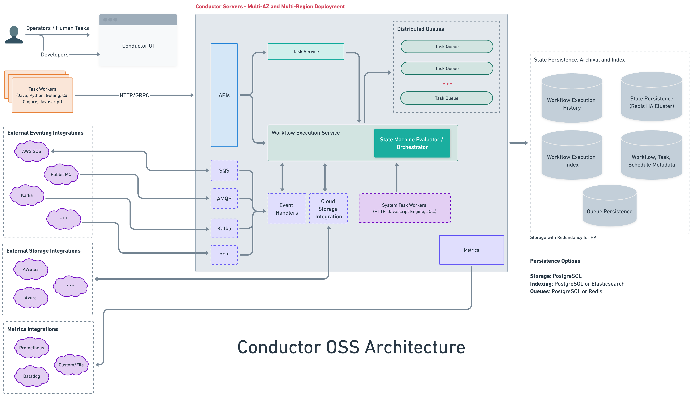

# 生产部署

Conductor 是开源且可自托管的：你在自己的基础设施上运行服务器。本指南涵盖部署架构、如何用 Docker 运行服务器、后端配置选项，以及如何扩展和监控生产环境安装。

## 架构概览

一个 Conductor 部署由以下组件构成：



**各组件的职责：**

| 组件 | 角色 |
|:--|:--|
| **API Server** | 暴露用于工作流和任务操作的 REST 和 gRPC 端点。 |
| **Decider** | 核心状态机。评估工作流状态并调度下一批任务。 |
| **Sweeper** | 轮询运行中工作流并触发 decider 评估它们的后台进程。长生命周期工作流要取得进展离不开它。 |
| **System Task Workers** | 在服务器 JVM 内执行内置任务类型（HTTP、Event、Wait、Inline、JSON_JQ 等）。 |
| **Event Processor** | 监听已配置的事件总线，并根据传入事件触发工作流或完成任务。 |
| **Database** | 持久化工作流定义、执行状态、任务状态和轮询数据。 |
| **Queue** | 管理任务调度：待处理任务、延迟任务，以及 sweeper 自己的工作队列。 |
| **Index** | 支撑 UI 和搜索 API 中的工作流与任务搜索。 |
| **Lock** | 防止并发 decider 评估同一工作流的分布式锁。**生产环境必需。** |

---

## 使用 Docker 运行

### 独立镜像

初次体验，可以运行独立镜像。它打包了服务器、UI 和基于 SQLite 的持久化，因此不需要任何外部依赖：

```shell
docker run -p 8080:8080 conductoross/conductor:latest
```

| URL | 说明 |
|:----|:---|
| `http://localhost:8080` | Conductor UI |
| `http://localhost:8080/swagger-ui/index.html` | REST API 文档 |
| `http://localhost:8080/api/` | API 基础 URL |

在生产环境中，请固定使用发布标签（如 `conductoross/conductor:3.4.0`）而非 `latest`，这样升级由你选择时机。

### Docker Compose

仓库提供了将服务器与生产后端配对的 compose 文件：

```shell
git clone https://github.com/conductor-oss/conductor
cd conductor
docker compose -f docker/docker-compose.yaml up
```

这会以 Redis（数据库 + 队列）、Elasticsearch（索引）和带 UI 的服务器（端口 **8080**）启动 Conductor。

其他后端组合的预构建 compose 文件：

| Compose 文件 | 数据库 | 队列 | 索引 |
|:--|:--|:--|:--|
| `docker-compose.yaml` | Redis | Redis | Elasticsearch 7 |
| `docker-compose-es8.yaml` | Redis | Redis | Elasticsearch 8 |
| `docker-compose-postgres.yaml` | PostgreSQL | PostgreSQL | PostgreSQL |
| `docker-compose-postgres-es7.yaml` | PostgreSQL | PostgreSQL | Elasticsearch 7 |
| `docker-compose-mysql.yaml` | MySQL | Redis | Elasticsearch 7 |
| `docker-compose-cassandra-es7.yaml` | Cassandra | Redis | Elasticsearch 7 |
| `docker-compose-redis-os2.yaml` | Redis | Redis | OpenSearch 2 |
| `docker-compose-redis-os3.yaml` | Redis | Redis | OpenSearch 3 |

```shell
# Example: PostgreSQL for everything
docker compose -f docker/docker-compose-postgres.yaml up

# Example: Redis + Elasticsearch 8
docker compose -f docker/docker-compose-es8.yaml up

# Example: Redis + OpenSearch 3
docker compose -f docker/docker-compose-redis-os3.yaml up
```

对于 Elasticsearch 8，设置 `conductor.indexing.type=elasticsearch8`，并使用
`config-redis-es8.properties` 或等效的自定义配置。

### 自定义配置

当 `CONFIG_PROP` 环境变量指定了文件名时，镜像会从 `/app/config` 读取 properties 文件。挂载你的文件并设置该变量：

```shell
docker run -p 8080:8080 \
  -e CONFIG_PROP=config.properties \
  -v /path/to/my-config.properties:/app/config/config.properties \
  conductoross/conductor:latest
```

没有 `CONFIG_PROP` 时，服务器会忽略挂载的文件，并使用内置的 SQLite 默认配置启动。

用 `JAVA_OPTS` 环境变量设置 JVM 选项，例如 `-e JAVA_OPTS="-Xms2g -Xmx4g"`。

### 关闭

```shell
# Ctrl+C to stop, then:
docker compose down
```

---

## 生产配置

所有配置都通过 `application.properties` 中的 Spring Boot 属性或环境变量完成。properties 文件也可以作为 Docker 卷挂载。

### 数据库

数据库存储工作流定义、执行状态、任务状态和事件处理器定义。

```properties
conductor.db.type=postgres
```

**支持的数据库后端：**

| 后端 | 属性值 | 适用场景 | 备注 |
|:--|:--|:--|:--|
| PostgreSQL | `postgres` | **生产环境推荐。** 支持 ACID，还可以兼任索引后端。 | 需要 `spring.datasource.*` 配置。 |
| MySQL | `mysql` | 如果你的团队已经在运行 MySQL，可作为生产替代。 | 需要 `spring.datasource.*` 配置。需要单独的队列后端（Redis）。 |
| Redis | `redis_standalone` | 快速、简单。适合中等规模。 | 需要 `conductor.redis.*` 配置。也支持 `redis_cluster` 和 `redis_sentinel`。 |
| Cassandra | `cassandra` | 高写入吞吐量、多区域。 | 需要 `conductor.cassandra.*` 配置。 |
| SQLite | `sqlite` | **仅限本地开发。** 单文件、零配置。 | 默认值。不用于生产。 |

#### PostgreSQL

```properties
conductor.db.type=postgres
conductor.external-payload-storage.type=postgres

spring.datasource.url=jdbc:postgresql://db-host:5432/conductor
spring.datasource.username=conductor
spring.datasource.password=<password>

# Optional tuning
conductor.postgres.deadlockRetryMax=3
conductor.postgres.taskDefCacheRefreshInterval=60s
conductor.postgres.asyncMaxPoolSize=12
conductor.postgres.asyncWorkerQueueSize=100
```

#### MySQL

```properties
conductor.db.type=mysql

spring.datasource.url=jdbc:mysql://db-host:3306/conductor
spring.datasource.username=conductor
spring.datasource.password=<password>

# Optional tuning
conductor.mysql.deadlockRetryMax=3
conductor.mysql.taskDefCacheRefreshInterval=60s
```

#### Redis

```properties
conductor.db.type=redis_standalone

# Format: host:port:rack (semicolon-separated for multiple hosts)
conductor.redis.hosts=redis-host:6379:us-east-1c
conductor.redis.workflowNamespacePrefix=conductor
conductor.redis.queueNamespacePrefix=conductor_queues
conductor.redis.taskDefCacheRefreshInterval=1s

# Connection pool
conductor.redis.maxIdleConnections=8
conductor.redis.minIdleConnections=5

# SSL
conductor.redis.ssl=false

# Auth (password is taken from the first host entry: host:port:rack:password)
# Or set conductor.redis.username and conductor.redis.password directly
```

---

### 队列

队列后端管理任务调度。它跟踪哪些任务是待处理、延迟还是就绪可执行，sweeper 和系统任务工作者都依赖它。

```properties
conductor.queue.type=postgres
```

**支持的队列后端：**

| 后端 | 属性值 | 适用场景 |
|:--|:--|:--|
| PostgreSQL | `postgres` | 当数据库也是 PostgreSQL 时使用。最简单的技术栈。 |
| Redis | `redis_standalone` | 当数据库是 Redis 或 MySQL 时使用。快速、低延迟。 |
| SQLite | `sqlite` | 仅限本地开发。 |

!!! tip "让队列后端与数据库匹配"
    PostgreSQL 数据库 + PostgreSQL 队列是最简单的生产技术栈——少一个依赖。如果数据库使用 MySQL，请搭配 Redis 作为队列。

---

### 索引

索引后端支撑 UI 以及 `/api/workflow/search` 和 `/api/tasks/search` 端点中的工作流与任务搜索。

```properties
conductor.indexing.enabled=true
conductor.indexing.type=postgres
```

**支持的索引后端：**

| 后端 | 属性值 | 适用场景 | 备注 |
|:--|:--|:--|:--|
| PostgreSQL | `postgres` | 当数据库也是 PostgreSQL 时最简单的技术栈。 | 设置 `conductor.elasticsearch.version=0` 以禁用 ES 客户端。 |
| Elasticsearch 7 | `elasticsearch` | 大规模下最佳搜索性能。全文搜索。 | 设置 `conductor.elasticsearch.version=7`。 |
| Elasticsearch 8 | `elasticsearch8` | 当运行 ES8 持久化模块时使用。 | 设置 `conductor.elasticsearch.version=8`。 |
| OpenSearch 2 | `opensearch2` | 开源的 ES 替代方案。 | 兼容 ES 7 查询。 |
| OpenSearch 3 | `opensearch3` | 最新 OpenSearch。 | |
| SQLite | `sqlite` | 仅限本地开发。 | |
| 禁用 | N/A | 设置 `conductor.indexing.enabled=false`。UI 搜索将不可用。 | |

#### PostgreSQL 索引

```properties
conductor.indexing.enabled=true
conductor.indexing.type=postgres
# Disable Elasticsearch client
conductor.elasticsearch.version=0
```

#### Elasticsearch 7

```properties
conductor.indexing.enabled=true
conductor.elasticsearch.url=http://es-host:9200
conductor.elasticsearch.version=7
conductor.elasticsearch.indexName=conductor
conductor.elasticsearch.clusterHealthColor=yellow

# Performance tuning
conductor.elasticsearch.indexBatchSize=1
conductor.elasticsearch.asyncMaxPoolSize=12
conductor.elasticsearch.asyncWorkerQueueSize=100
conductor.elasticsearch.asyncBufferFlushTimeout=10s
conductor.elasticsearch.indexShardCount=5
conductor.elasticsearch.indexReplicasCount=1

# Auth (if using security)
conductor.elasticsearch.username=elastic
conductor.elasticsearch.password=<password>
```

#### Elasticsearch 8

```properties
conductor.indexing.enabled=true
conductor.indexing.type=elasticsearch8
conductor.elasticsearch.url=http://es-host:9200
conductor.elasticsearch.version=8
conductor.elasticsearch.indexName=conductor
conductor.elasticsearch.clusterHealthColor=yellow
```

#### OpenSearch

```properties
conductor.indexing.enabled=true
conductor.indexing.type=opensearch2   # or opensearch3
conductor.opensearch.url=http://os-host:9200
conductor.opensearch.indexPrefix=conductor
conductor.opensearch.clusterHealthColor=yellow
conductor.opensearch.indexReplicasCount=0
```

#### 异步索引

对于高吞吐量部署，启用异步索引，把索引路径与工作流执行路径解耦：

```properties
conductor.app.asyncIndexingEnabled=true
conductor.app.asyncUpdateShortRunningWorkflowDuration=30s
conductor.app.asyncUpdateDelay=60s
```

#### 索引开关

控制哪些内容被索引：

```properties
conductor.app.taskIndexingEnabled=true
conductor.app.taskExecLogIndexingEnabled=true
conductor.app.eventMessageIndexingEnabled=true
conductor.app.eventExecutionIndexingEnabled=true
```

---

### 锁 { #locking }

!!! warning "生产环境必需"
    分布式锁防止多个服务器实例并发评估同一工作流时产生竞态条件。**在生产环境中务必使用分布式锁提供者（Redis 或 Zookeeper）启用锁。**

```properties
conductor.workflow-execution-lock.type=redis
conductor.app.workflowExecutionLockEnabled=true
```

**支持的锁提供者：**

| 提供者 | 属性值 | 适用场景 |
|:--|:--|:--|
| Redis | `redis` | **推荐。** 当技术栈中已有 Redis 时使用。 |
| Zookeeper | `zookeeper` | 当 Zookeeper 可用时使用（例如 Kafka 部署）。 |
| Local | `local_only` | 仅限单实例开发。**多实例不安全。** |

#### Redis 锁

```properties
conductor.workflow-execution-lock.type=redis
conductor.app.workflowExecutionLockEnabled=true
conductor.app.lockLeaseTime=60000      # lock held for max 60s
conductor.app.lockTimeToTry=500        # wait up to 500ms to acquire

conductor.redis-lock.serverType=SINGLE              # SINGLE, CLUSTER, or SENTINEL
conductor.redis-lock.serverAddress=redis://redis-host:6379
# conductor.redis-lock.serverPassword=<password>
# conductor.redis-lock.serverMasterName=master     # for Sentinel
# conductor.redis-lock.namespace=conductor          # key prefix
conductor.redis-lock.ignoreLockingExceptions=false
```

> **多端点的 Sentinel：** 使用 `SENTINEL` 服务器类型时，可以用分号分隔提供
> 多个 sentinel 地址以提高高可用性：
> ```properties
> conductor.redis-lock.serverType=SENTINEL
> conductor.redis-lock.serverAddress=redis://sentinel-0:26379;redis://sentinel-1:26379
> conductor.redis-lock.serverMasterName=mymaster
> ```
> 这能确保即使某个 sentinel 节点宕机，锁客户端也能发现主节点。

#### Zookeeper 锁

```properties
conductor.workflow-execution-lock.type=zookeeper
conductor.app.workflowExecutionLockEnabled=true
conductor.app.lockLeaseTime=60000
conductor.app.lockTimeToTry=500

conductor.zookeeper-lock.connectionString=zk1:2181,zk2:2181,zk3:2181
# conductor.zookeeper-lock.sessionTimeoutMs=60000
# conductor.zookeeper-lock.connectionTimeoutMs=15000
# conductor.zookeeper-lock.namespace=conductor
```

---

### Sweeper

sweeper 是监控运行中工作流的后台进程。它轮询队列中需要评估的工作流并触发 decider。没有 sweeper，长生命周期工作流将无法取得进展。

sweeper 作为 Conductor 服务器的一部分自动运行。根据你的工作流量调整线程数：

```properties
# Number of sweeper threads (default: availableProcessors * 2)
conductor.app.sweeperThreadCount=8

# How long to wait when polling the sweep queue (default: 2000ms)
conductor.app.sweeperWorkflowPollTimeout=2000

# Batch size per sweep poll (default: 2)
conductor.app.sweeper.sweepBatchSize=2

# Queue pop timeout in ms (default: 100)
conductor.app.sweeper.queuePopTimeout=100
```

!!! tip "Sweeper 规模设定"
    从 `sweeperThreadCount = 2 * CPU 核心数` 开始。如果发现工作流卡在 RUNNING 状态，就增加它。如果空闲时 CPU 使用率高，就减少它。

---

### 系统任务工作者

系统任务工作者在 Conductor 服务器 JVM 内执行内置任务类型（HTTP、Event、Wait、Inline、JSON_JQ_TRANSFORM 等）。它们轮询内部队列中已调度的系统任务并执行它们。

```properties
# Number of system task worker threads (default: availableProcessors * 2)
conductor.app.systemTaskWorkerThreadCount=20

# Max number of tasks to poll at once (default: same as thread count)
conductor.app.systemTaskMaxPollCount=20

# Poll interval (default: 50ms)
conductor.app.systemTaskWorkerPollInterval=50ms

# Callback duration — how often to re-check async system tasks (default: 30s)
conductor.app.systemTaskWorkerCallbackDuration=30s

# Queue pop timeout (default: 100ms)
conductor.app.systemTaskQueuePopTimeout=100ms
```

#### 单独运行系统任务工作者

在大型部署中，你可能希望把系统任务工作者放在专用实例上，与 API 服务器分开。使用**执行命名空间（execution namespace）**来隔离哪个实例处理系统任务：

```properties
# On API-only instances — set a namespace that no system task worker listens on
conductor.app.systemTaskWorkerExecutionNamespace=api-only
conductor.app.systemTaskWorkerThreadCount=0

# On dedicated system task worker instances — match the namespace
conductor.app.systemTaskWorkerExecutionNamespace=worker-pool-1
conductor.app.systemTaskWorkerThreadCount=40
conductor.app.systemTaskMaxPollCount=40
```

#### 隔离的系统任务工作者

用于任务域隔离（把特定任务路由到特定的工作者组）：

```properties
# Threads per isolation group (default: 1)
conductor.app.isolatedSystemTaskWorkerThreadCount=4
```

#### 延迟阈值（Postpone threshold）

当一个系统任务被轮询了很多次仍未完成（例如一个等待各分支的 Join）时，Conductor 会渐进式延迟重新评估，以避免忙轮询：

```properties
# After this many polls, begin exponential backoff (default: 200)
conductor.app.systemTaskPostponeThreshold=200
```

---

### 事件处理

事件处理器监听已配置的事件总线，并根据传入事件触发工作流或完成任务。

```properties
# Thread count for event processing (default: 2)
conductor.app.eventProcessorThreadCount=4

# Event queue polling
conductor.app.eventQueueSchedulerPollThreadCount=4  # default: CPU cores
conductor.app.eventQueuePollInterval=100ms
conductor.app.eventQueuePollCount=10
conductor.app.eventQueueLongPollTimeout=1000ms
```

配置 Kafka、NATS、AMQP 和 SQS 事件队列的方法参见 [事件驱动配方](../cookbook/event-driven.md)。

---

### 载荷大小限制

Conductor 强制执行载荷大小限制，以防止超大数据降低性能。当载荷超过阈值时，它会被自动存入外部载荷存储（S3、PostgreSQL 或 Azure Blob）。

```properties
# Workflow input/output — threshold to move to external storage (default: 5120 KB)
conductor.app.workflowInputPayloadSizeThreshold=5120KB
conductor.app.workflowOutputPayloadSizeThreshold=5120KB

# Workflow input/output — hard limit, fails the workflow (default: 10240 KB)
conductor.app.maxWorkflowInputPayloadSizeThreshold=10240KB
conductor.app.maxWorkflowOutputPayloadSizeThreshold=10240KB

# Task input/output — threshold to move to external storage (default: 3072 KB)
conductor.app.taskInputPayloadSizeThreshold=3072KB
conductor.app.taskOutputPayloadSizeThreshold=3072KB

# Task input/output — hard limit, fails the task (default: 10240 KB)
conductor.app.maxTaskInputPayloadSizeThreshold=10240KB
conductor.app.maxTaskOutputPayloadSizeThreshold=10240KB

# Workflow variables — hard limit (default: 256 KB)
conductor.app.maxWorkflowVariablesPayloadSizeThreshold=256KB
```

外部载荷存储配置参见 [外部载荷存储](../../documentation/advanced/externalpayloadstorage.md)。

---

### 工作流监控与可观测性

Conductor 暴露 Prometheus 兼容的指标：

```properties
conductor.metrics-prometheus.enabled=true
management.endpoints.web.exposure.include=health,info,prometheus
management.metrics.web.server.request.autotime.percentiles=0.50,0.75,0.90,0.95,0.99
management.endpoint.health.show-details=always
```

`management.endpoints.web.exposure.include` 一行与服务器默认值一致，因此即使没有自定义配置，`health`、`info` 和 `prometheus` 也会暴露。用 Prometheus 抓取 `http://<conductor-host>:8080/actuator/prometheus`。

可用指标的详情请参见 [服务器指标](../../documentation/metrics/server.md) 和 [客户端指标](../../documentation/metrics/client.md)。

#### 健康检查

把存活（liveness）和就绪（readiness）探针指向 `http://<conductor-host>:8080/actuator/health`。要单独验证 API 层，请求 `GET /api/metadata/workflow`，健康服务器会返回 `200`。没有 `/api/health` 端点。

---

## 推荐的生产配置

### PostgreSQL 技术栈（最简单）

一个数据库搞定所有——活动部件最少。

```properties
# Database
conductor.db.type=postgres
conductor.queue.type=postgres
conductor.external-payload-storage.type=postgres
spring.datasource.url=jdbc:postgresql://db-host:5432/conductor
spring.datasource.username=conductor
spring.datasource.password=<password>

# Indexing (use PostgreSQL, no Elasticsearch needed)
conductor.indexing.enabled=true
conductor.indexing.type=postgres
conductor.elasticsearch.version=0

# Locking (use Redis — lightweight, fast)
conductor.workflow-execution-lock.type=redis
conductor.app.workflowExecutionLockEnabled=true
conductor.redis-lock.serverAddress=redis://redis-host:6379

# Sweeper
conductor.app.sweeperThreadCount=8

# System task workers
conductor.app.systemTaskWorkerThreadCount=20
conductor.app.systemTaskMaxPollCount=20

# Metrics
conductor.metrics-prometheus.enabled=true
management.endpoints.web.exposure.include=health,info,prometheus
```

### Redis + Elasticsearch 技术栈（高吞吐）

最佳搜索性能，队列操作延迟最低。

```properties
# Database + Queue
conductor.db.type=redis_standalone
conductor.queue.type=redis_standalone
conductor.redis.hosts=redis-host:6379:us-east-1c
conductor.redis.workflowNamespacePrefix=conductor
conductor.redis.queueNamespacePrefix=conductor_queues

# Indexing
conductor.indexing.enabled=true
conductor.elasticsearch.url=http://es-host:9200
conductor.elasticsearch.version=7
conductor.elasticsearch.indexName=conductor
conductor.elasticsearch.clusterHealthColor=yellow
conductor.app.asyncIndexingEnabled=true

# Locking
conductor.workflow-execution-lock.type=redis
conductor.app.workflowExecutionLockEnabled=true
conductor.redis-lock.serverAddress=redis://redis-host:6379

# Sweeper
conductor.app.sweeperThreadCount=16

# System task workers
conductor.app.systemTaskWorkerThreadCount=40
conductor.app.systemTaskMaxPollCount=40

# Metrics
conductor.metrics-prometheus.enabled=true
management.endpoints.web.exposure.include=health,info,prometheus
```

---

## 多实例部署与水平扩展

为了实现高可用和水平扩展，在负载均衡器后面运行多个 Conductor 服务器实例。所有实例共享相同的数据库、队列、索引和锁后端。这种架构使工作流引擎可扩展到数百万个并发执行。

**要求：**

- **必须启用分布式锁**（`redis` 或 `zookeeper`）。否则，对同一工作流的并发 decider 评估会导致竞态条件。
- 所有实例必须指向相同的数据库、队列和索引后端。
- 负载均衡器应使用轮询（round-robin）或最少连接（least-connections）路由。

**可选：API 实例与工作者实例分离：**

```
┌──────────────────┐     ┌──────────────────┐
│  API Instance 1  │     │  API Instance 2  │   ← handle REST/gRPC, low system task threads
│  (systemTask=0)  │     │  (systemTask=0)  │
└────────┬─────────┘     └────────┬─────────┘
         │                        │
    ┌────┴────────────────────────┴────┐
    │         Load Balancer            │
    └────┬────────────────────────┬────┘
         │                        │
┌────────┴──────────┐     ┌───────┴───────────┐
│  Worker Instance  │     │  Worker Instance  │  ← high system task threads, sweeper
│  (systemTask=40)  │     │  (systemTask=40)  │
└───────────────────┘     └───────────────────┘
```

---

## 故障排查

| 问题 | 解决方案 |
|:--|:--|
| 内存不足或性能缓慢 | 检查 JVM 堆使用量，并按需调整 `-Xms` / `-Xmx`。用 `jstat` 或 `/actuator/health` 端点监控。 |
| Elasticsearch 卡在黄色健康状态 | 设置 `conductor.elasticsearch.clusterHealthColor=yellow`，或增加 ES 节点以获得绿色。 |
| 工作流卡在 RUNNING | 检查 sweeper 是否在运行且 `sweeperThreadCount > 0`。检查锁提供者是否可达。 |
| 系统任务未执行 | 确认 `systemTaskWorkerThreadCount > 0` 且队列后端可达。 |
| 配置更改未生效 | properties 在构建时被烘焙进 Docker 镜像。请挂载卷而不是重新构建。 |
