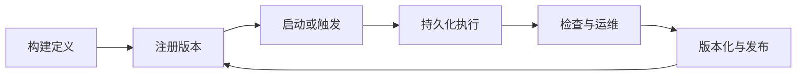

# 工作流

Conductor 把工作流"是什么"与它每次运行时"何时运行"区分开来。**工作流定义**声明哪些任务运行、以什么顺序运行，以及数据如何在它们之间传递。当你启动一个工作流时，Conductor 会创建一个**工作流执行**，即该蓝图的一次运行，拥有自己的 ID、输入和历史。由于两者是分离的，编辑定义永远不会改写已经运行过的执行的历史。在实践中，开发者通过版本来演进定义，而运维人员检查和恢复执行。

每个工作流都经历同样的生命周期：

执行是持久化的，因为 Conductor 在每完成一个任务后就保存进度。这就是为什么工作可以跨越多个服务、等待人或计时器，并在重启后从中断处继续。由于 Conductor 把任务从一个传递给下一个，每个任务都必须写明自己的契约：输入从哪里来，失败时会发生什么。工作者任务还有一个额外要求。如果没有工作者在轮询该任务，工作流就只是等待，不会前进。

工作流的日常工作通常落在以下四类活动之一。

-   **构建（Build）**

    定义契约，选择系统任务或工作者，接通数据，校验模式（schema），并注册一个版本。从 [创建或更新工作流](../how-tos/Workflows/creating-workflows.md) 开始。

-   **运行（Run）**

    启动一个执行，记录其 workflow ID，并检查任务的输入、输出和状态。从 [启动工作流](../how-tos/Workflows/starting-workflows.md) 开始。

-   **触发（Trigger）**

    决定由应用、调度、事件、父工作流还是外部信号来掌控下一次状态转换。从 [选择触发器](../how-tos/Workflows/choosing-a-trigger.md) 开始。

-   **运维（Operate）**

    添加超时和重试，搜索执行，调试失败，安全地恢复，并发布新版本。遵循[最佳实践](../bestpractices.md)。

## 选择任务的运行方式

大多数工作流步骤应使用内置系统任务。当代码必须在你的服务中执行，或没有内置任务能表示该操作时，使用 `SIMPLE` 任务。

| 需求 | 选择 | 由谁操作 |
|---|---|---|
| 调用 HTTP、等待、分支、分叉、转换 JSON、发布事件，或启动另一个工作流 | 内置系统任务 | Conductor 服务器 |
| 执行领域逻辑、访问私有库，或调用专有系统 | `SIMPLE` 任务 | 你的工作者进程 |
| 运行一个子工作流并等待其结果 | `SUB_WORKFLOW` | Conductor 服务器 |
| 启动一个子工作流并立即继续 | `START_WORKFLOW` | Conductor 服务器 |

`SIMPLE` 任务需要一个已注册的任务定义，以及一个正在轮询该确切任务类型的工作者。没有它们，任务就会一直留在队列中，工作流不会前进。[任务选择器](../how-tos/Tasks/choosing-tasks.md) 涵盖完整的内置目录；[第一个工作者快速入门](../../quickstart/first-worker.md) 涵盖外部工作者的路径。

## 选择执行的启动或恢复方式

| 需求 | 机制 | 适用场景 |
|---|---|---|
| 服务或用户现在就要启动工作 | 直接通过 API、CLI 或 SDK 启动 | 调用方已经拥有该请求和输入 |
| 工作要在特定时间或按固定节奏启动 | 调度 | Cron 和时区定义何时创建新的执行 |
| 消息启动或推进工作 | 事件处理器 | 代理（broker）或 Conductor 事件是事实来源 |
| 一个工作流调用另一个工作流 | `SUB_WORKFLOW` 或 `START_WORKFLOW` | 父工作流显式掌控组合 |
| 现有工作等待外部决定而暂停 | `WAIT`、`HUMAN`，或 `asyncComplete` 加任务信号/事件动作 | 同一执行必须恢复，而不是创建一个新执行 |

不要仅靠业务关联（business correlation）就通过事件处理器来完成等待中的工作。已实现的 OSS 动作要求提供 `taskId`，或 `workflowId` 加 `taskRefName`。投递和幂等规则参见 [事件编排](../how-tos/event-bus.md)。

## 一个实用的生命周期

在**构建（Build）**期间，先定义输入和稳定的输出参数，再接通任务。优先使用内置任务；为每个 `SIMPLE` 步骤所需的任务定义进行注册。校验定义，然后使用 mock 工作流测试来在不调用真实依赖的情况下演练分支。最后针对测试依赖运行一次真实执行。

在**运行（Run）**期间，当可重复性重要时，启动固定版本的定义，记录返回的 workflow ID，并检查执行结果，而不是假定提交就意味着完成。同步启动对有限范围的测试很方便；异步启动加状态查询对长生命周期工作更安全。

在**触发（Trigger）**期间，让所有权显式化。调度总是创建执行。事件可以创建执行，也可以使某个已标识的任务完成/失败。工作流组合直接表达已知的依赖关系。信号恢复已存在的工作。

在**运维（Operate）**期间，配置任务重试和所有相关超时，定义幂等的工作者行为，携带关联数据，监控队列和执行状态，并演练恢复。把破坏性的输入或输出变更作为新的工作流版本发布，并在调用方准备好之前让它们保持固定在旧版本上。

## 选择你的路线

要在本地环境取得第一次成功，请遵循 [运行你的第一个工作流](../../quickstart/first-workflow.md)。它只使用内置任务，并以一个可观测的已完成执行收尾。

要构建生产服务，请遵循[最佳实践](../bestpractices.md)。它们将契约设计、校验、真实边界测试、工作者部署、可靠性策略、可观测性和恢复演练串联起来。当你已经理解生命周期并希望获得紧凑的可运行变体时，使用 Recipes 部分。
