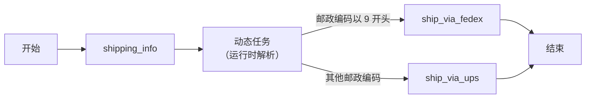

# Dynamic
```json
"type" : "DYNAMIC"
```

Dynamic 任务（`DYNAMIC`）用于在运行时动态执行一个已注册的任务。它类似于编程中的函数指针，适用于执行哪个任务的决定只在工作流开始之后才能做出的场景。

Dynamic 任务接受一个任务名称作为输入，该任务可以是系统任务或注册在 Conductor 上的 Worker 任务（`SIMPLE`）。


## 任务参数

要配置 Dynamic 任务，请在任务配置顶层提供一个 `dynamicTaskNameParam`，并在 `inputParameters` 中提供与之匹配的参数。

例如，如果 `dynamicTaskNameParam` 为 "taskToExecute"，则在 `inputParameters` 的 `taskToExecute` 中指定要执行的任务名称。

| 参数          | 类型                | 描述                                       | 必填 / 可选  |
| ------------------ | ------------------- | ------------------------------------------------- | -------------------- |
| dynamicTaskNameParam | String | `inputParameters` 中的参数名，其值用于调度要执行的任务。例如 "taskToExecute"。 | 必填。 |
| taskToExecute | String | 将要执行的任务的名称。 | 必填。
| 

你还可以将 Dynamic 任务的其他任何输入传入 `inputParameters`。

## JSON 配置

以下是 Dynamic 任务的任务配置。

```json
{
  "name": "dynamic",
  "taskReferenceName": "dynamic_ref",
  "inputParameters": {
    "taskToExecute": "${workflow.input.dynamicTaskName}" // name of the task to execute
  },
  "type": "DYNAMIC",
  "dynamicTaskNameParam": "taskToExecute" // input parameter key that will contain the task name to execute
}
```

# 输出

执行期间，Dynamic 任务会被运行时实际调用的任务所取代。Dynamic 任务的输出即为被调用任务的输出。


## 执行

在运行时，如果提供了错误的任务名称且该任务不存在，工作流将失败并报错 "Invalid task specified. Cannot find task by name in the task definitions."

同样，如果任务名称提供的是空引用，工作流将失败并报错
"Cannot map a dynamic task based on the parameter and input. Parameter= taskToExecute, input= {taskToExecute=null}"。


## 示例

在此示例工作流中，根据收货地址使用不同的快递商进行发货。

这一决定只能在运行时收到地址之后才能做出，后续的发货任务可能是 `ship_via_fedex` 或 `ship_via_ups`。在此工作流中可以使用 Dynamic 任务，使发货任务能够实时决定。

前面的 `shipping_info` 任务生成一个输出，用于决定在 Dynamic 任务中运行哪个任务。

以下是工作流定义：

```json
{
  "name": "Shipping_Flow",
  "description": "Ships smartly based on the shipping address",
  "version": 1,
  "tasks": [
    {
      "name": "shipping_info",
      "taskReferenceName": "shipping_info_ref",
      "inputParameters": {},
      "type": "SIMPLE"
    },
    {
      "name": "shipping_task",
      "taskReferenceName": "shipping_task_ref",
      "inputParameters": {
        "taskToExecute": "${shipping_info.output.shipping_service}"
      },
      "type": "DYNAMIC",
      "dynamicTaskNameParam": "taskToExecute"
    }
  ],
  "inputParameters": [],
	"outputParameters": {},
  "restartable": true,
  "ownerEmail":"abc@example.com",
  "workflowStatusListenerEnabled": true,
  "schemaVersion": 2
}
```

工作流流程如下：



物流服务根据邮政编码决定。如果邮政编码以 9 开头，则执行 `ship_via_fedex`。如果邮政编码以其他任何数字开头，则执行 `ship_via_ups`。
