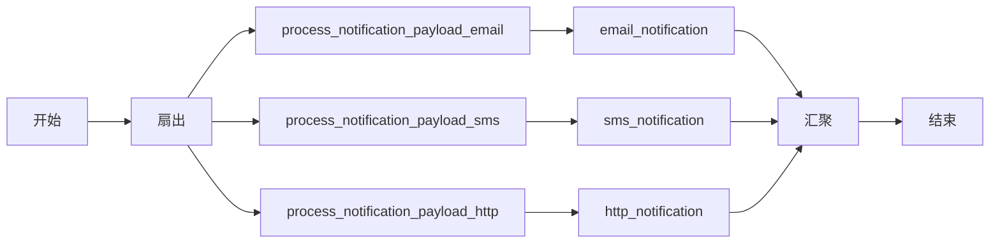

# Fork
```json
"type" : "FORK_JOIN"
```

Fork 任务（`FORK_JOIN`）也称为静态分叉（static fork），用于并行运行任务序列，包括 [Sub Workflow](sub-workflow-task.md) 任务。

Fork 任务之后必须跟随一个 [Join](join-task.md) 任务，等待分叉任务完成后再进入下一个任务。该 Join 任务会收集每个分叉任务的输出。

## 任务参数
  
在 Fork 任务配置顶层使用以下参数。

| 参数          | 类型                | 描述                                       | 必填 / 可选  |
| ------------------ | ------------------- | ------------------------------------------------- | -------------------- |
| forkTasks         | List[List[Task]] | 要并行调用的任务列表的列表（`[[...], [...]]`）。<br/><br/> 外层列表中的每个项表示一个将并行调用的分叉，而每个内层列表包含特定分叉的任务配置。每个子列表中定义的任务可以是顺序执行的，也可以是更深层嵌套的分叉。 | 必填。 |

[Join](join-task.md) 任务必须在分叉任务之后运行。同样配置 Join 任务以完成分叉-汇聚（fork-join）操作。

## JSON 配置

以下是 Fork 任务的任务配置。

```json
{
  "name": "fork",
  "taskReferenceName": "fork_ref",
  "inputParameters": {},
  "type": "FORK_JOIN",
  "forkTasks": [
    [ // fork branch
      {
        // task configuration
      },
      {
        // task configuration
      }
    ],
    [ // another fork branch 
      {
        // task configuration
      },
      {
        // task configuration
      }
    ]
  ]
}
```

## 输出

Fork 任务本身没有输出。它与 [JOIN](join-task.md) 任务配合使用，由后者聚合并行化分叉的输出。

## 示例

在此示例工作流中，会发送三个通知：电子邮件、短信和 HTTP。由于这些任务之间互不依赖，因此可以使用 Fork 任务并行运行它们。



以下是 Fork 任务的 JSON 配置，以及与之对应的 Join 任务：

```json
[
  {
    "name": "fork_join",
    "taskReferenceName": "my_fork_join_ref",
    "type": "FORK_JOIN",
    "forkTasks": [
      [
        {
          "name": "process_notification_payload",
          "taskReferenceName": "process_notification_payload_email",
          "type": "SIMPLE"
        },
        {
          "name": "email_notification",
          "taskReferenceName": "email_notification_ref",
          "type": "SIMPLE"
        }
      ],
      [
        {
          "name": "process_notification_payload",
          "taskReferenceName": "process_notification_payload_sms",
          "type": "SIMPLE"
        },
        {
          "name": "sms_notification",
          "taskReferenceName": "sms_notification_ref",
          "type": "SIMPLE"
        }
      ],
      [
        {
          "name": "process_notification_payload",
          "taskReferenceName": "process_notification_payload_http",
          "type": "SIMPLE"
        },
        {
          "name": "http_notification",
          "taskReferenceName": "http_notification_ref",
          "type": "SIMPLE"
        }
      ]
    ]
  },
  {
    "name": "notification_join",
    "taskReferenceName": "notification_join_ref",
    "type": "JOIN",
    "joinOn": [
      "email_notification_ref",
      "sms_notification_ref"
    ]
  }
]
```

有关 Fork 中 Join 部分的更多细节，请参阅 [Join](join-task.md) 任务。
