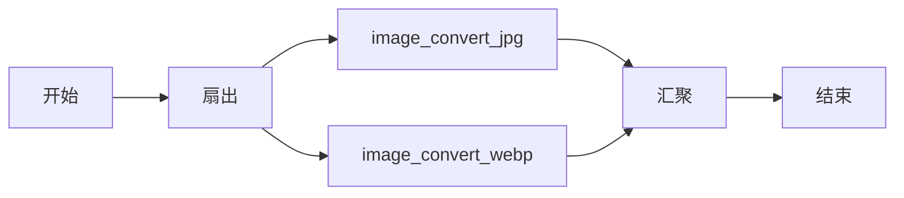
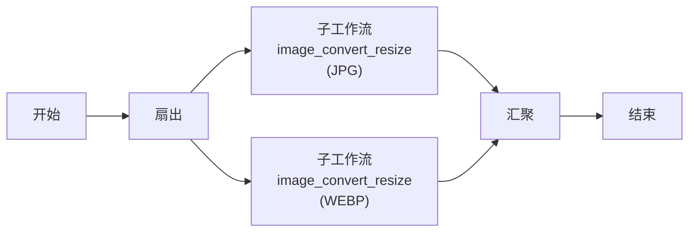

# Sub Workflow
```json
"type" : "SUB_WORKFLOW"
```

Sub Workflow 任务在当前工作流内部执行另一个工作流。这使得你可以跨多个工作流嵌套和复用通用工作流。


与 [Start Workflow](start-workflow-task.md) 任务不同，Sub Workflow 任务提供同步执行，且被执行的子工作流将包含对其父工作流的引用。

Sub Workflow 任务还可以用于克服其他任务的局限性：

- 在 [Do While](do-while-task.md) 任务中使用它以实现嵌套的 Do While 循环。
- 在 [Dynamic Fork](dynamic-fork-task.md) 任务中使用它，使每个分叉执行多个任务。


## 任务参数

在 Sub Workflow 任务配置的 `subWorkflowParam` 内部使用以下参数。

| 参数 | 类型 | 描述 | 必填 / 可选 |
| --------- | ---- | ----------- | ------------------- |
| subWorkflowParam.name | String | 要执行的工作流名称。在未提供内联 `workflowDefinition` 时，必须与已注册的工作流定义匹配。 | 必填。 |
| subWorkflowParam.version | Integer | 要执行的工作流版本。如果未指定，将使用最新版本。提供内联 `workflowDefinition` 时将被忽略。 | 可选。 |
| subWorkflowParam.workflowDefinition | Object _或_ String | 无需预先注册即可执行的内联工作流定义。接受两种形式：**(1) 对象** — 直接嵌入任务定义中的完整 `WorkflowDef` JSON 对象；**(2) String 表达式** — 一个 `${ref.output.field}` 表达式，在运行时解析为较早任务（例如规划 agent）生成的 `WorkflowDef` 结构的 Map。参见下文[内联工作流定义](#inline-workflow-definition)。 | 可选。 |
| subWorkflowParam.taskToDomain | Map[String, String] | 允许将子工作流的任务调度到特定的 domain 映射。有关如何配置 `taskToDomain`，请参阅[任务 domain](../../../api/taskdomains.md)。 | 可选。 |
| inputParameters | Map[String, Any] | 包含子工作流的输入参数（如果有）。 | 可选。 |

## 任务配置

以下是 Sub Workflow 任务的任务配置。

```json
{
  "name": "sub_workflow",
  "taskReferenceName": "sub_workflow_ref",
  "inputParameters": {
    "someParameter": "someValue"
  },
  "type": "SUB_WORKFLOW",
  "subWorkflowParam": {
    "name": "my_workflow",
    "version": 1
  }
}
```

## 内联工作流定义 { #inline-workflow-definition }

`subWorkflowParam.workflowDefinition` 允许你无需先将其注册到元数据存储中即可执行子工作流。它支持两种使用模式。

### 静态内联定义

将一个完整的 `WorkflowDef` 对象直接嵌入任务定义内部。Conductor 会将其直接传递给子工作流执行器。

```json
{
  "name": "exec_plan",
  "taskReferenceName": "exec",
  "type": "SUB_WORKFLOW",
  "inputParameters": {
    "threshold": "${workflow.input.threshold}"
  },
  "subWorkflowParam": {
    "name": "my_inline_workflow",
    "version": 1,
    "workflowDefinition": {
      "name": "my_inline_workflow",
      "version": 1,
      "schemaVersion": 2,
      "tasks": [
        {
          "name": "some_task",
          "taskReferenceName": "t1",
          "type": "SIMPLE",
          "inputParameters": {
            "p1": "${workflow.input.threshold}"
          }
        }
      ],
      "outputParameters": {
        "result": "${t1.output.result}"
      }
    }
  }
}
```

### 动态内联定义（String 表达式）

将 `workflowDefinition` 设置为一个 `${ref.output.field}` 表达式。Conductor 在任务调度时解析该表达式，并将得到的 `WorkflowDef` 结构的 Map 用作子工作流定义。无需通过 HTTP 注册 —— 工作流直接从该 Map 启动。

当较早的任务（例如规划 agent 或 LLM 步骤）在运行时生成执行计划时，这种模式非常有用：

```json
{
  "name": "exec_plan",
  "taskReferenceName": "exec",
  "type": "SUB_WORKFLOW",
  "inputParameters": {
    "threshold": "${workflow.input.threshold}",
    "iterations": "${workflow.input.iterations}"
  },
  "subWorkflowParam": {
    "name": "dynamic_plan_wf",
    "version": 1,
    "workflowDefinition": "${planner.output.workflow_def}"
  }
}
```

表达式所引用的任务（本例中为 `planner`）必须输出一个符合 `WorkflowDef` schema 的 Map —— 即你 `POST` 到 `/api/metadata/workflow` 的相同 JSON 结构。Conductor 通过其内部 ObjectMapper 将 Map 转换为 `WorkflowDef`，并将其作为子工作流启动。

使用此模式的典型父工作流：

```json
{
  "name": "parent_wf",
  "version": 1,
  "tasks": [
    {
      "name": "planner_task",
      "taskReferenceName": "planner",
      "type": "SIMPLE",
      "inputParameters": {
        "goal": "${workflow.input.goal}"
      }
    },
    {
      "name": "exec_plan",
      "taskReferenceName": "exec",
      "type": "SUB_WORKFLOW",
      "inputParameters": {
        "threshold": "${workflow.input.threshold}",
        "iterations": "${workflow.input.iterations}"
      },
      "subWorkflowParam": {
        "name": "dynamic_plan_wf",
        "version": 1,
        "workflowDefinition": "${planner.output.workflow_def}"
      }
    }
  ]
}
```

`planner_task` 工作者在其输出中返回 `workflow_def` 键，其中包含完整的 `WorkflowDef` Map（tasks、inputParameters、outputParameters 等）。`exec` SUB_WORKFLOW 任务解析该表达式并内联执行该定义 —— 无需预先调用元数据 API。

## 输出

Sub Workflow 任务将返回以下参数。

| 名称             | 类型         | 描述                                                   |
| ---------------- | ------------ | ------------------------------------------------------------- |
| subWorkflowId | String | 子工作流的工作流执行 ID。 |

此外，任务输出还将包含子工作流的输出。


## 执行

执行期间，只有当被派生的工作流完成后，Sub Workflow 任务才会被标记为 COMPLETED。如果子工作流失败或终止，Sub Workflow 任务将被标记为 FAILED，并在配置了重试的情况下进行重试。

如果 Sub Workflow 任务在父工作流定义中被定义为 optional，则子工作流失败或终止时不会重试该 Sub Workflow 任务。此外，即使子工作流在到达终止状态后进行了重试/重跑/重启，父工作流任务状态也将保持不变。


## 示例

在此示例工作流中，一个包含两个任务的 Fork 任务被用于同时从一张图片创建两张图片：



左侧分叉将创建一个 JPG 文件，右侧分叉创建一个 WEBP 文件。维护该工作流可能比较繁琐，因为对其中一个分叉任务所做的更改不会自动传播到另一个。与其使用两个任务，我们可以定义一个可复用的 `image_convert_resize` 工作流，在两个分叉中作为子工作流调用：


```json

{
	"name": "image_convert_resize_subworkflow1",
	"description": "Image Processing Workflow",
	"version": 1,
	"tasks": [{
			"name": "image_convert_resize_multipleformat_fork",
			"taskReferenceName": "image_convert_resize_multipleformat_ref",
			"inputParameters": {},
			"type": "FORK_JOIN",
			"decisionCases": {},
			"defaultCase": [],
			"forkTasks": [
				[{
					"name": "image_convert_resize_sub",
					"taskReferenceName": "subworkflow_jpg_ref",
					"inputParameters": {
						"fileLocation": "${workflow.input.fileLocation}",
						"recipeParameters": {
							"outputSize": {
								"width": "${workflow.input.recipeParameters.outputSize.width}",
								"height": "${workflow.input.recipeParameters.outputSize.height}"
							},
							"outputFormat": "jpg"
						}
					},
					"type": "SUB_WORKFLOW",
					"subWorkflowParam": {
						"name": "image_convert_resize",
						"version": 1
					}
				}],
				[{
						"name": "image_convert_resize_sub",
						"taskReferenceName": "subworkflow_webp_ref",
						"inputParameters": {
							"fileLocation": "${workflow.input.fileLocation}",
							"recipeParameters": {
								"outputSize": {
									"width": "${workflow.input.recipeParameters.outputSize.width}",
									"height": "${workflow.input.recipeParameters.outputSize.height}"
								},
								"outputFormat": "webp"
							}
						},
						"type": "SUB_WORKFLOW",
						"subWorkflowParam": {
							"name": "image_convert_resize",
							"version": 1
						}
					}

				]
			]
		},
		{
			"name": "image_convert_resize_multipleformat_join",
			"taskReferenceName": "image_convert_resize_multipleformat_join_ref",
			"inputParameters": {},
			"type": "JOIN",
			"decisionCases": {},
			"defaultCase": [],
			"forkTasks": [],
			"startDelay": 0,
			"joinOn": [
				"subworkflow_jpg_ref",
				"upload_toS3_webp_ref"
			],
			"optional": false,
			"defaultExclusiveJoinTask": [],
			"asyncComplete": false,
			"loopOver": []
		}
	],
	"inputParameters": [],
	"outputParameters": {
		"fileLocationJpg": "${subworkflow_jpg_ref.output.fileLocation}",
		"fileLocationWebp": "${subworkflow_webp_ref.output.fileLocation}"
	},
	"schemaVersion": 2,
	"restartable": true,
	"workflowStatusListenerEnabled": true,
	"ownerEmail": "conductor@example.com",
	"timeoutPolicy": "ALERT_ONLY",
	"timeoutSeconds": 0,
	"variables": {},
	"inputTemplate": {}
}
```

工作流流程如下：



现在任务已被抽象为子工作流，对子工作流的任何更改都将自动应用于两个分叉。
