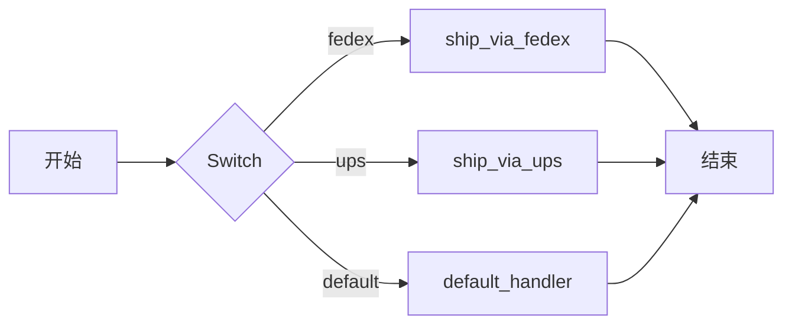

# Switch
```json
"type" : "SWITCH"
```

Switch 任务（`SWITCH`）用于条件分支逻辑。它代表编程中的 _if...then...else_ 或 _switch...case_ 语句，适用于根据预定义条件执行多个任务序列中的一个。

在运行时，Switch 任务会评估一个表达式，并将表达式的输出与任务配置中定义的 switch 分支名称进行匹配。然后工作流将执行匹配分支中的任务。如果未找到匹配的分支，则执行默认分支。

Switch 任务支持两种类型的评估器：

* `value-param`—对任务输入参数键的引用。
* `javascript`—一个复杂的 JavaScript 表达式。

## 任务参数

在 Switch 任务配置顶层使用以下参数。

| 参数          | 类型                | 描述                                       | 必填 / 可选  |
| ------------------ | ------------------- | ------------------------------------------------- | -------------------- |
| evaluatorType | String (enum)            | 所使用的评估器类型。支持的类型：<ul><li>`value-param`—评估 `expression` 中引用的输入参数。</li><li>`javascript`—评估 `expression` 中的 JavaScript 脚本并计算其值。</li></ul>                                                                                 | 必填。 |
| expression    | String                   | Switch 任务所评估的表达式。表达式格式取决于评估器类型：<ul><li>对于 `value-param`，表达式应为 `inputParameters` 中提供的参数键。</li><li>对于 `javascript`，表达式应为 JavaScript 表达式。</li></ul>                                                                                  | 必填。 |
| decisionCases | Map[String, List[task]] | 可能的 switch 分支及其任务的映射。键是 `expression` 评估后可能产生的值，而值是将要执行的任务配置列表。                   | 必填。 |
| defaultCase   | List[Task]              | 默认的 switch 分支，包含在 `decisionCases` 中未找到匹配分支时将执行的任务列表。                                                                     | 必填。 |
| inputParameters   | Map[String, Any]            | 任务的输入参数。<br/> <br/> **注意：** 如果 `evaluatorType` 为 `value-param`，则 `inputParameters` 中必须包含 `expression` 中指定的键。                                                                      | 可选。 |


## JSON 配置

以下是 Switch 任务的任务配置。

### 使用 `value-param`
```json
{
  "name": "switch",
  "taskReferenceName": "switch_ref",
  "inputParameters": {
    "switchCaseValue": "${workflow.input}"
  },
  "type": "SWITCH",
  "decisionCases": {
    "caseName1": [
      {
        // task configuration
      }
    ],
    "caseName2": [
      {
        // task configuration
      },
      {
        // task configuration
      }
    ]
  },
  "defaultCase": [
    {// task configuration}
  ],
  "evaluatorType": "value-param",
  "expression": "switchCaseValue"
}
```

### 使用 `javascript`

```json
{
  "name": "switch",
  "taskReferenceName": "switch_ref",
  "inputParameters": {
    "switchCaseValue": "${workflow.input.num}"
  },
  "type": "SWITCH",
  "decisionCases": {
    "apples": [
      {
        // task configuration
      }
    ],
    "tomatoes":  [
      {
        // task configuration
      }
    ],
    "oranges":  [
      {
        // task configuration
      }
    ]
  },
  "defaultCase": [],
  "evaluatorType": "graaljs",
  "expression": "(function () {\n    switch ($.switchCaseValue) {\n      case \"1\":\n        return \"apple\";\n      case \"2\":\n        return \"tomatoes\";\n      case \"3\":\n        return \"oranges\"\n    }\n  }())"
}
```


## 输出

Switch 任务将返回以下参数。

| 名称             | 类型         | 描述                                                   |
| ---------------- | ------------ | ------------------------------------------------------------- |
| evaluationResult | List[String] | 代表匹配的分支列表的值列表。 |
| selectedCase | String | Switch 任务的评估结果。 |


## 示例

以下是使用 Switch 任务的一些示例。

### 使用 `value-param` 

在此示例工作流中，一个包裹将根据给定的工作流输入由特定的物流提供商发货。以下是使用 `value-param` evaluatorType 的 Switch 任务配置：

```json
{
  "name": "switch",
  "taskReferenceName": "switch_ref",
  "inputParameters": {
    "switchCaseValue": "${workflow.input.service}"
  },
  "type": "SWITCH",
  "evaluatorType": "value-param",
  "expression": "switchCaseValue",
  "defaultCase": [
    {
      ...
    }
  ],
  "decisionCases": {
    "fedex": [
      {
        ...
      }
    ],
    "ups": [
      {
        ...
      }
    ]
  }
}
```

在上面的 Switch 任务中，任务输入 `switchCaseValue` 的值用于确定所选分支。评估器类型为 `value-param`，表达式是对输入参数名称的直接引用。

如果 `switchCaseValue` 的值为 `fedex`，则执行包含 `ship_via_fedex` 任务的 `fedex` 分支。同样，如果输入为 `ups`，则执行 `ship_via_ups` 任务。如果没有任何分支匹配，则执行默认路径。



### 使用 `javascript` 

在此示例中，使用 `javascript` evaluatorType 选择 switch 分支：

```json
{
  "name": "switch",
  "taskReferenceName": "switch_ref",
  "inputParameters": {
    "shipping": "${workflow.input.service}"
  },
  "type": "SWITCH",
  "evaluatorType": "javascript",
  "expression": "$.shipping == 'fedex' ? 'fedex' : 'ups'",
  "defaultCase": [
    {
      ...
    }
  ],
  "decisionCases": {
    "fedex": [
      {
        ...
      }
    ],
    "ups": [
      {
        ...
      }
    ]
  }
}
```

在该任务基于 JavaScript 的表达式中，使用 "$.shipping" 引用任务的输入参数。
