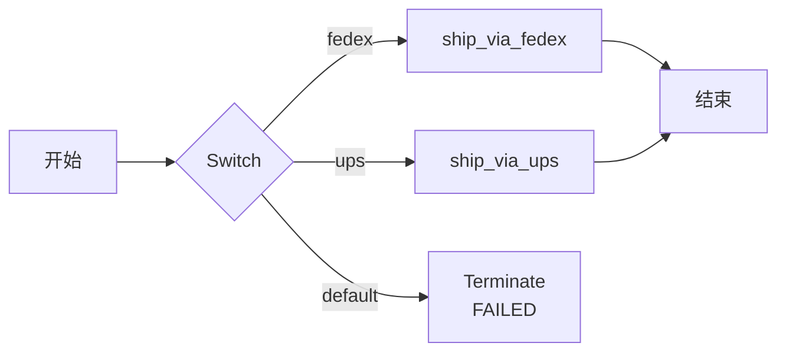

# Terminate
```json
"type" : "TERMINATE"
```

Terminate 任务（`TERMINATE`）以终止状态和原因终止当前工作流，并用任何提供的值设置工作流输出。

Terminate 任务常用于 [Switch](switch-task.md) 任务中，可以充当返回语句，用于希望终止工作流而不继续执行后续任务的场景。

## 任务参数

在 Terminate 任务配置的 `inputParameters` 内部使用以下参数。

| 参数          | 类型                | 描述                                       | 必填 / 可选  |
| ------------------ | ------------------- | ------------------------------------------------- | -------------------- |
| terminationStatus | String (enum) | 终止状态。支持的类型：<ul><li>COMPLETED</li><li>FAILED</li><li>TERMINATED</li></ul>                                   | 必填。 |
| terminationReason | String | 终止当前工作流的原因，用于提供终止的上下文。<br/><br/> 对于 FAILED 工作流，该原因会传递到任何已配置的 `failureWorkflow`。 | 可选。         |
| workflowOutput    | Any     | 终止时期望的工作流输出。                                                              | 可选。         |


## 配置 JSON
以下是 Terminate 任务的任务配置。

```json
{
  "name": "terminate",
  "taskReferenceName": "terminate_ref",
  "inputParameters": {
    "terminationStatus": "TERMINATED",
    "terminationReason": "",
    "workflowOutput": "${someTask.output}"
  },
  "type": "TERMINATE"
}
```


## 输出

Terminate 任务将返回以下参数。

| 名称   | 类型 | 描述                                                                                               |
| ------ | ---- | --------------------------------------------------------------------------------------------------------- |
| output | Map[String, Any]  | 终止时的工作流输出映射，如 `workflowOutput` 中所定义。如果未在 Terminate 任务配置中设置 `workflowOutput`，则输出为空对象。 |

## 示例

以下是使用 Terminate 任务的一些示例。

### 在 switch 分支中使用 Terminate 任务

在此示例工作流中，根据提供的工作流输入决定使用特定的物流提供商发货。如果提供的输入与可用的物流提供商不匹配，则工作流将以 FAILED 状态终止。以下是显示默认 switch 分支终止工作流的一个代码片段：


```json
{
  "name": "switch_task",
  "taskReferenceName": "switch_task",
  "type": "SWITCH",
  "defaultCase": [
      {
      "name": "terminate",
      "taskReferenceName": "terminate_ref",
      "type": "TERMINATE",
      "inputParameters": {
          "terminationStatus": "FAILED",
          "terminationReason":"Shipping provider not found."
      }      
    }
   ]
}
```

工作流流程：




## 最佳实践

以下是处理工作流终止的一些最佳实践：

* 在以 FAILED 状态终止工作流时，包含终止原因，以便容易理解原因。
2. 在工作流输出中包含任何额外细节（例如任务的输出、所选的 switch 分支），为通向终止的路径添加上下文。
