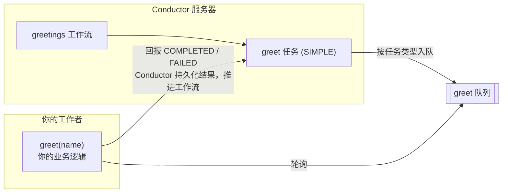

# 你的第一个工作流 & 工作者

**结果：** 一个 `greetings` 工作流，它会排入一个 `greet` 任务，并由工作者返回 `Hello Conductor`。

**用时：** 大约 5 分钟。

请先完成[连接到 Conductor](connect.md)。本指南使用在那里配置的 SDK 连接变量：`CONDUCTOR_SERVER_URL`，如果你的服务器需要，还有 `CONDUCTOR_AUTH_KEY` 和 `CONDUCTOR_AUTH_SECRET`。

## 工作者如何运行

在本快速入门中，你将构建两个东西：一个名为 `greetings` 的**工作流** —— Conductor 执行的持久化定义 —— 以及一个**工作者** —— 你代码中执行该工作流内一个任务的函数。

该工作流只有一个类型为 `SIMPLE` 的任务，这意味着工作由你的代码完成，而不是由 Conductor 的内置任务之一完成。每个 `SIMPLE` 任务都有一个任务类型 —— 这里是 `greet`。当运行中的工作流到达该任务时，Conductor 会将其放入该任务类型的队列中。你的工作者轮询 `greet` 队列，运行你的业务逻辑，并回报 `COMPLETED` 或 `FAILED`。Conductor 持久化地保存结果，然后将工作流推进到下一个任务。

由此设计衍生出两条规则：

- 工作流定义和工作者中的任务类型必须完全一致 —— 否则该任务会停留在一个无人轮询的队列中。
- 工作者作为普通进程运行在你自己的基础设施中，独立于 Conductor 服务器部署和扩缩容。Conductor 保证至少一次投递，意味着同一任务在失败或超时后可能再次被投递 —— 因此要编写幂等的工作者，即两次运行同一任务产生相同结果。



## 特定语言的快速入门

选择一种语言，显示一个完整的 `greet` 工作者和与之匹配的 `greetings` 工作流。示例改编自受维护的 SDK hello-world 工作者示例。

<div class="worker-language-picker" markdown="1">
  <label for="worker-language-select">语言</label>
  <select id="worker-language-select" aria-describedby="worker-language-help">
    <option value="python" selected>Python</option>
    <option value="java">Java</option>
    <option value="typescript">TypeScript / JavaScript</option>
    <option value="csharp">C#</option>
    <option value="rust">Rust</option>
  </select>
  <p id="worker-language-help">选择一种语言，以显示其安装、工作者、工作流和运行步骤。</p>

  <section class="worker-language-guide" data-worker-language="python" markdown="1">

<p class="worker-language-guide__heading" role="heading" aria-level="3">1. 安装 Python 支持</p>

```bash
pip install conductor-python
```

<p class="worker-language-guide__heading" role="heading" aria-level="3">2. 保存工作者和工作流应用</p>

保存为 `quickstart.py`：

```python
from conductor.client.automator.task_handler import TaskHandler
from conductor.client.configuration.configuration import Configuration
from conductor.client.orkes_clients import OrkesClients
from conductor.client.workflow.conductor_workflow import ConductorWorkflow
from conductor.client.worker.worker_task import worker_task


@worker_task(task_definition_name="greet", register_task_def=True)
def greet(name: str) -> dict:
    return {"result": f"Hello {name}"}


def main():
    config = Configuration()
    clients = OrkesClients(configuration=config)
    executor = clients.get_workflow_executor()

    workflow = ConductorWorkflow(name="greetings", version=1, executor=executor)
    greet_task = greet(task_ref_name="greet_ref", name=workflow.input("name"))
    workflow >> greet_task
    workflow.output_parameters({"result": greet_task.output("result")})
    workflow.register(overwrite=True)

    with TaskHandler(configuration=config, scan_for_annotated_workers=True) as handler:
        handler.start_processes()
        run = executor.execute(name="greetings", version=1, workflow_input={"name": "Conductor"})
        print(run.output["result"])


if __name__ == "__main__":
    main()
```

<p class="worker-language-guide__heading" role="heading" aria-level="3">3. 运行并验证</p>

```bash
python quickstart.py
# Hello Conductor
```

工作者配置和生产模式，参见 [Python SDK 指南](../documentation/clientsdks/python-sdk.md)。

  </section>

  <section class="worker-language-guide" data-worker-language="java" hidden markdown="1">

<p class="worker-language-guide__heading" role="heading" aria-level="3">1. 安装 Java 支持</p>

在 Gradle 项目中添加 SDK 依赖：

```groovy
dependencies {
    implementation 'org.conductoross:conductor-client:5.0.1'
}
```

<p class="worker-language-guide__heading" role="heading" aria-level="3">2. 保存工作者和工作流应用</p>

保存为 `Main.java`：

```java
import com.netflix.conductor.client.automator.TaskRunnerConfigurer;
import com.netflix.conductor.client.http.ConductorClient;
import com.netflix.conductor.client.http.TaskClient;
import com.netflix.conductor.client.http.WorkflowClient;
import com.netflix.conductor.client.worker.Worker;
import com.netflix.conductor.common.metadata.tasks.Task;
import com.netflix.conductor.common.metadata.tasks.TaskResult;
import com.netflix.conductor.sdk.workflow.def.ConductorWorkflow;
import com.netflix.conductor.sdk.workflow.def.tasks.SimpleTask;
import com.netflix.conductor.sdk.workflow.executor.WorkflowExecutor;
import java.util.List;
import java.util.Map;

class GreetWorker implements Worker {
    @Override
    public String getTaskDefName() {
        return "greet";
    }

    @Override
    public TaskResult execute(Task task) {
        String name = (String) task.getInputData().get("name");
        TaskResult result = new TaskResult(task);
        result.setStatus(TaskResult.Status.COMPLETED);
        result.addOutputData("result", "Hello " + name);
        return result;
    }
}

public class Main {
    public static void main(String[] args) {
        String serverUrl = System.getenv().getOrDefault(
                "CONDUCTOR_SERVER_URL", "http://localhost:8080/api");
        ConductorClient client = ConductorClient.builder().basePath(serverUrl).build();
        WorkflowExecutor executor = new WorkflowExecutor(client);

        ConductorWorkflow workflow = new ConductorWorkflow<>(executor);
        workflow.setName("greetings");
        workflow.setVersion(1);
        SimpleTask greetTask = new SimpleTask("greet", "greet_ref");
        greetTask.input("name", "${workflow.input.name}");
        workflow.add(greetTask);
        workflow.registerWorkflow(true, true);

        TaskClient taskClient = new TaskClient(client);
        new TaskRunnerConfigurer.Builder(taskClient, List.of(new GreetWorker()))
                .withThreadCount(10)
                .build()
                .init();

        WorkflowClient workflowClient = new WorkflowClient(client);
        String workflowId = workflowClient.startWorkflow(
                "greetings", 1, "", Map.of("name", "Conductor"));
        System.out.println("Started workflow: " + workflowId);
    }
}
```

<p class="worker-language-guide__heading" role="heading" aria-level="3">3. 运行并验证</p>

使用你的 Gradle 应用任务运行该类，然后检查 `greetings` 执行中已完成的 `greet_ref` 任务。其输出为：

```text
Hello Conductor
```

完整的导入和工作者配置，参见 [Java SDK 指南](../documentation/clientsdks/java-sdk.md)。

  </section>

  <section class="worker-language-guide" data-worker-language="typescript" hidden markdown="1">

<p class="worker-language-guide__heading" role="heading" aria-level="3">1. 安装 TypeScript / JavaScript 支持</p>

```bash
npm install @io-orkes/conductor-javascript
```

<p class="worker-language-guide__heading" role="heading" aria-level="3">2. 保存工作者和工作流应用</p>

保存为 `quickstart.ts`：

```typescript
import {
  OrkesClients,
  ConductorWorkflow,
  TaskHandler,
  worker,
  simpleTask,
} from "@io-orkes/conductor-javascript";
import type { Task } from "@io-orkes/conductor-javascript";

@worker({ taskDefName: "greet" })
async function greet(task: Task) {
  return {
    status: "COMPLETED" as const,
    outputData: { result: `Hello ${task.inputData.name}` },
  };
}

async function main() {
  const clients = await OrkesClients.from();
  const executor = clients.getWorkflowClient();
  const workflow = new ConductorWorkflow(executor, "greetings")
    .add(simpleTask("greet_ref", "greet", { name: "${workflow.input.name}" }))
    .outputParameters({ result: "${greet_ref.output.result}" });
  await workflow.register();

  const handler = new TaskHandler({ client: clients.getClient(), scanForDecorated: true });
  await handler.startWorkers();
  const run = await workflow.execute({ name: "Conductor" });
  console.log(run.output?.result);
  await handler.stopWorkers();
}

main();
```

<p class="worker-language-guide__heading" role="heading" aria-level="3">3. 运行并验证</p>

```bash
npx ts-node quickstart.ts
# Hello Conductor
```

TypeScript 5 装饰器、工作者健康检查和生产配置，参见 [JavaScript SDK 指南](../documentation/clientsdks/js-sdk.md)。

  </section>

  <section class="worker-language-guide" data-worker-language="csharp" hidden markdown="1">

<p class="worker-language-guide__heading" role="heading" aria-level="3">1. 安装 C# 支持</p>

```bash
dotnet add package conductor-csharp
```

<p class="worker-language-guide__heading" role="heading" aria-level="3">2. 保存并启动工作者</p>

保存为 `GreetWorker.cs`：

```csharp
using Conductor.Client.Extensions;
using Conductor.Client.Interfaces;
using Conductor.Client.Models;
using Conductor.Client.Worker;
using Task = Conductor.Client.Models.Task;

public class GreetWorker : IWorkflowTask
{
    public string TaskType => "greet";
    public WorkflowTaskExecutorConfiguration WorkerSettings { get; } = new();

    public async Task<TaskResult> Execute(Task task, CancellationToken token)
    {
        var result = task.Completed();
        result.OutputData = new Dictionary<string, object>
        {
            ["result"] = $"Hello {task.InputData["name"]}"
        };
        return await System.Threading.Tasks.Task.FromResult(result);
    }

    public TaskResult Execute(Task task) => throw new NotImplementedException();
}
```

在 `Program.cs` 中使用 SDK 受维护的 worker-host 模式启动工作者：

```csharp
using Conductor.Client;
using Conductor.Client.Authentication;
using Conductor.Client.Worker;
using Microsoft.Extensions.Logging;

var configuration = new Configuration
{
    BasePath = Environment.GetEnvironmentVariable("CONDUCTOR_SERVER_URL"),
    AuthenticationSettings = new OrkesAuthenticationSettings(
        Environment.GetEnvironmentVariable("CONDUCTOR_AUTH_KEY"),
        Environment.GetEnvironmentVariable("CONDUCTOR_AUTH_SECRET"))
};
var host = WorkflowTaskHost.CreateWorkerHost(
    configuration, LogLevel.Information, new GreetWorker());
await host.StartAsync(CancellationToken.None);
await Task.Delay(Timeout.Infinite);
```

在第二个终端中，将其保存为 `greetings.json`，然后注册并运行：

```json
{
  "name": "greetings",
  "description": "Return a greeting from a C# worker.",
  "version": 1,
  "schemaVersion": 2,
  "tasks": [{
    "name": "greet",
    "taskReferenceName": "greet_ref",
    "type": "SIMPLE",
    "inputParameters": { "name": "${workflow.input.name}" }
  }],
  "outputParameters": { "result": "${greet_ref.output.result}" }
}
```

<p class="worker-language-guide__heading" role="heading" aria-level="3">3. 运行并验证</p>

```bash
dotnet run
# In the second terminal:
conductor workflow create greetings.json
conductor workflow start -w greetings -i '{"name":"Conductor"}' --sync
# result: Hello Conductor
```

受维护的示例和 SDK 参考，参见 [C# SDK 指南](../documentation/clientsdks/csharp-sdk.md)。

  </section>

  <section class="worker-language-guide" data-worker-language="rust" hidden markdown="1">

<p class="worker-language-guide__heading" role="heading" aria-level="3">1. 创建 Rust 应用并添加 SDK</p>

```bash
cargo new greetings-worker
cd greetings-worker
```

在 `Cargo.toml` 中，于 `[dependencies]` 下添加 SDK 和异步运行时：

```toml
[dependencies]
conductor = { version = "0.1", package = "conductor-sdk", features = ["macros"] }
conductor-macros = "0.1"
tokio = { version = "1", features = ["full"] }
```

<p class="worker-language-guide__heading" role="heading" aria-level="3">2. 保存工作者和工作流应用</p>

将 `src/main.rs` 替换为：

```rust
use conductor::{
    client::ConductorClient,
    configuration::Configuration,
    models::{StartWorkflowRequest, WorkflowDef, WorkflowTask},
    worker::TaskHandler,
};
use conductor_macros::worker;

#[worker(name = "greet")]
async fn greet(name: String) -> String {
    format!("Hello {}", name)
}

fn greetings_workflow() -> WorkflowDef {
    WorkflowDef::new("greetings")
        .with_version(1)
        .with_task(
            WorkflowTask::simple("greet", "greet_ref")
                .with_input_param("name", "${workflow.input.name}"),
        )
        .with_output_param("result", "${greet_ref.output.result}")
}

#[tokio::main]
async fn main() -> Result<(), Box<dyn std::error::Error>> {
    // Reads CONDUCTOR_SERVER_URL and, when needed, CONDUCTOR_AUTH_* from the environment.
    let config = Configuration::default();
    let client = ConductorClient::new(config.clone())?;

    client
        .metadata_client()
        .register_or_update_workflow_def(&greetings_workflow(), true)
        .await?;

    let mut task_handler = TaskHandler::new(config.clone())?;
    task_handler.add_worker(greet_worker());
    task_handler.start().await?;

    let run = client
        .workflow_client()
        .execute_workflow(
            &StartWorkflowRequest::new("greetings")
                .with_version(1)
                .with_input_value("name", "Conductor"),
            std::time::Duration::from_secs(10),
        )
        .await?;

    println!("result: {:?}", run.output.get("result"));
    task_handler.stop().await?;
    Ok(())
}
```

<p class="worker-language-guide__heading" role="heading" aria-level="3">3. 运行并验证</p>

```bash
cargo run
# result: Some("Hello Conductor")
```

工作者配置、指标和生产模式，参见受维护的 [Rust SDK 快速入门](https://github.com/conductor-oss/rust-sdk#60-second-quickstart)。

  </section>
</div>

<script>
  (function () {
    var select = document.getElementById("worker-language-select");
    var guides = document.querySelectorAll("[data-worker-language]");

    function showGuide() {
      guides.forEach(function (guide) {
        guide.hidden = guide.dataset.workerLanguage !== select.value;
      });
    }

    select.addEventListener("change", showGuide);
  })();
</script>

## 验证持久化执行

1. 打开 Conductor UI（本地服务器为 `http://localhost:8080`），在左侧导航中进入 **Executions → Workflow**。点击最新的 `greetings` 执行 —— 时间线中已完成的 `greet_ref` 任务显示 `result: Hello Conductor`。
2. 现在见证持久化的威力。你的快速入门应用在打印后已退出，因此没有工作者在运行。仅用 CLI 启动另一个执行：

    ```bash
    conductor workflow start -w greetings -i '{"name":"Conductor"}'
    ```

3. 刷新执行列表：新的运行为 `RUNNING`，`greet_ref` 为 `SCHEDULED` —— 已持久化地入队，等待工作者。没有丢失任何东西。
4. 再次运行你的快速入门应用。工作者轮询，等待中的任务完成，执行以 `result: Hello Conductor` 结束。

**故障排查**

- `greet_ref` 即使在应用运行时仍停留在 `SCHEDULED`：工作者没有轮询 `greet` 任务类型 —— 确认工作者正在运行，且其任务类型恰好是 `greet`。
- 注册提示定义已存在：提高版本号或更新本地测试定义。
- `greet_ref` 为 `FAILED`：在 UI 中检查该任务的输入、输出和失败原因，修复工作者，然后启动新的执行。

## 继续学习

**下一步：** [运行你的第一个代理](first-agent.md) —— 将相同的持久化执行模型应用于 LLM 驱动的代理。

更喜欢不写代码？[从 JSON 运行工作流](first-workflow.md) 仅用 CLI 注册一个两步工作流。[SDKs 首页](../documentation/clientsdks/index.md) 链接到 Go、Ruby、Rust 以及每个受支持 SDK 的语言特定参考材料和生产指南。
